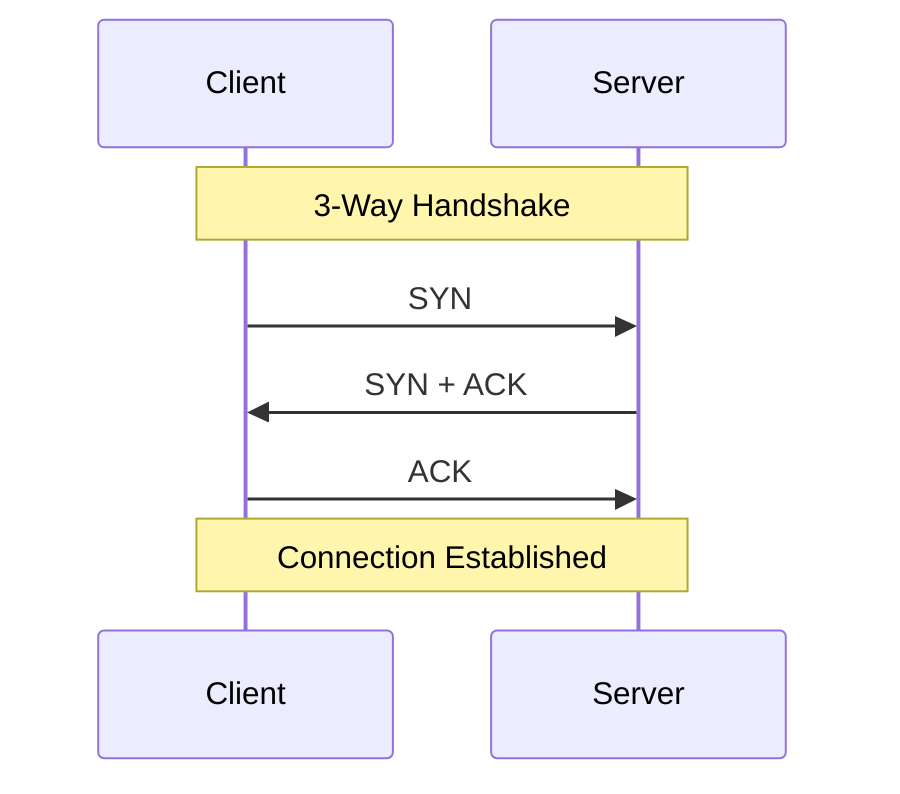

# 11주차: 네트워크 기초 (Winsock)

## 0. 미리 알면 좋은 용어 (Friendly Terms)
- **Socket (소켓)**: "전화기". 네트워크 통신을 위한 끝점입니다.
- **IP**: "집 주소". 컴퓨터의 고유한 네트워크 주소.
- **Port**: "문 번호". 같은 컴퓨터에서 어떤 프로그램인지 구분하는 번호.
- **TCP**: "등기우편". 데이터가 순서대로 안전하게 도착하는 것을 보장합니다.

"이제 컴퓨터 밖으로 나가봅시다!"
이번 주부터는 **네트워크 프로그래밍**의 세계로 들어갑니다. Windows에서는 **Winsock** 라이브러리를 사용합니다.

## 1. 핵심 개념

### A. 소켓 (Socket)
- 네트워크 통신의 끝점(Endpoint)입니다.
- "전화기"라고 생각하면 됩니다.

### B. TCP/IP
- **IP**: 주소 (집 주소)
- **Port**: 항구/문 (몇 호실)
- **TCP**: 신뢰성 있는 연결 (전화 통화)
- **UDP**: 빠르지만 불안정한 전송 (편지/택배)

### C. Winsock 초기화
- 윈도우에서는 반드시 `WSAStartup`으로 라이브러리를 켜고, `WSACleanup`으로 꺼야 합니다.

## 2. 자주 하는 실수 (Common Pitfalls)

### 1. `WSAStartup` 까먹기
- 이거 안 하면 소켓 함수 호출할 때마다 에러 납니다.

### 2. Endianness (Big-endian vs Little-endian)
- 네트워크는 Big-endian(대왕 엔디안)을 씁니다.
- 내 컴퓨터(x86)는 Little-endian(리틀 엔디안)입니다.
- `htons`, `htonl` 함수로 변환 안 하면 엉뚱한 포트로 연결됩니다.

## 3. 실습 가이드
1. **01_winsock_init.cpp**: Winsock 초기화 및 종료.
2. **02_ip_address.cpp**: 문자열 IP("127.0.0.1")를 이진 데이터로 변환.
3. **03_simple_socket.cpp**: 구글(8.8.8.8)에 연결 시도해보기.

## 4. 빌드 및 실행
```powershell
.\build_cmake.bat
```

## Diagram


## Step-by-Step Guide
1. `build_cmake.bat`를 실행하여 빌드합니다.
2. `Debug/01_winsock_init.exe`를 실행하여 Winsock 라이브러리 초기화 성공 여부를 확인합니다.
3. `Debug/02_ip_address.exe`를 실행하여 문자열 IP 변환 결과를 확인합니다.
4. `Debug/03_simple_socket.exe`를 실행하여 실제 외부 서버(Google DNS)와의 연결을 테스트합니다.
