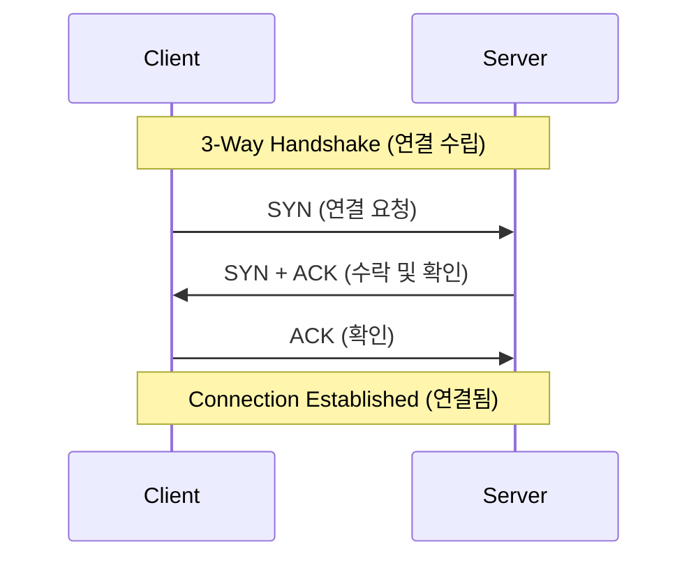

# 11주차: 네트워크 기초 (Winsock)

"이제 컴퓨터 밖으로 나가봅시다!"
이번 주부터는 **네트워크 프로그래밍**의 세계로 들어갑니다. Windows에서는 **Winsock (Windows Socket)** 라이브러리를 사용합니다.

## 0. 미리 알면 좋은 용어 (Friendly Terms)
- **Socket (소켓)**: "전화기"입니다. 네트워크 통신을 하기 위한 끝점(Endpoint)입니다. 소켓을 통해 데이터를 보내고 받습니다.
- **IP (Internet Protocol)**: "집 주소"입니다. 전 세계 컴퓨터 네트워크에서 내 컴퓨터를 식별하는 고유한 주소입니다. (예: 192.168.0.1)
- **Port (포트)**: "방 번호"입니다. 하나의 컴퓨터(IP) 안에서 실행 중인 여러 프로그램 중, 누구에게 데이터를 줄지 구분하는 번호입니다. (예: 웹은 80번, 게임은 7777번)
- **TCP (Transmission Control Protocol)**: "등기우편" 또는 "전화 통화"입니다. 연결을 먼저 맺고, 데이터가 순서대로 빠짐없이 도착하는 것을 보장합니다. 신뢰성이 중요할 때 씁니다.

## 1. 핵심 개념

### A. 소켓 (Socket)
- 운영체제가 제공하는 네트워크 통신 도구입니다.
- 파일 입출력과 비슷하게 `open`, `read`, `write`, `close` 개념을 사용합니다.

### B. TCP/IP
- **IP**: 데이터를 어디로 보낼지 결정합니다.
- **TCP**: 데이터가 잘 도착했는지 확인하고, 순서를 맞춥니다.
- **UDP**: "일반 우편"입니다. 빠르지만 분실될 수 있고 순서가 뒤바뀔 수 있습니다. (게임 이동 패킷 등에 사용)

### C. Winsock 초기화
- 윈도우에서는 소켓을 쓰기 전에 반드시 `WSAStartup` 함수로 라이브러리를 초기화해야 합니다.
- 다 쓰고 나면 `WSACleanup`으로 정리해야 합니다. 리눅스/맥에서는 필요 없는 과정이라 자주 까먹습니다.

## 2. 자주 하는 실수 (Common Pitfalls)

### 1. `WSAStartup` 누락
- 이걸 안 하면 `socket()` 함수를 호출하자마자 에러가 납니다.
- 프로그램 시작 시 한 번만 호출하면 됩니다.

### 2. Endianness (빅 엔디안 vs 리틀 엔디안)
- **네트워크**: Big-endian (상위 바이트가 먼저) 방식을 표준으로 씁니다.
- **내 컴퓨터(x86)**: Little-endian (하위 바이트가 먼저) 방식을 씁니다.
- 따라서 포트 번호 등을 보낼 때 `htons`(Host to Network Short) 함수로 변환하지 않으면, 엉뚱한 숫자로 전달됩니다. (예: 1234번 포트가 53764번이 됨)

## 3. 실습 가이드
1. **01_winsock_init.cpp**: Winsock 라이브러리를 초기화하고 종료하는 기본 코드를 작성합니다.
2. **02_ip_address.cpp**: 문자열 IP("127.0.0.1")를 컴퓨터가 이해하는 이진 데이터로 변환해봅니다.
3. **03_simple_socket.cpp**: 구글 DNS 서버(8.8.8.8)에 연결을 시도해보고 성공 여부를 확인합니다.

## 4. Step-by-Step Guide
1. `build_cmake.bat`를 실행하여 빌드합니다.
2. `Debug/01_winsock_init.exe`를 실행하여 Winsock 라이브러리 초기화 성공 여부를 확인합니다.
3. `Debug/02_ip_address.exe`를 실행하여 문자열 IP 변환 결과를 확인합니다.
4. `Debug/03_simple_socket.exe`를 실행하여 실제 외부 서버(Google DNS)와의 연결을 테스트합니다.

## 5. 빌드 및 실행
```powershell
.\build_cmake.bat
```

## 6. Diagram

