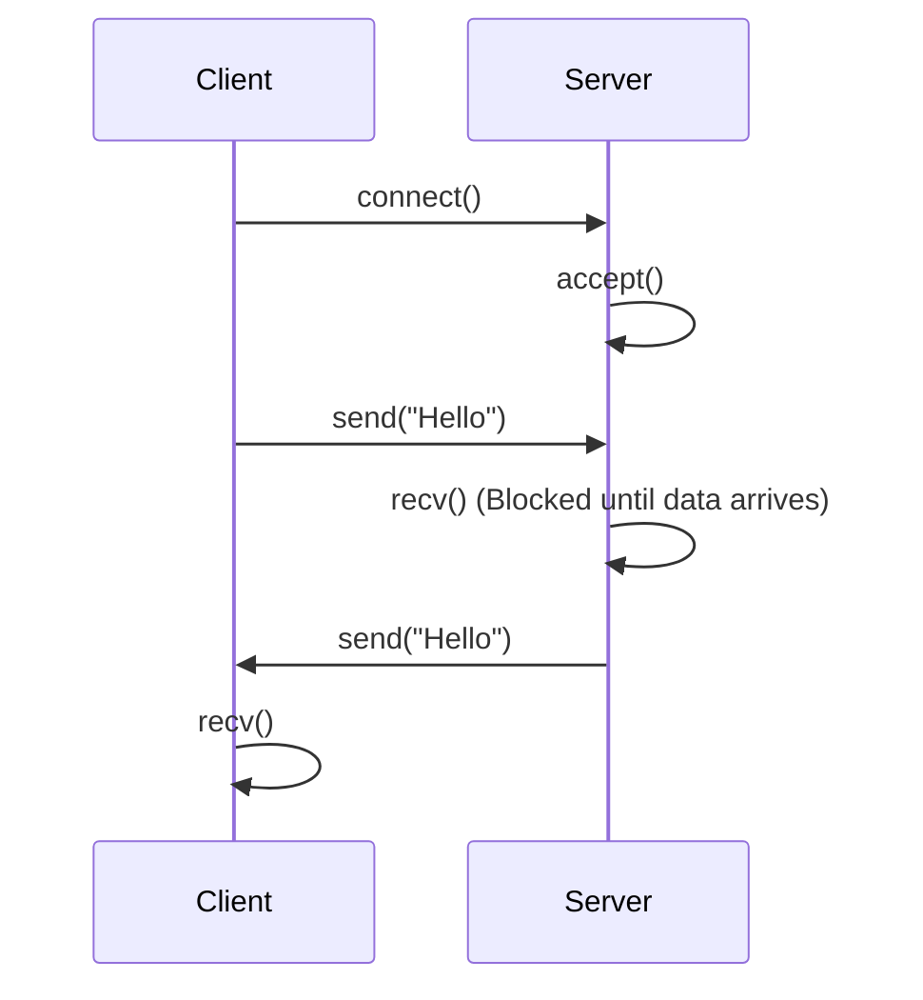

# 12주차: Blocking I/O와 에코 서버

"여보세요? 말할 때까지 안 끊고 기다릴게요."
가장 기본적이지만 직관적인 **Blocking I/O** 모델을 배웁니다.

## 1. 핵심 개념

### A. Blocking I/O
- `recv()`를 호출했는데 데이터가 없으면? -> 데이터가 올 때까지 **영원히 멈춥니다(Block)**.
- `send()`를 호출했는데 버퍼가 꽉 찼으면? -> 비워질 때까지 **멈춥니다**.
- 코딩하기는 쉽지만, 한 쓰레드가 한 클라이언트밖에 처리를 못 합니다.

### B. 서버의 흐름
1. `socket()`: 전화기 설치
2. `bind()`: 전화번호(IP/Port) 할당
3. `listen()`: 개통 (연결 대기)
4. `accept()`: 전화 받기 (새로운 소켓 생성)
5. `recv/send`: 대화
6. `close()`: 끊기

## 2. 자주 하는 실수 (Common Pitfalls)

### 1. `accept`는 새로운 소켓을 반환합니다
- `listen`한 소켓(듣기 전용)으로 데이터를 보내려고 하면 안 됩니다.
- `accept`가 리턴해준 **새로운 소켓**으로 대화해야 합니다.

### 2. TCP는 스트림입니다 (Packet Boundary)
- "Hello"를 5번 보냈다고 해서 `recv`도 5번 호출된다는 보장이 없습니다.
- "HelloHelloHello..."처럼 뭉쳐서 올 수도 있고, "He", "llo" 처럼 끊겨서 올 수도 있습니다.
- 애플리케이션 레벨에서 경계 처리를 해줘야 합니다.

## 3. 실습 가이드
1. **01_echo_server.cpp**: 클라이언트가 보낸 말을 그대로 돌려주는 서버.
2. **02_echo_client.cpp**: 서버에 접속해서 말을 거는 클라이언트.

## 4. 빌드 및 실행
서버를 먼저 켜고, 클라이언트를 켜야 합니다.
```powershell
# 터미널 1
.\build\Debug\01_EchoServer.exe

# 터미널 2
.\build\Debug\02_EchoClient.exe
```

## Diagram


## Step-by-Step Guide
1. `build_cmake.bat`를 실행하여 빌드합니다.
2. 터미널을 두 개 엽니다.
3. 첫 번째 터미널에서 `Debug/01_EchoServer.exe`를 실행하여 서버를 대기시킵니다.
4. 두 번째 터미널에서 `Debug/02_EchoClient.exe`를 실행하여 서버에 접속하고 메시지를 보냅니다.
5. 서버가 메시지를 그대로 돌려주는지(Echo) 확인합니다.
