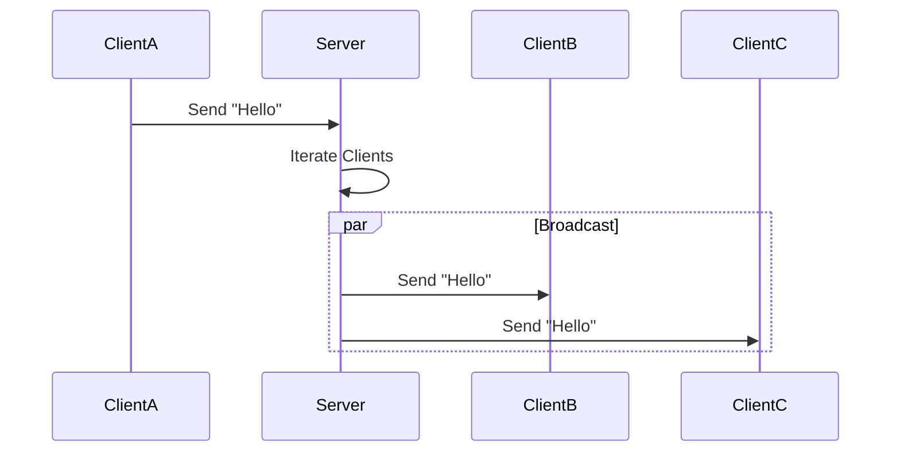

# 15주차: [프로젝트] 1:N 채팅 서버 (Select 기반)

"이제 진짜 채팅방을 만들어봅시다!"
지금까지 배운 `select` 모델과 `std::vector`를 활용해 다자간 채팅 서버를 만듭니다.
단순한 에코 서버를 넘어, **브로드캐스팅(Broadcasting)** 로직을 구현하는 것이 핵심입니다.

## 0. 미리 알면 좋은 용어 (Friendly Terms)
- **Broadcasting (브로드캐스팅)**: "확성기" 또는 "전체 방송"입니다. 한 명이 보낸 메시지를 접속해 있는 모든 사람에게 전달하는 방식입니다.
- **Client List (접속자 목록)**: "출석부"입니다. 현재 서버에 연결된 모든 클라이언트들의 소켓 정보를 관리하는 리스트입니다.
- **Chat Room (채팅 방)**: 논리적으로 여러 사람이 모여 이야기하는 공간입니다. 여기서는 서버 전체가 하나의 채팅방이 됩니다.

## 1. 핵심 개념

### A. 학습 목표
- **다중 접속 처리**: 여러 클라이언트의 연결을 동시에 유지하고 관리합니다.
- **브로드캐스팅**: 한 클라이언트가 보낸 메시지를 다른 모든 클라이언트에게 전달합니다.
- **소켓 생명주기**: 접속(Accept)부터 종료(Close)까지의 흐름을 정확히 제어합니다.

### B. Select 모델의 한계와 활용
`select` 모델은 소켓 셋(`fd_set`)을 매번 초기화하고 커널에 복사해야 하므로 성능상 한계가 있습니다.
하지만 **구현이 직관적이고 이식성이 좋아** 간단한 서버나 학습용으로는 아주 훌륭합니다.

### C. 브로드캐스팅 로직
```cpp
// 나(sender_socket)를 제외한 모두에게 메시지 보내기
for (SOCKET s : connected_clients) {
    if (s != sender_socket) { 
        send(s, message, len, 0);
    }
}
```

## 2. 자주 하는 실수 (Common Pitfalls)

### 1. 벡터 순회 중 삭제 (Iterator Invalidated)
`std::vector`를 `for`문으로 돌면서 `erase`를 하면 반복자(iterator)나 인덱스가 꼬여서 건너뛰거나 크래시가 납니다.
```cpp
// Bad
for (int i=0; i<reads.size(); ++i) {
    if (disconnected) reads.erase(reads.begin() + i); // i가 그대로라서 다음 요소를 건너뜀!
}

// Good
reads.erase(reads.begin() + i);
i--; // 인덱스 보정
```

### 2. FD_SETSIZE 제한
윈도우의 `select`는 기본적으로 64개의 소켓만 관리할 수 있습니다. (`winsock2.h` 헤더 포함 전 `#define FD_SETSIZE 1024` 등으로 늘릴 수 있지만 한계가 있습니다.)

## 3. 실습 가이드
### 3.1. 주요 자료구조
- `std::vector<SOCKET> reads`: 현재 접속 중인 모든 소켓(Listen 소켓 포함)을 저장합니다.
- `fd_set`: `select` 함수에 넘겨줄 소켓 집합입니다.

### 3.2. 단계별 로직
1.  **초기화**: `WSAStartup`, `socket`, `bind`, `listen`.
2.  **소켓 등록**: `listen_sock`을 `reads` 벡터에 추가합니다.
3.  **루프 진입**:
    -   `fd_set` 초기화 (`FD_ZERO`).
    -   `reads` 벡터의 소켓들을 `fd_set`에 등록 (`FD_SET`).
    -   `select` 호출 (대기).
4.  **이벤트 처리**:
    -   **Listen 소켓 이벤트**: `accept`로 새 클라이언트 입장 -> `reads`에 추가.
    -   **일반 소켓 이벤트**: `recv`로 데이터 수신.
        -   데이터 > 0: `broadcast` 함수 호출.
        -   데이터 <= 0: 연결 종료 (`closesocket`) 및 `reads`에서 제거.

## 4. Step-by-Step Guide
1. `build_cmake.bat`를 실행하여 빌드합니다.
2. `Debug/01_ChatServer.exe`를 실행합니다.
3. 터미널 3개를 열고 `Week12/Debug/02_EchoClient.exe`를 각각 실행합니다. (Week12의 클라이언트를 재사용합니다)
4. 한 클라이언트에서 메시지를 입력하면 나머지 두 클라이언트에게 전달되는지 확인합니다.

## 5. 빌드 및 실행
```powershell
.\build_cmake.bat
```

## 6. Diagram


