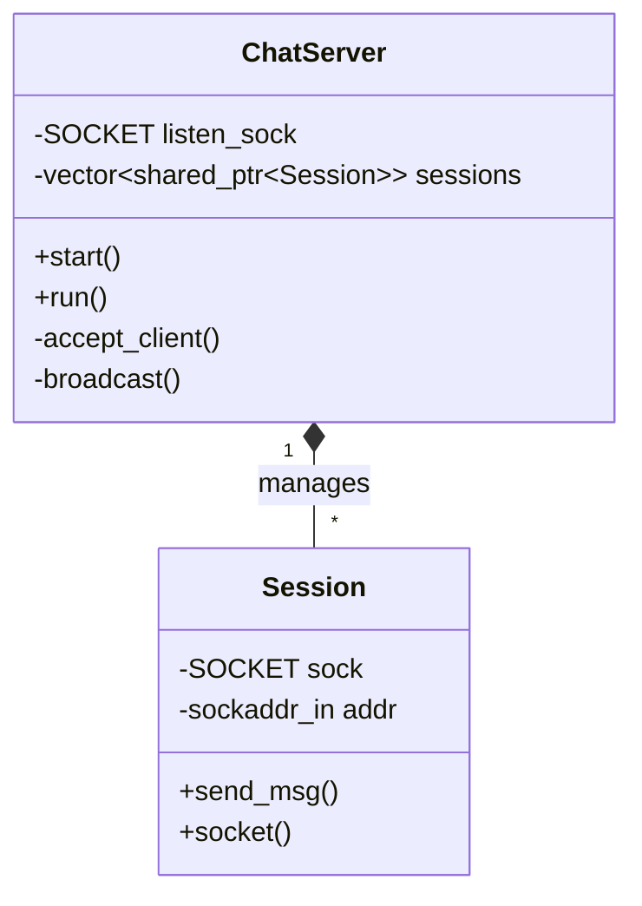

# 16주차: 중간 점검 및 리팩토링

## 0. 미리 알면 좋은 용어 (Friendly Terms)
- **Refactoring (리팩토링)**: "집안 정리". 기능은 그대로두고 코드 구조를 깨끗하게 정리하는 과정.
- **Code Review**: "점검 회의". 코드를 검토하고 문제점을 찾는 과정.
- **OOP (객체 지향)**: "역할 분담". 코드를 객체 단위로 나눠서 관리하는 방법.

"코드가 너무 지저분해요. 정리 좀 하고 가죠!"
지난주에 만든 채팅 서버, `main` 함수 하나에 모든 로직이 들어있어 유지보수가 힘들었죠?
이번 주에는 **객체 지향적 설계(OOP)**를 적용해 코드를 깔끔하게 분리해봅니다.

## 1. 학습 목표
- **관심사의 분리 (Separation of Concerns)**: 네트워크 I/O, 세션 관리, 메시지 처리를 분리합니다.
- **RAII 패턴 적용**: 소켓 리소스 관리를 클래스 소멸자에 위임하여 누수를 방지합니다.
- **Modern C++ 활용**: `std::shared_ptr`, `std::vector` 등을 적극 활용합니다.

## 2. 리팩토링 설계
### 2.1. 클래스 구조


- **`ChatServer`**: 서버의 생명주기(Start, Stop)와 메인 루프(`select`)를 담당합니다.
- **`Session`**: 클라이언트 한 명의 상태(소켓, IP주소, 버퍼 등)를 관리합니다.

## 3. 핵심 개념: RAII (Resource Acquisition Is Initialization)
C++에서는 자원의 획득과 해제를 객체의 생성/소멸과 일치시키는 것이 중요합니다.
```cpp
class Session {
public:
    ~Session() {
        if (sock_ != INVALID_SOCKET) closesocket(sock_); // 소멸자에서 자동 정리
    }
};
```
이렇게 하면 예외가 발생하거나 함수를 빠져나갈 때 별도로 `closesocket`을 호출하지 않아도 안전합니다.

## 4. Common Pitfalls (흔한 실수)
> [!CAUTION]
> **1. 스마트 포인터 순환 참조 (Circular Reference)**
> 만약 `Session`이 `ChatServer`를 `shared_ptr`로 들고 있고, `ChatServer`도 `Session`을 `shared_ptr`로 들고 있다면?
> 서로가 서로를 놓아주지 않아 메모리 누수가 발생합니다. 이럴 땐 `weak_ptr`를 사용해야 합니다.

> [!TIP]
> **2. 복사 비용 최소화**
> `broadcast` 함수에서 메시지(`std::string`)를 값으로 전달하면 매번 복사가 일어납니다.
> `const std::string&` (const reference)를 사용하여 복사 비용을 줄이세요.


## Step-by-Step Guide
1. `build_cmake.bat`를 실행하여 빌드합니다.
2. `Debug/01_refactored_server.exe`를 실행합니다.
3. `Week12/Debug/02_EchoClient.exe`를 실행하여 접속 테스트를 진행합니다.
4. 서버 코드를 보며 `ChatServer` 클래스가 어떻게 `Session` 객체를 관리하는지 분석합니다.

