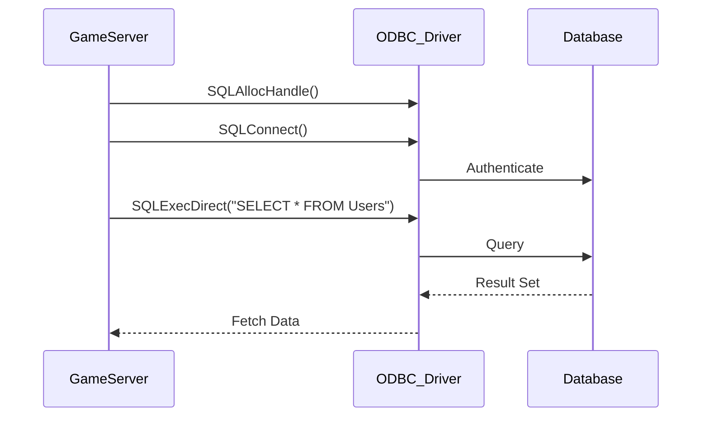

# 18주차: 데이터베이스 연동 기초

## 0. 미리 알면 좋은 용어 (Friendly Terms)
- **Database (데이터베이스)**: "영구 저장소". 서버가 꺼져도 데이터가 남아있는 저장 공간.
- **SQL**: "질문서". 데이터베이스에게 데이터를 요청하는 언어.
- **Connection Pool**: "대기 줄". 미리 연결을 맺어두고 필요할 때 빌려 쓰는 방식.

"서버 껐다 켜도 데이터가 남아있어야죠!"
게임 서버에서 유저 정보, 아이템, 로그 등을 저장하기 위해 DB는 필수입니다.
이번 주에는 C++ 서버에서 DB와 통신하는 방법과 **비동기 DB 처리 패턴**을 익힙니다.

## 1. 학습 목표
- **DB 연동 방식**: ODBC, Native Client 등의 차이를 이해합니다.
- **비동기 처리**: DB 작업은 느리기 때문에 메인 로직을 막지 않도록(Non-blocking) 처리해야 함을 배웁니다.
- **SQL Injection 방지**: 보안을 위한 Prepared Statement 사용법을 익힙니다.

## 2. 핵심 이론
### 2.1. 동기(Synchronous) vs 비동기(Asynchronous) DB 처리
- **동기 방식**: `query()` 함수를 호출하면 DB 응답이 올 때까지 쓰레드가 멈춥니다. (게임 렉 유발)
- **비동기 방식**: 별도의 **DB Worker Thread**에게 일감을 던져주고(`push`), 메인 쓰레드는 하던 일을 계속합니다. 나중에 결과가 나오면 콜백으로 처리합니다.

### 2.2. Connection Pool
DB 연결(`Connect`)은 비용이 매우 비쌉니다.
따라서 미리 여러 개의 연결을 맺어두고(Pool), 필요할 때 빌려 쓰고 반납하는 방식을 사용합니다.

## 3. 구현 가이드 (Mock DB)
실제 DB 설치 없이 비동기 패턴을 익히기 위해 `MockDB` 클래스를 만듭니다.
```cpp
class MockDB {
    // 요청 큐
    ConcurrentQueue<Task> tasks_;
    
    // 워커 쓰레드
    void Worker() {
        while(true) {
            Task task = tasks_.pop();
            // 가짜 딜레이 (DB 처리 시간 시뮬레이션)
            std::this_thread::sleep_for(10ms);
            task.callback(result);
        }
    }
};
```

## 4. Common Pitfalls (흔한 실수)
> [!DANGER]
> **1. 메인 쓰레드에서 DB 접속**
> `Connect`나 `Query`를 게임 로직 쓰레드(메인 루프)에서 직접 호출하면, 네트워크 지연 등으로 인해 서버 전체가 수 초간 멈출 수 있습니다. **절대 금지!**

# 18주차: 데이터베이스 연동 기초

"서버 껐다 켜도 데이터가 남아있어야죠!"
게임 서버에서 유저 정보, 아이템, 로그 등을 저장하기 위해 DB는 필수입니다.
이번 주에는 C++ 서버에서 DB와 통신하는 방법과 **비동기 DB 처리 패턴**을 익힙니다.

## 1. 학습 목표
- **DB 연동 방식**: ODBC, Native Client 등의 차이를 이해합니다.
- **비동기 처리**: DB 작업은 느리기 때문에 메인 로직을 막지 않도록(Non-blocking) 처리해야 함을 배웁니다.
- **SQL Injection 방지**: 보안을 위한 Prepared Statement 사용법을 익힙니다.

## 2. 핵심 이론
### 2.1. 동기(Synchronous) vs 비동기(Asynchronous) DB 처리
- **동기 방식**: `query()` 함수를 호출하면 DB 응답이 올 때까지 쓰레드가 멈춥니다. (게임 렉 유발)
- **비동기 방식**: 별도의 **DB Worker Thread**에게 일감을 던져주고(`push`), 메인 쓰레드는 하던 일을 계속합니다. 나중에 결과가 나오면 콜백으로 처리합니다.

### 2.2. Connection Pool
DB 연결(`Connect`)은 비용이 매우 비쌉니다.
따라서 미리 여러 개의 연결을 맺어두고(Pool), 필요할 때 빌려 쓰고 반납하는 방식을 사용합니다.

## 3. 구현 가이드 (Mock DB)
실제 DB 설치 없이 비동기 패턴을 익히기 위해 `MockDB` 클래스를 만듭니다.
```cpp
class MockDB {
    // 요청 큐
    ConcurrentQueue<Task> tasks_;
    
    // 워커 쓰레드
    void Worker() {
        while(true) {
            Task task = tasks_.pop();
            // 가짜 딜레이 (DB 처리 시간 시뮬레이션)
            std::this_thread::sleep_for(10ms);
            task.callback(result);
        }
    }
};
```

## 4. Common Pitfalls (흔한 실수)
> [!DANGER]
> **1. 메인 쓰레드에서 DB 접속**
> `Connect`나 `Query`를 게임 로직 쓰레드(메인 루프)에서 직접 호출하면, 네트워크 지연 등으로 인해 서버 전체가 수 초간 멈출 수 있습니다. **절대 금지!**

> [!WARNING]
> **2. 쿼리 문자열 조합 (String Concatenation)**
> `string query = "SELECT * FROM Users WHERE Name = '" + name + "'";`
> 이렇게 짜면 `name`에 `'; DROP TABLE Users; --` 같은 값을 넣어 해킹할 수 있습니다 (**SQL Injection**).
> 반드시 `Bind Parameter` 기능을 제공하는 라이브러리를 사용하세요.


## Diagram


## Step-by-Step Guide
1. `build_cmake.bat`를 실행하여 빌드합니다.
2. `Debug/01_odbc_connect.exe`를 실행하여 DB 연결 테스트를 수행합니다. (사전에 ODBC 데이터 원본 설정 필요)
3. `Debug/02_crud_example.exe`를 실행하여 데이터 생성, 조회, 수정, 삭제(CRUD) 동작을 확인합니다.
