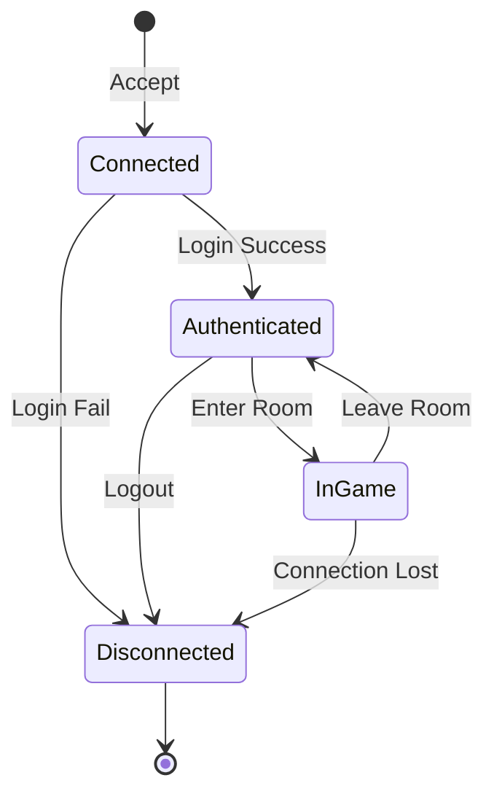

# 19주차: 세션 관리 (Session Management)

## 0. 미리 알면 좋은 용어 (Friendly Terms)
- **Session (세션)**: "사용자 방". 각 접속자의 상태(로그인, 게임 중 등)를 관리하는 객체.
- **State Machine (상태 머신)**: "상태표". 사용자가 현재 어떤 상태(대기, 게임중, 종료)인지 추적하고 관리하는 시스템.
- **Authentication (인증)**: "신분 확인". 아이디/비번을 확인하여 사용자가 누구인지 식별하는 과정.
- **Heartbeat (하트비트)**: "생존 신고". 연결이 끊어지지 않았는지 확인하기 위해 주기적으로 주고받는 신호.

"유저가 로그인했는지 어떻게 알죠?"
단순한 소켓 연결(`SOCKET`)은 물리적인 연결일 뿐입니다.
이 연결이 "누구"인지, "어떤 상태"인지를 관리하는 논리적인 객체가 바로 **세션(Session)**입니다.

## 1. 핵심 개념

### A. 학습 목표
- **세션의 정의**: 소켓과 유저 정보를 맵핑하는 객체를 설계합니다.
- **세션 관리자**: 전체 세션을 생성, 조회, 삭제하는 매니저 클래스를 구현합니다.
- **상태 머신**: `Connected` -> `Authenticated` -> `InGame` 등의 상태 변화를 관리합니다.

### B. Session ID
소켓 핸들 값은 재사용될 수 있고, OS마다 다르기 때문에 고유한 **Session ID**를 발급하여 관리하는 것이 좋습니다.
- `std::map<int, Session*> sessions_`: ID로 세션을 빠르게 찾기 위함.
- `std::atomic<int> id_generator`: 쓰레드 안전하게 ID 발급.

### C. 스마트 포인터와 생명주기
세션은 여러 쓰레드에서 동시에 접근할 수 있습니다.
- 네트워크 쓰레드: 패킷 수신.
- 로직 쓰레드: 게임 처리.
따라서 `std::shared_ptr`를 사용하여, 누군가 참조하고 있다면 메모리에서 해제되지 않도록 해야 합니다.

## 2. 자주 하는 실수 (Common Pitfalls)
> [!WARNING]
> **1. Deadlock (교착 상태)**
> `SessionManager`의 락을 잡은 상태에서 `Session`의 락을 잡고, 다른 곳에선 반대로 잡으면 데드락이 걸립니다.
> 락의 순서를 항상 일정하게 유지하거나, 락 범위를 최소화하세요.

> [!TIP]
> **2. Stale Session (상한 세션)**
> 클라이언트는 이미 연결을 끊었는데, 서버 메모리에는 세션 객체가 남아있는 경우입니다.
> `Keep-Alive` 패킷이나 `Heartbeat` 체크를 통해 오랫동안 응답 없는 세션을 강제로 정리해야 합니다.

## 3. 실습 가이드
```cpp
class SessionManager {
public:
    // 쓰레드 안전하게 세션 생성
    int create_session() {
        int id = next_id_++;
        auto session = std::make_shared<Session>(id);
        
        std::lock_guard<std::mutex> lock(mtx_);
        sessions_[id] = session;
        return id;
    }
    
    // ID로 세션 찾기
    std::shared_ptr<Session> find_session(int id) {
        std::lock_guard<std::mutex> lock(mtx_);
        if (sessions_.find(id) != sessions_.end()) return sessions_[id];
        return nullptr;
    }
};
```

## 4. Step-by-Step Guide
1. `build_cmake.bat`를 실행하여 빌드합니다.
2. `Debug/01_session_manager.exe`를 실행합니다.
3. 콘솔 로그를 통해 세션 생성(ID 발급) → 상태 변경(Login/InGame) → 세션 종료 및 정리 과정을 확인합니다.

## 5. 빌드 및 실행
```powershell
.\build_cmake.bat
```

## 6. Diagram


