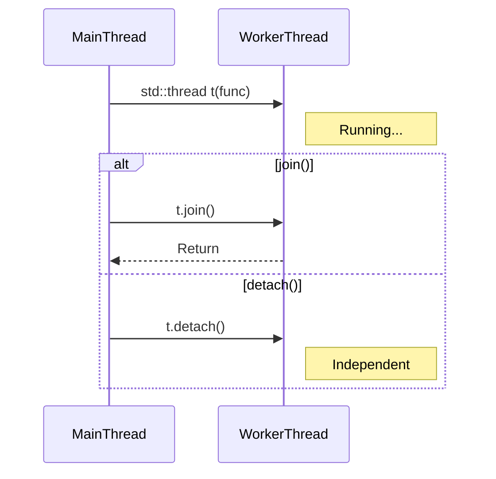

# 2주차: 쓰레드 관리 (Thread Management)

1주차에서 환경 설정하느라 고생 많으셨습니다!
이번 주에는 **쓰레드를 만들고, 일을 시키고, 퇴근시키는(종료)** 가장 기초적인 방법을 배웁니다.

## 0. 미리 알면 좋은 용어 (Friendly Terms)
- **Thread (쓰레드)**: "일꾼". 프로그램 안에서 실제로 일을 하는 작업 단위입니다.
- **Join (조인)**: "퇴근 대기". 시킨 일이 끝날 때까지 부모(메인 쓰레드)가 기다려주는 것입니다.
- **Detach (디태치)**: "자율 근무". 부모가 기다리지 않고 알아서 하라고 놔주는 것입니다. (끝나면 알아서 퇴근함)
- **Context Switch (문맥 교환)**: "작업 전환 비용". A 일꾼에서 B 일꾼으로 작업을 바꿀 때 드는 시간과 비용입니다.


## 1. 핵심 개념

### A. 쓰레드의 생명주기 (Lifecycle)
쓰레드는 `std::thread` 객체를 만드는 순간 **즉시 실행**됩니다.
하지만 메인 쓰레드(부모)가 먼저 끝나버리면, 자식 쓰레드는 갈 곳을 잃고 프로그램이 터집니다.
그래서 부모는 자식에게 두 가지 중 하나를 결정해줘야 합니다:
1. **`join()`**: "끝날 때까지 기다릴게." (동기적)
2. **`detach()`**: "알아서 살아라." (비동기적, 백그라운드) -> *주의: 자식이 부모의 메모리를 참조하면 위험함!*

### B. 인자 전달 (Argument Passing)
쓰레드 함수에 변수를 넘길 때 조심해야 합니다.
- **기본**: 값 복사(Copy)로 넘어갑니다.
- **참조(`&`)**: `std::ref(변수)`로 감싸야 진짜 참조로 넘어갑니다. 그냥 `&` 쓰면 컴파일 에러 나거나 복사됩니다.
- **이동(`std::move`)**: `unique_ptr` 같은 친구들은 복사가 안 되니 `move`로 소유권을 넘겨야 합니다.

### C. 하드웨어 동시성 (Hardware Concurrency)
`std::thread::hardware_concurrency()`를 쓰면 현재 CPU 코어 개수(논리 프로세서 수)를 알 수 있습니다.
무작정 쓰레드를 100개 만드는 것보다, 코어 수에 맞춰 만드는 게 성능에 좋습니다.

## 2. 자주 하는 실수 (Common Pitfalls)

### 1. `detach()`의 함정
"백그라운드에서 돌라고 `detach` 했는데 왜 죽죠?"
- 메인 함수(`main`)가 끝나면 프로세스가 종료됩니다. `detach`된 쓰레드가 아직 돌고 있어도 강제로 꺼집니다.
- 또한, `detach`된 쓰레드가 이미 소멸된 메인 쓰레드의 변수(지역 변수 등)를 참조하면 크래시가 납니다.

### 2. 인자가 복사되는지 모름
```cpp
void update(int& n) { n++; }
std::thread t(update, val); // 컴파일 에러 또는 복사됨!
```
- `std::thread`는 인자를 무조건 복사해서 가져갑니다.
- 참조로 넘기려면 반드시 `std::ref(val)`을 써야 합니다.

## 3. 실습 가이드

`Week2/src` 폴더의 예제들을 순서대로 실행해보세요.

1. **01_thread_lifecycle.cpp**: `join`과 `detach`의 차이, 그리고 쓰레드 ID 확인.
2. **02_argument_passing.cpp**: `std::ref`와 `std::move`를 안 쓰면 생기는 일.
3. **03_parallel_sum.cpp (미니 프로젝트)**: 
   - 1부터 100만까지 더하는 작업을 
   - 싱글 쓰레드 vs 멀티 쓰레드(4개)로 나눠서 수행해보고 속도/결과 비교하기.

## 3. 빌드 및 실행
1주차와 똑같습니다! `Week2` 폴더에서 아래 스크립트를 실행하세요.

```powershell
.\build_cmake.bat
```

실행 파일은 `Week2/build/Debug` 폴더에 생성됩니다.

## Diagram



## Step-by-Step Guide
1. `build_cmake.bat`를 실행하여 빌드합니다.
2. `Debug/01_thread_lifecycle.exe`를 실행하여 `join`과 `detach`의 동작 차이를 확인합니다.
3. `Debug/02_argument_passing.exe`를 실행하여 값 복사와 참조 전달(`std::ref`)의 차이를 확인합니다.
4. `Debug/03_parallel_sum.exe`를 실행하여 싱글 쓰레드와 멀티 쓰레드의 성능 차이를 비교합니다.
