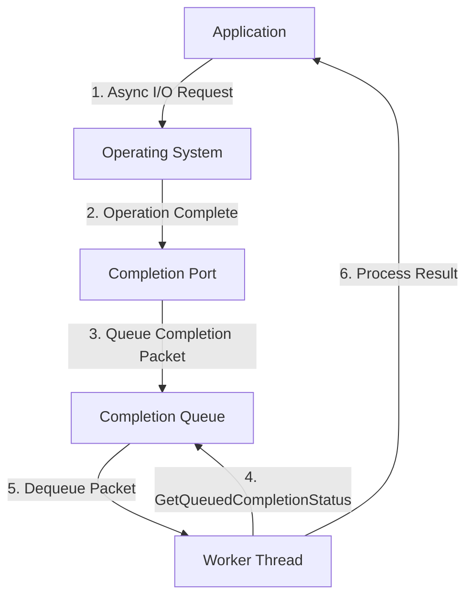

# 21주차: Windows IOCP (I/O Completion Port) 이론

"윈도우 서버의 끝판왕."
수만 명의 동시 접속을 처리하려면 `select`로는 어림도 없습니다.
**IOCP**는 OS 커널 레벨에서 지원하는 가장 효율적인 비동기 I/O 모델입니다.

## 1. 학습 목표
- **Proactor 패턴**: "완료되면 알려줘" 방식의 비동기 처리를 이해합니다.
- **Completion Port**: 작업 완료 통지를 받는 항구(Port)의 개념을 익힙니다.
- **Overlapped I/O**: 중첩 입출력 구조체의 역할을 이해합니다.

## 2. 핵심 이론
### 2.1. Reactor vs Proactor
- **Reactor (Select/Epoll)**: "지금 읽을 데이터가 있어?" -> "응 있어" -> (내가 직접 읽음)
- **Proactor (IOCP)**: "이 버퍼에 데이터 좀 읽어놔" -> (OS가 읽음) -> "다 읽었어" -> (나는 결과만 확인)

### 2.2. IOCP 동작 원리
1.  **Completion Queue**: 완료된 작업들이 쌓이는 큐입니다. (OS 관리)
2.  **Worker Threads**: `GetQueuedCompletionStatus` 함수를 호출하여 큐에서 작업을 꺼내갑니다.
3.  **LIFO 특성**: 대기 중인 쓰레드 중 가장 마지막에 들어온 놈을 먼저 깨워 문맥 교환(Context Switch)을 줄입니다.

## 3. 주요 함수
- `CreateIoCompletionPort`: CP 생성 및 소켓 연결.
- `GetQueuedCompletionStatus`: 완료된 작업 꺼내기 (Blocking).
- `PostQueuedCompletionStatus`: 사용자 정의 작업을 큐에 넣기 (쓰레드 간 통신용으로도 씀).

## 4. Common Pitfalls (흔한 실수)
> [!IMPORTANT]
> **1. Overlapped 구조체 유지**
> 비동기 작업(`WSARecv`, `WSASend`)을 요청할 때 넘겨준 `OVERLAPPED` 구조체는 **작업이 끝날 때까지 절대 메모리에서 해제되거나 이동되면 안 됩니다.**
> 보통 `Session` 객체의 멤버 변수로 포함시켜 수명을 같이하게 합니다.

> [!TIP]
> **2. 쓰레드 개수**
> IOCP 워커 쓰레드는 몇 개가 적당할까요?
> 보통 **CPU 코어 수 * 2** 또는 **코어 수 + 1**을 권장합니다. 너무 많으면 컨텍스트 스위칭 비용이 커집니다.

## Diagram

## Step-by-Step Guide
1. `build_cmake.bat`를 실행하여 빌드합니다.
2. `Debug/01_iocp_basic.exe`를 실행합니다.
3. 콘솔에서 메인 쓰레드가 작업을 큐에 넣고(`PostQueuedCompletionStatus`), 워커 쓰레드가 이를 꺼내 처리하는 과정을 확인합니다.

