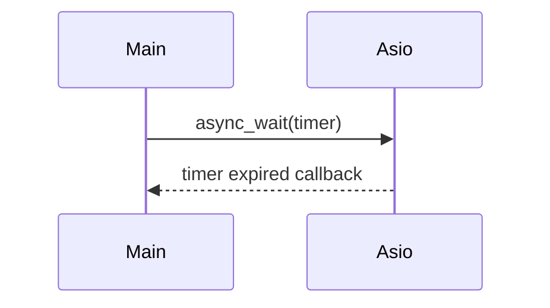

# 25주차: Boost.Asio (Standalone) 기초

"C++ 네트워크의 미래."
**Boost.Asio**는 C++ 표준 네트워크 라이브러리(Networking TS)의 기반이 되는 강력한 라이브러리입니다.
IOCP의 복잡함을 세련된 C++ 템플릿과 객체로 감싸서, 훨씬 직관적이고 안전하게 고성능 서버를 짤 수 있게 해줍니다.

## 1. 학습 목표
- **Asio 환경 설정**: Boost 설치 없이 Standalone Asio를 설정합니다.
- **io_context**: Asio의 핵심인 I/O 실행 컨텍스트를 이해합니다.
- **비동기 타이머**: `async_wait`를 통해 비동기 콜백 패턴을 익힙니다.

## 2. 핵심 이론
### 2.1. Proactor Pattern in Asio
Asio는 OS에 따라 최적의 구현체(Windows는 IOCP, Linux는 Epoll)를 자동으로 선택합니다.
사용자는 `io_context.run()`만 호출하면 됩니다.

### 2.2. 비동기 핸들러 (Completion Handler)
비동기 작업이 끝나면 호출될 함수(콜백)입니다.
람다(Lambda) 함수를 주로 사용하며, 문맥(Context)을 캡처할 수 있어 매우 편리합니다.
```cpp
timer.async_wait([](const asio::error_code& e) {
    std::cout << "Timer expired!\n";
});
```

## 3. 환경 설정 (필수)
이 폴더에 있는 `setup_asio.bat`를 실행하여 Asio 헤더 파일을 다운로드 받으세요.
(`include/asio.hpp` 등이 생성됩니다.)

## 4. Common Pitfalls (흔한 실수)
> [!IMPORTANT]
> **1. io_context.run()의 블로킹**
> `io_context.run()`은 할 일이 없으면 즉시 리턴합니다.
> 서버처럼 계속 떠있게 하려면 `asio::executor_work_guard`를 쓰거나, 계속해서 비동기 작업을 걸어둬야 합니다.

> [!WARNING]
> **2. 싱글 쓰레드 vs 멀티 쓰레드**
> `io_context.run()`을 한 쓰레드에서만 호출하면 싱글 쓰레드 서버가 되고(동기화 불필요),
> 여러 쓰레드에서 호출하면 멀티 쓰레드 서버가 됩니다(동기화 필요).

## 5. 실습
1.  **01_timer_sync.cpp**: 동기 타이머 (Blocking).
2.  **02_timer_async.cpp**: 비동기 타이머 (Non-blocking).

## Theory Overview
- Boost.Asio의 Proactor 모델과 io_context 동작 원리를 설명합니다.
- 비동기 타이머와 콜백 메커니즘을 이해합니다.

## Step-by-Step Guide
1. `setup_asio.bat` 실행하여 헤더를 다운로드합니다.
2. `build_cmake.bat` 로 프로젝트를 빌드합니다.
3. `Debug\01_timer_sync.exe` 와 `Debug\02_timer_async.exe` 를 실행해 동작을 확인합니다.
4. 로그 출력으로 콜백 호출 시점을 확인합니다.

## Common Pitfalls
- **io_context.run() 블로킹**: 작업이 없으면 즉시 반환합니다. `executor_work_guard` 로 유지하거나 지속적인 작업을 예약하세요.
- **싱글 vs 멀티 스레드**: `io_context.run()`을 여러 스레드에서 호출하면 멀티스레드 서버가 됩니다. 동기화 필요성을 인지하세요.

## Diagram

