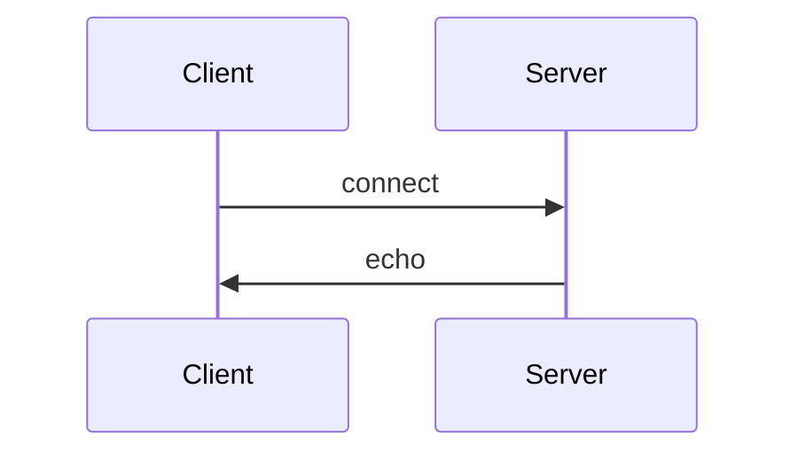

# 26주차: Asio 에코 서버

"IOCP보다 훨씬 쉽죠?"
Asio를 사용하면 복잡한 Overlapped 구조체나 `GetQueuedCompletionStatus` 루프 없이도 고성능 비동기 서버를 만들 수 있습니다.
이번 주에는 Asio로 TCP 에코 서버를 구현하며 **비동기 소켓 입출력**을 익힙니다.

## 1. 학습 목표
- **Acceptor**: 연결을 수락하는 `tcp::acceptor` 사용법.
- **Socket**: 데이터를 주고받는 `tcp::socket` 사용법.
- **shared_from_this**: 비동기 작업 중 객체 수명을 관리하는 표준 패턴.

## 2. 핵심 이론: shared_from_this
비동기 작업(`async_read`)을 걸어두고 함수를 빠져나가면, `Session` 객체가 소멸될 위험이 있습니다.
이때 람다 캡처에 `shared_from_this()`를 넘겨주면, 비동기 작업이 끝날 때까지 참조 카운트가 유지되어 객체가 살아있게 됩니다.
```cpp
void do_read() {
    auto self(shared_from_this()); // 나를 붙잡아둠
    socket_.async_read_some(..., [this, self](...) {
        // 작업 완료 시 self가 소멸되면서 참조 카운트 감소
    });
}
```

## 3. 구현 가이드
1.  **Server 클래스**: `acceptor`를 가지고 `do_accept` 루프를 돕니다.
2.  **Session 클래스**: `socket`을 가지고 `do_read` <-> `do_write` 핑퐁을 칩니다.

## 4. Common Pitfalls (흔한 실수)
> [!DANGER]
> **1. std::bind vs Lambda**
> 예전 예제들은 `std::bind`를 많이 썼지만, 모던 C++에서는 **Lambda**가 훨씬 가독성이 좋고 성능도 우수합니다.
> 람다를 쓰세요!

> [!WARNING]
> **2. 버퍼 수명**
> `async_write`에 넘긴 버퍼(`std::string` 등)는 전송이 완료될 때까지 살아있어야 합니다.
> 임시 변수를 넘기면 안 됩니다. 보통 `Session` 멤버 변수나 `shared_ptr`로 관리되는 버퍼를 씁니다.

## 5. 실습
1.  **01_asio_echo.cpp**: Asio 에코 서버 구현.

## Theory Overview
- Asio의 Proactor 모델과 `io_context` 동작 원리를 설명합니다.
- `shared_from_this` 를 이용한 객체 수명 관리 개념을 다룹니다.

## Step‑by‑Step Guide
1. `setup_asio.bat` 실행하여 헤더를 준비합니다.
2. `build_cmake.bat` 로 빌드합니다.
3. `Debug\01_asio_echo.exe` 실행해 에코 동작을 확인합니다.
4. 로그를 통해 연결·읽기·쓰기 흐름을 검증합니다.

## Common Pitfalls
- **버퍼 수명**: `async_write`에 전달하는 버퍼는 작업이 끝날 때까지 살아 있어야 합니다. 멤버 변수나 `shared_ptr` 로 관리하세요.
- **std::bind vs Lambda**: 현대 C++에서는 가독성·성능 모두 좋은 Lambda 사용을 권장합니다.

## Diagram

