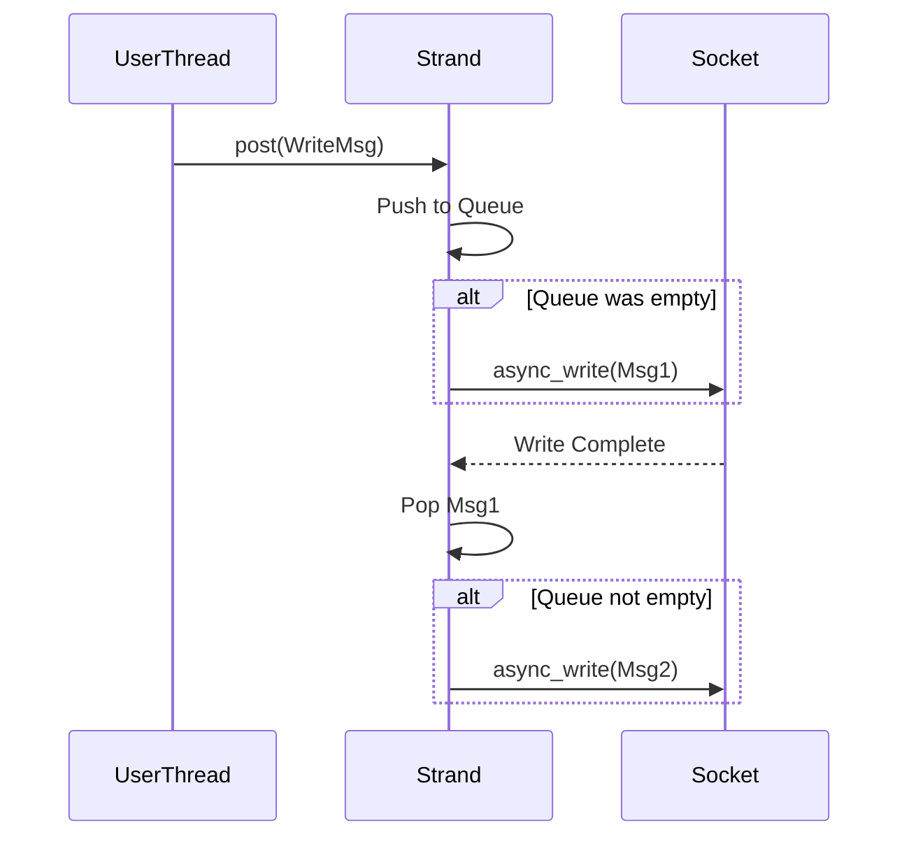

# 27주차: Asio 채팅 서버

"Asio로 채팅방을 만들어봅시다."
Week 23의 IOCP 채팅 서버를 Asio 버전으로 포팅합니다.
Asio의 강력한 기능인 **Strand**를 사용하면 락(Mutex) 없이도 멀티쓰레드 동기화가 가능합니다. (이번 예제는 간단히 Mutex 없이 단일 쓰레드 혹은 묵시적 동기화를 가정하지만, 심화 학습으로 Strand를 알아두면 좋습니다.)

## 1. 학습 목표
- **채팅방(Room) 추상화**: 참여자(`Participant`) 관리 및 메시지 배달(`Deliver`).
- **쓰레드 안전성**: 여러 세션이 동시에 채팅방에 접근할 때의 처리.
- **메시지 큐**: 보내야 할 메시지들을 큐에 쌓아두고 순차적으로 전송 (`async_write` 중복 호출 방지).

## 2. 핵심 이론: Write Queue
Asio에서 `async_write`는 **동시에 여러 번 호출하면 안 됩니다.** (소켓 하나당 한 번의 Write만 진행 중이어야 함).
따라서 채팅방에서 여러 명이 동시에 말을 걸면, 메시지를 바로 `async_write` 하는 게 아니라 **큐(Queue)**에 넣고,
"지금 보내고 있는 게 없으면" 보내기 시작하는 로직이 필요합니다.

```cpp
void deliver(const string& msg) {
    bool write_in_progress = !write_msgs_.empty();
    write_msgs_.push_back(msg);
    if (!write_in_progress) {
        do_write(); // 큐의 맨 앞 메시지 전송 시작
    }
}
```

## 3. Common Pitfalls (흔한 실수)
> [!CAUTION]
> **1. async_write 중복 호출**
> 위에서 설명했듯, 이미 전송 중인데 또 `async_write`를 호출하면 데이터가 섞이거나 크래시가 날 수 있습니다.
> 반드시 큐를 사용하여 순차적으로 처리해야 합니다.

> [!TIP]
> **2. Strand (스트랜드)**
> 멀티쓰레드 환경에서 `io_context.run()`을 여러 쓰레드가 돌릴 때,
# 27주차: Asio 채팅 서버

"Asio로 채팅방을 만들어봅시다."
Week 23의 IOCP 채팅 서버를 Asio 버전으로 포팅합니다.
Asio의 강력한 기능인 **Strand**를 사용하면 락(Mutex) 없이도 멀티쓰레드 동기화가 가능합니다. (이번 예제는 간단히 Mutex 없이 단일 쓰레드 혹은 묵시적 동기화를 가정하지만, 심화 학습으로 Strand를 알아두면 좋습니다.)

## 0. 미리 알면 좋은 용어 (Friendly Terms)
- **Chat Room (채팅방)**: "대화 공간". 여러 세션(참여자)을 관리하고 메시지를 뿌려주는 관리자 객체입니다.
- **Write Queue (쓰기 대기열)**: "우체통". 보내야 할 편지(메시지)들을 순서대로 쌓아두는 곳입니다.
- **Strand (스트랜드)**: "외길". 여러 쓰레드가 동시에 달려들어도, 이 길 위에서는 한 번에 한 명만 지나가게 해주는 교통정리 도구입니다. (락 없이 동기화 가능)

## 1. 핵심 개념
### A. 학습 목표
- **채팅방(Room) 추상화**: 참여자(`Participant`) 관리 및 메시지 배달(`Deliver`).
- **쓰레드 안전성**: 여러 세션이 동시에 채팅방에 접근할 때의 처리.
- **메시지 큐**: 보내야 할 메시지들을 큐에 쌓아두고 순차적으로 전송 (`async_write` 중복 호출 방지).

### B. 핵심 이론: Write Queue
Asio에서 `async_write`는 **동시에 여러 번 호출하면 안 됩니다.** (소켓 하나당 한 번의 Write만 진행 중이어야 함).
따라서 채팅방에서 여러 명이 동시에 말을 걸면, 메시지를 바로 `async_write` 하는 게 아니라 **큐(Queue)**에 넣고,
"지금 보내고 있는 게 없으면" 보내기 시작하는 로직이 필요합니다.

```cpp
void deliver(const string& msg) {
    bool write_in_progress = !write_msgs_.empty();
    write_msgs_.push_back(msg);
    if (!write_in_progress) {
        do_write(); // 큐의 맨 앞 메시지 전송 시작
    }
}
```

## 2. 자주 하는 실수 (Common Pitfalls)
> [!CAUTION]
> **1. async_write 중복 호출**
> 위에서 설명했듯, 이미 전송 중인데 또 `async_write`를 호출하면 데이터가 섞이거나 크래시가 날 수 있습니다.
> 반드시 큐를 사용하여 순차적으로 처리해야 합니다.

> [!TIP]
> **2. Strand (스트랜드)**
> 멀티쓰레드 환경에서 `io_context.run()`을 여러 쓰레드가 돌릴 때,
> 특정 핸들러들이 순차적으로 실행되도록 보장해주는 장치입니다.
> `asio::strand`를 쓰면 명시적인 `mutex` 없이도 동기화가 가능합니다.

## 3. 실습 가이드
### A. 실습 예제
1.  **01_asio_chat.cpp**: `ChatRoom`, `ChatSession`을 이용한 채팅 서버.

## 4. Step-by-Step Guide
1. `build_cmake.bat`를 실행하여 빌드합니다.
2. `Debug/01_asio_chat.exe`를 실행합니다.
3. 여러 클라이언트로 접속하여 채팅이 잘 되는지 확인합니다.

## 5. 빌드 및 실행
**중요**: 터미널을 새로 열었다면 먼저 루트 폴더(`E:\repos\C++_Study`)의 `setup_env.bat`를 실행해주세요.

### 방법 A: CMake 사용 (자동 스크립트)
```powershell
.\build_cmake.bat
```

## 6. Diagram

