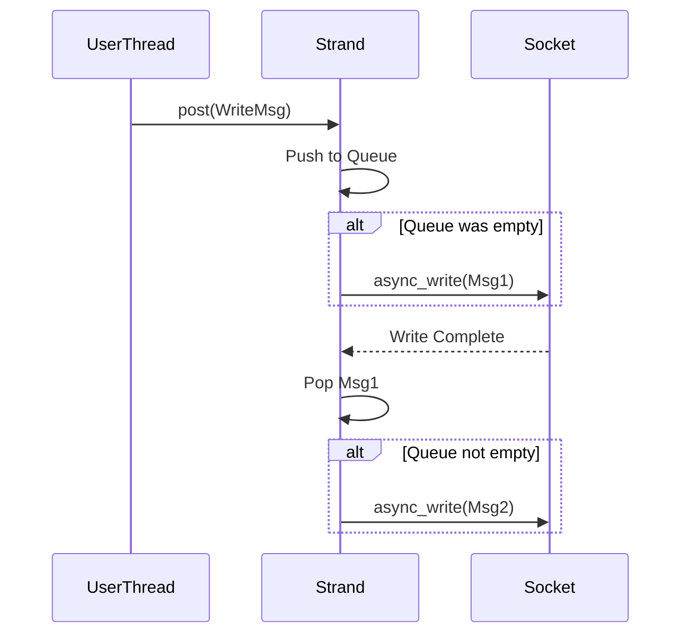

# 27주차: Asio 채팅 서버

"Asio로 채팅방을 만들어봅시다."
Week 23의 IOCP 채팅 서버를 Asio 버전으로 포팅합니다.
Asio의 강력한 기능인 **Strand**를 사용하면 락(Mutex) 없이도 멀티쓰레드 동기화가 가능합니다. (이번 예제는 간단히 Mutex 없이 단일 쓰레드 혹은 묵시적 동기화를 가정하지만, 심화 학습으로 Strand를 알아두면 좋습니다.)

## 1. 학습 목표
- **채팅방(Room) 추상화**: 참여자(`Participant`) 관리 및 메시지 배달(`Deliver`).
- **쓰레드 안전성**: 여러 세션이 동시에 채팅방에 접근할 때의 처리.
- **메시지 큐**: 보내야 할 메시지들을 큐에 쌓아두고 순차적으로 전송 (`async_write` 중복 호출 방지).

## 2. 핵심 이론: Write Queue
Asio에서 `async_write`는 **동시에 여러 번 호출하면 안 됩니다.** (소켓 하나당 한 번의 Write만 진행 중이어야 함).
따라서 채팅방에서 여러 명이 동시에 말을 걸면, 메시지를 바로 `async_write` 하는 게 아니라 **큐(Queue)**에 넣고,
"지금 보내고 있는 게 없으면" 보내기 시작하는 로직이 필요합니다.

```cpp
void deliver(const string& msg) {
    bool write_in_progress = !write_msgs_.empty();
    write_msgs_.push_back(msg);
    if (!write_in_progress) {
        do_write(); // 큐의 맨 앞 메시지 전송 시작
    }
}
```

## 3. Common Pitfalls (흔한 실수)
> [!CAUTION]
> **1. async_write 중복 호출**
> 위에서 설명했듯, 이미 전송 중인데 또 `async_write`를 호출하면 데이터가 섞이거나 크래시가 날 수 있습니다.
> 반드시 큐를 사용하여 순차적으로 처리해야 합니다.

> [!TIP]
> **2. Strand (스트랜드)**
> 멀티쓰레드 환경에서 `io_context.run()`을 여러 쓰레드가 돌릴 때,
# 27주차: Asio 채팅 서버

"Asio로 채팅방을 만들어봅시다."
Week 23의 IOCP 채팅 서버를 Asio 버전으로 포팅합니다.
Asio의 강력한 기능인 **Strand**를 사용하면 락(Mutex) 없이도 멀티쓰레드 동기화가 가능합니다. (이번 예제는 간단히 Mutex 없이 단일 쓰레드 혹은 묵시적 동기화를 가정하지만, 심화 학습으로 Strand를 알아두면 좋습니다.)

## 1. 학습 목표
- **채팅방(Room) 추상화**: 참여자(`Participant`) 관리 및 메시지 배달(`Deliver`).
- **쓰레드 안전성**: 여러 세션이 동시에 채팅방에 접근할 때의 처리.
- **메시지 큐**: 보내야 할 메시지들을 큐에 쌓아두고 순차적으로 전송 (`async_write` 중복 호출 방지).

## 2. 핵심 이론: Write Queue
Asio에서 `async_write`는 **동시에 여러 번 호출하면 안 됩니다.** (소켓 하나당 한 번의 Write만 진행 중이어야 함).
따라서 채팅방에서 여러 명이 동시에 말을 걸면, 메시지를 바로 `async_write` 하는 게 아니라 **큐(Queue)**에 넣고,
"지금 보내고 있는 게 없으면" 보내기 시작하는 로직이 필요합니다.

```cpp
void deliver(const string& msg) {
    bool write_in_progress = !write_msgs_.empty();
    write_msgs_.push_back(msg);
    if (!write_in_progress) {
        do_write(); // 큐의 맨 앞 메시지 전송 시작
    }
}
```

## 3. Common Pitfalls (흔한 실수)
> [!CAUTION]
> **1. async_write 중복 호출**
> 위에서 설명했듯, 이미 전송 중인데 또 `async_write`를 호출하면 데이터가 섞이거나 크래시가 날 수 있습니다.
> 반드시 큐를 사용하여 순차적으로 처리해야 합니다.

> [!TIP]
> **2. Strand (스트랜드)**
> 멀티쓰레드 환경에서 `io_context.run()`을 여러 쓰레드가 돌릴 때,
> 특정 핸들러들이 순차적으로 실행되도록 보장해주는 장치입니다.
> `asio::strand`를 쓰면 명시적인 `mutex` 없이도 동기화가 가능합니다.

## 4. 실습
1.  **01_asio_chat.cpp**: `ChatRoom`, `ChatSession`을 이용한 채팅 서버.


## Theory Overview
- **Asio Chat Server**: 비동기 I/O를 활용한 다자간 채팅 서버의 구조를 설명합니다.
- **Strand**: 멀티쓰레드 환경에서 핸들러의 실행 순서를 보장하고 동기화 비용을 줄이는 `asio::strand`를 다룹니다.
- **Write Queue**: 비동기 쓰기(`async_write`)가 겹치지 않도록 메시지를 큐잉하는 패턴을 학습합니다.

## Step-by-Step Guide
1. `build_cmake.bat`를 실행하여 빌드합니다.
2. `Debug/01_asio_chat_server.exe`를 실행합니다.
3. `Week12/Debug/02_EchoClient.exe`를 여러 개 실행하여 채팅을 시도합니다.
4. 모든 클라이언트에게 메시지가 브로드캐스팅되는지 확인합니다.

## Common Pitfalls
> [!IMPORTANT]
> **1. async_write 중복 호출 금지**
> Asio 소켓은 한 번에 하나의 `async_write` 작업만 수행할 수 있습니다.
> 이전 `async_write`가 끝나기 전에 또 호출하면 데이터가 섞이거나 크래시가 납니다.
> -> **해결책**: `Write Queue`를 만들어서, 큐가 비어있을 때만 `async_write`를 호출하고, 완료 핸들러에서 큐를 확인해 다음 작업을 수행해야 합니다.

> [!WARNING]
> **2. Strand 없는 멀티쓰레드**
> `io_context`가 여러 쓰레드에서 돌아갈 때, `strand` 없이 핸들러를 등록하면 핸들러들이 동시에 실행되어 경쟁 조건(Race Condition)이 발생합니다.
> 반드시 `asio::bind_executor(strand_, ...)`를 사용하여 핸들러를 감싸야 합니다.

## Diagram

