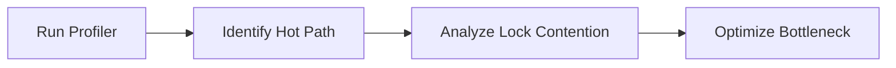

# 28주차: 성능 프로파일링

"왜 이렇게 느리죠?"
서버 개발자의 영원한 숙제, 최적화.
하지만 "여기가 느릴 거야"라는 추측(뇌피셜)으로 코드를 고치면 안 됩니다.
반드시 **프로파일러(Profiler)**를 써서 과학적으로 병목 지점을 찾아야 합니다.

## 1. 학습 목표
- **프로파일링 도구 사용법**: Visual Studio Performance Profiler 기초.
- **Hot Path 식별**: CPU를 가장 많이 쓰는 함수 찾기.
- **Lock Contention 분석**: 락 때문에 대기하는 시간 측정.

## 2. 핵심 이론
### 2.1. Sampling vs Instrumentation
- **Sampling**: 주기적으로(예: 1ms마다) CPU가 어디를 실행 중인지 훔쳐봅니다. 오버헤드가 적어 실서버 분석에 적합합니다.
- **Instrumentation**: 함수 진입/종료마다 기록을 남깁니다. 정확하지만 느립니다.
- Visual Studio는 주로 Sampling 방식을 씁니다.

### 2.2. 락 경합 (Lock Contention)
멀티쓰레드 프로그램이 느린 주범입니다.
CPU 사용률은 낮은데 처리량이 안 나온다면, 대부분 쓰레드들이 락을 얻기 위해 **대기(Wait)**하고 있는 상태입니다.

## 3. 실습 가이드
1.  **01_slow_server.cpp**: 일부러 무거운 연산과 락 경합을 넣은 예제입니다.
2.  **분석 단계**:
    -   Visual Studio 상단 메뉴 `Debug` -> `Performance Profiler` (단축키 `Alt+F2`).
    -   `CPU Usage` 체크 -> `Start`.
    -   프로그램을 10초 정도 돌리고 `Stop Collection`.
    -   결과 리포트에서 `heavy_computation`과 `lock_contention` 함수가 상위에 뜨는지 확인합니다.

## 4. Common Pitfalls (흔한 실수)
> [!WARNING]
> **1. Debug 모드에서 프로파일링**
> Debug 모드는 최적화가 꺼져있고 디버그 코드가 들어가 있어 매우 느립니다.
> 성능 측정은 반드시 **Release 모드**에서 해야 정확합니다.

> [!TIP]
> **2. Premature Optimization (성급한 최적화)**
> "이거 비트 연산으로 바꾸면 빠르겠지?" -> 하지 마세요.
> 전체 성능의 90%는 10%의 코드에서 나옵니다. 프로파일러가 가리키는 그 10%만 고치세요.

## 5. 실습
1.  **01_slow_server.cpp**: 프로파일링 대상 코드.

## Theory Overview
- Profiling의 Sampling vs Instrumentation 방식과 Lock Contention 분석 개념을 설명합니다.
- Visual Studio Performance Profiler 사용법과 병목 지점 식별 방법을 다룹니다.

## Step‑by‑Step Guide
1. `build_cmake.bat` 로 **Release 모드**로 빌드합니다.
2. Visual Studio에서 `Debug` → `Performance Profiler` (Alt+F2)를 엽니다.
3. `CPU Usage` 체크 후 `Start`.
4. 프로그램을 10초 정도 실행 후 `Stop Collection`.
5. 결과 리포트에서 `heavy_computation`과 `lock_contention` 함수 확인.

## Common Pitfalls
- **Debug 모드 프로파일링**: Debug 모드는 최적화가 꺼져 있어 부정확합니다. 반드시 Release 모드로 측정하세요.
- **성급한 최적화**: 프로파일러가 가리키지 않은 부분을 먼저 최적화하지 마세요. 전체 성능의 90%는 10%의 코드에서 나옵니다.

## Diagram

