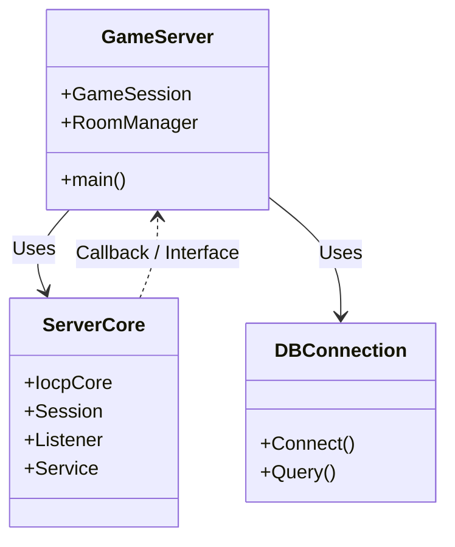

# 29주차: [Final] 종합 프로젝트 - 아키텍처 설계

"대망의 최종 프로젝트."
지금까지 배운 모든 기술(IOCP/Asio, DB, 세션, 패킷, 동기화)을 총동원하여 **확장 가능한 채팅 서버**를 구축합니다.
29주차부터 32주차까지는 하나의 거대한 프로젝트를 단계별로 완성해 나가는 과정입니다.

## 1. 프로젝트 개요
- **목표**: MMORPG 서버의 축소판인 **고성능 채팅/로비 서버** 구현.
- **기술 스택**: C++23, Boost.Asio (Standalone), Mock DB.
- **구조**:
    -   `ServerCore`: 재사용 가능한 네트워크 엔진 라이브러리.
    -   `GameServer`: 실제 컨텐츠(채팅, 방) 로직.
    -   `DummyClient`: 부하 테스트 툴.

## 2. 폴더 구조
```
Week29/
├── src/
│   ├── ServerCore/   # 30주차 구현
│   ├── GameServer/   # 31주차 구현
│   └── main.cpp      # 진입점
├── CMakeLists.txt
└── README.md
```

## 3. 아키텍처 설계
### 3.1. Layered Architecture
1.  **Network Layer**: `Session`, `Listener` (Asio 래핑). 비동기 입출력 담당.
2.  **Logic Layer**: `PacketHandler`, `RoomManager`. 게임 규칙 처리.
3.  **Data Layer**: `DBConnection`. 데이터 영구 저장.

## 4. 실습 가이드
이번 주차에는 프로젝트의 **골격(Skeleton)**을 잡습니다.
`main.cpp`에서 서버가 시작되고 종료되는 전체 흐름을 확인하세요.

## 5. 빌드 및 실행
```powershell
.\build_cmake.bat
```


## Theory Overview
- **Layered Architecture**: 소프트웨어를 유사한 관심사(Concern)를 가진 계층으로 나누는 아키텍처 패턴입니다.
- **Dependency Rule**: 상위 계층은 하위 계층을 의존할 수 있지만, 하위 계층은 상위 계층을 의존하면 안 된다는 원칙을 설명합니다.
- **Component Separation**: 네트워크 엔진(`ServerCore`)과 게임 컨텐츠(`GameServer`)를 분리하여 재사용성을 높이는 방법을 다룹니다.

## Step-by-Step Guide
1. `build_cmake.bat`를 실행하여 전체 솔루션을 빌드합니다.
2. `src/ServerCore` 폴더를 열어 네트워크 라이브러리의 구조를 파악합니다.
3. `src/GameServer` 폴더를 열어 컨텐츠 코드가 어떻게 분리되어 있는지 확인합니다.
4. `Debug/GameServer.exe`를 실행하여 서버가 정상적으로 구동되는지 확인합니다.

## Common Pitfalls
> [!WARNING]
> **1. 계층 경계 위반 (Layer Violation)**
> `ServerCore`(하위 계층)에서 `GameServer`(상위 계층)의 헤더를 포함하거나 함수를 호출하면 안 됩니다.
> 이렇게 되면 순환 의존성이 생겨 컴파일이 불가능하거나 유지보수가 매우 어려워집니다.
> -> 필요한 경우 **인터페이스(Interface)**나 **콜백(Callback)**을 사용하세요.

> [!TIP]
> **2. 조급한 구현 (Premature Coding)**
> 전체적인 아키텍처와 데이터 흐름을 설계하지 않고 코딩부터 시작하면, 나중에 구조를 바꾸기 위해 엄청난 비용을 치르게 됩니다.
> 종이와 펜으로 클래스 다이어그램을 먼저 그려보세요.

## Diagram

