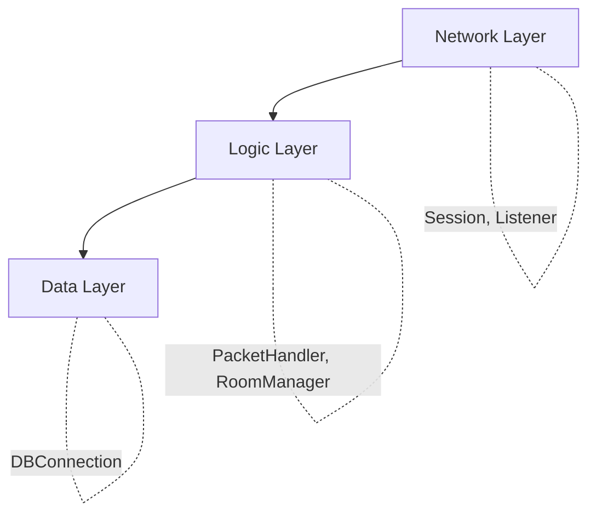

# 29주차: [Final] 종합 프로젝트 - 아키텍처 설계

"대망의 최종 프로젝트."
지금까지 배운 모든 기술(IOCP/Asio, DB, 세션, 패킷, 동기화)을 총동원하여 **확장 가능한 채팅 서버**를 구축합니다.
29주차부터 32주차까지는 하나의 거대한 프로젝트를 단계별로 완성해 나가는 과정입니다.

## 1. 프로젝트 개요
- **목표**: MMORPG 서버의 축소판인 **고성능 채팅/로비 서버** 구현.
- **기술 스택**: C++23, Boost.Asio (Standalone), Mock DB.
- **구조**:
    -   `ServerCore`: 재사용 가능한 네트워크 엔진 라이브러리.
    -   `GameServer`: 실제 컨텐츠(채팅, 방) 로직.
    -   `DummyClient`: 부하 테스트 툴.

## 2. 폴더 구조
```
Week29/
├── src/
│   ├── ServerCore/   # 30주차 구현
│   ├── GameServer/   # 31주차 구현
│   └── main.cpp      # 진입점
├── CMakeLists.txt
└── README.md
```

## 3. 아키텍처 설계
### 3.1. Layered Architecture
1.  **Network Layer**: `Session`, `Listener` (Asio 래핑). 비동기 입출력 담당.
2.  **Logic Layer**: `PacketHandler`, `RoomManager`. 게임 규칙 처리.
3.  **Data Layer**: `DBConnection`. 데이터 영구 저장.

## 4. 실습 가이드
이번 주차에는 프로젝트의 **골격(Skeleton)**을 잡습니다.
`main.cpp`에서 서버가 시작되고 종료되는 전체 흐름을 확인하세요.

## 5. 빌드 및 실행
```powershell
.\build_cmake.bat
```

## Theory Overview
- Layered Architecture (Network, Logic, Data)와 각 계층의 역할을 설명합니다.
- 재사용 가능한 네트워크 엔진과 게임 로직 분리의 중요성을 다룹니다.

## Step‑by‑Step Guide
1. 폴더 구조를 확인하고 `ServerCore`, `GameServer` 모듈을 이해합니다.
2. `main.cpp`에서 서버 시작/종료 흐름을 분석합니다.
3. `build_cmake.bat`로 프로젝트를 빌드합니다.
4. 실행하여 기본 골격이 정상적으로 동작하는지 확인합니다.

## Common Pitfalls
- **계층 경계 위반**: Network Layer에서 비즈니스 로직을 처리하면 안 됩니다. 각 계층의 역할을 명확히 분리하세요.
- **조급한 구현**: 아키텍처 설계가 확정되기 전에 코드를 작성하면 나중에 대규모 리팩토링이 필요합니다.

## Diagram

