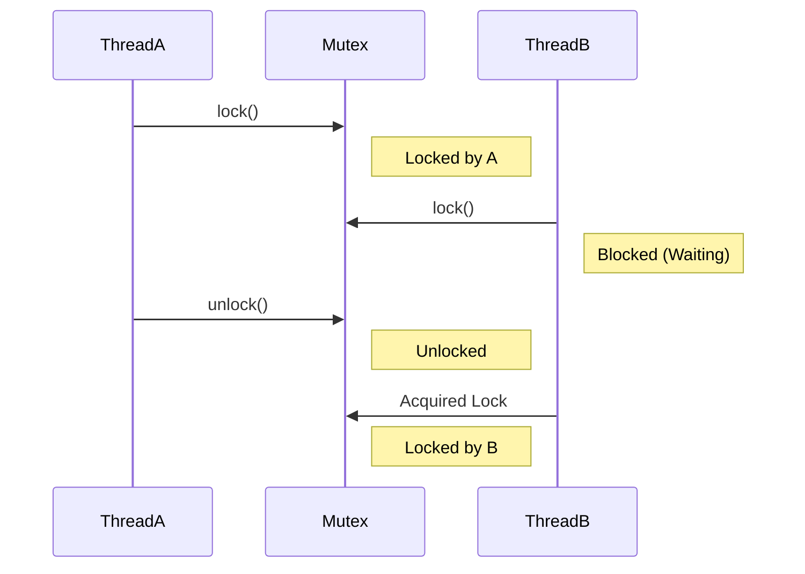

# 3주차: 데이터 공유와 경쟁 조건 (Data Sharing)

벌써 3주차입니다. 시간이 참 빠르죠?
지난 주에 "글자가 뒤죽박죽 섞이는 현상"을 보셨을 겁니다. 이번 주에는 그걸 해결하는 **동기화(Synchronization)**를 배웁니다.

## 0. 미리 알면 좋은 용어 (Friendly Terms)
- **Mutex (뮤텍스)**: "화장실 열쇠"입니다. 화장실(공유 데이터)은 한 번에 한 명만 쓸 수 있습니다. 열쇠를 가진 사람만 들어가고, 나올 때 열쇠를 반납해야 다음 사람이 들어갈 수 있습니다.
- **Race Condition (경쟁 조건)**: "새치기" 또는 "달리기 시합"입니다. 여러 쓰레드가 서로 먼저 데이터를 차지하려고 다투다가, 순서가 꼬여서 결과가 엉망이 되는 상황입니다.
- **Critical Section (임계 영역)**: "보호 구역"입니다. 한 번에 오직 하나의 쓰레드만 실행해야 하는 코드 영역입니다. (예: 변수 값을 수정하는 코드)

## 1. 핵심 개념

### A. 경쟁 조건 (Race Condition)
여러 쓰레드가 동시에 같은 데이터(메모리)를 건드리면 사단이 납니다.
- **Data Race (데이터 레이스)**: 적어도 하나의 쓰레드가 데이터를 쓰고(Write), 동시에 다른 쓰레드가 그 데이터를 읽거나(Read) 쓸 때 발생합니다.
- **결과**: 데이터가 깨지거나, 프로그램이 죽거나, 매번 실행할 때마다 다른 값이 나오는 등 예측 불가능한 동작(Undefined Behavior)을 합니다.

### B. 상호 배제 (Mutual Exclusion)
"나 쓸 동안 너네는 건드리지 마!"
이것을 구현하는 도구가 바로 **`std::mutex`**입니다.
- **`lock()`**: 자물쇠를 잠급니다. 이미 누가 잠갔다면, 그 사람이 열어줄 때까지 하염없이 기다립니다(Blocking).
- **`unlock()`**: 자물쇠를 엽니다. 기다리던 다른 쓰레드가 이제 들어올 수 있습니다.

### C. Lock Guard (RAII)
`lock()`을 하고 나서 실수로 `unlock()`을 안 하면 어떻게 될까요?
-> **Deadlock(교착 상태)**이 발생하여 프로그램이 영원히 멈춥니다.
그래서 C++에서는 직접 `lock/unlock`을 호출하는 것을 권장하지 않습니다. 대신 RAII 객체를 사용합니다.

- **`std::lock_guard`**: 생성될 때 잠그고, 소멸될 때(함수가 끝날 때) 알아서 엽니다. 가장 가볍고 빠릅니다.
- **`std::unique_lock`**: `lock_guard`보다 기능이 많습니다. 중간에 잠시 풀었다가(`unlock`) 다시 잠글(`lock`) 수도 있고, 나중에 잠글 수도 있습니다.

## 2. 자주 하는 실수 (Common Pitfalls)

> [!DANGER]
> **1. `unlock()` 까먹기 (Deadlock의 주범)**
> ```cpp
> mtx.lock();
> // ... 여기서 에러가 나서 함수가 종료되거나 예외가 발생하면?
> // mtx.unlock(); // 이 코드가 실행되지 않음 -> 영원히 잠김
> ```
> -> **해결**: 무조건 `std::lock_guard`나 `std::unique_lock`을 쓰세요. 예외가 발생해도 소멸자는 호출되므로 안전하게 잠금이 해제됩니다.

> [!WARNING]
> **2. 읽기 작업은 안전하다?**
> "나는 값만 읽을 거니까 락 안 걸어도 되겠지?" -> **절대 아닙니다!**
> 누군가 값을 수정하고(Write) 있는 도중에 읽으면(Read), 엉터리 값을 읽거나 프로그램이 죽을 수 있습니다.
> 쓰는 사람이 아예 없을 때만 읽기가 안전합니다.

> [!IMPORTANT]
> **3. 락 순서 꼬임**
> 쓰레드 A는 `Lock1 -> Lock2` 순서로, 쓰레드 B는 `Lock2 -> Lock1` 순서로 잡으려 하면 서로 기다리다 멈춥니다.
> -> **해결**: 모든 쓰레드에서 락을 잡는 순서를 통일해야 합니다. 혹은 C++17의 `std::scoped_lock`을 사용하면 알아서 안전하게 잠가줍니다.

## 3. 실습 가이드

`Week3/src` 폴더의 예제들을 순서대로 실행해보세요.

1. **01_race_condition.cpp**: 
   - 쓰레드들이 `counter` 변수를 1씩 10만 번 더합니다.
   - 결과가 20만이 나와야 하는데... 과연? (충격적인 결과를 보실 겁니다)
2. **02_mutex_guard.cpp**: 
   - `std::mutex`와 `std::lock_guard`로 위 문제를 해결합니다.
   - 속도는 좀 느려지지만, 결과는 정확해집니다.
3. **03_thread_safe_list.cpp**: 
   - 리스트(std::list)에 데이터를 넣고(`push_back`) 확인하는 작업을 안전하게 보호하는 클래스를 만들어봅니다.

## 4. Step-by-Step Guide
1. `build_cmake.bat`를 실행하여 빌드합니다.
2. `Debug/01_race_condition.exe`를 실행하여 데이터 레이스로 인한 잘못된 결과를 확인합니다.
3. `Debug/02_mutex_guard.exe`를 실행하여 Mutex 적용 후 올바른 결과(200000)가 나오는지 확인합니다.
4. `Debug/03_thread_safe_list.exe`를 실행하여 리스트 보호 로직을 검증합니다.

## 5. 빌드 및 실행
이번 주도 똑같습니다. `Week3` 폴더에서:

```powershell
.\build_cmake.bat
```

실행 파일은 `Week3/build/Debug` 폴더에 생성됩니다.

## 6. Diagram


