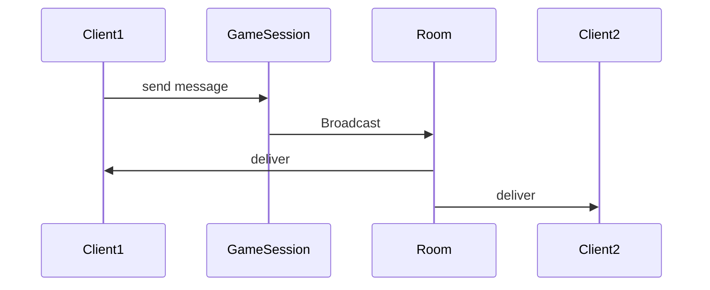

# 31주차: [Final] 게임 로직 (GameServer) 구현

"엔진 위에 컨텐츠를 올립니다."
Week 30에서 만든 `ServerCore`를 활용하여, 실제 채팅방 로직을 구현합니다.

## 1. 학습 목표
- **GameSession**: `ServerCore::Session`을 상속받아 실제 패킷 처리 로직 구현.
- **Room Manager**: 채팅방 입장/퇴장/브로드캐스팅 관리.
- **Packet Handling**: 수신된 데이터를 의미 있는 명령으로 해석.

## 2. 구현 상세
### 2.1. GameSession
```cpp
class GameSession : public Session {
    void OnRecv(char* data, int len) override {
        // 패킷 파싱 후 Room으로 전달
        room_->Broadcast(string(data, len));
    }
};
```

### 2.2. 동기화 전략
`Room` 클래스는 여러 세션이 동시에 접근하므로 `std::mutex`나 `Strand`로 보호해야 합니다.
이번 프로젝트에서는 간단하게 `std::mutex`를 사용하여 `Join`, `Leave`, `Broadcast` 함수를 보호합니다.

## 3. Common Pitfalls (흔한 실수)
> [!WARNING]
> **1. 락을 잡고 I/O 호출**
> `Room`의 락을 잡은 상태에서 `Broadacst` -> `Session::Send` -> `async_write`를 호출하는 것은 괜찮습니다(비동기니까).
> 하지만 만약 동기 `send`를 호출한다면 성능이 박살납니다.

## 4. 실습
1.  **src/main.cpp**: `GameSession`, `Room` 클래스가 추가된 완성된 서버 코드.

## Theory Overview
- GameSession의 패킷 처리 로직과 Room Manager의 브로드캠스팅 메커니즘을 설명합니다.
- 멀티스레드 환경에서 Room 동기화 전략('랍 사용 vs Strand)을 다룹니다.

## Step‑by‑Step Guide
1. `src/main.cpp`에서 `GameSession`과 `Room` 클래스를 분석합니다.
2. `build_cmake.bat`로 빌드합니다.
3. 서버를 실행하고 클라이언트를 여러 개 연결합니다.
4. 채팅 메시지가 모든 클라이언트에게 브로드캠스트되는지 확인합니다.

## Common Pitfalls
- **랍을 잡고 I/O 호출**: Room의 랍을 잡은 상태에서 동기 `send`를 호출하면 성능이 크게 저하합니다. 비동기 `async_write`를 사용하세요.
- **패킷 경계 처리**: TCP 스트림에서 패킷 경계를 처리하지 않으면 메시지가 잘리거나 합쳐지는 문제가 발생합니다. Week24의 Ring Buffer를 참고하세요.

## Diagram

