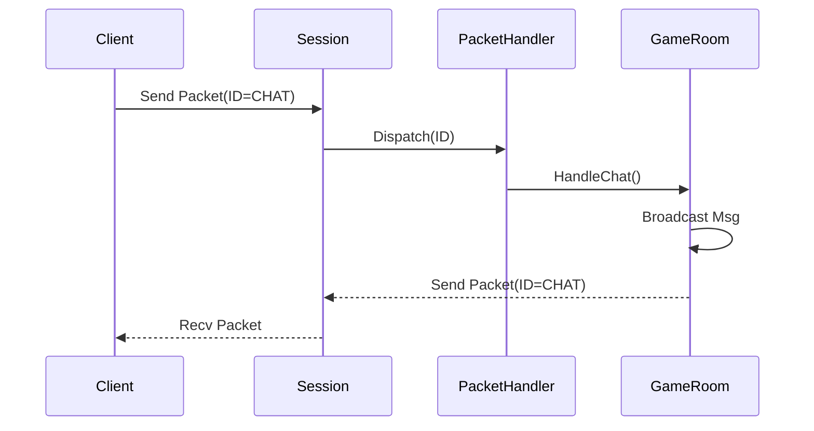

# 31주차: [Final] 게임 로직 (GameServer) 구현

"엔진 위에 컨텐츠를 올립니다."
Week 30에서 만든 `ServerCore`를 활용하여, 실제 채팅방 로직을 구현합니다.

## 0. 미리 알면 좋은 용어 (Friendly Terms)
- **Game Logic (게임 로직)**: "게임 규칙". 플레이어가 때리면 체력이 깎이고, 경험치가 오르는 등의 실제 게임 규칙입니다.
- **Room (방)**: "교실". 여러 플레이어가 모여서 서로 이야기하거나 상호작용하는 공간입니다.
- **Broadcasting (브로드캐스팅)**: "안내 방송". 방에 있는 모든 사람에게 동시에 메시지를 보내는 것입니다.
- **Packet Handler (패킷 핸들러)**: "분류 담당자". 들어온 편지(패킷)가 무슨 내용인지 보고, 담당 부서(함수)로 전달해주는 역할입니다.

## 1. 핵심 개념
### A. 학습 목표
- **GameSession**: `ServerCore::Session`을 상속받아 실제 패킷 처리 로직 구현.
- **Room Manager**: 채팅방 입장/퇴장/브로드캐스팅 관리.
- **Packet Handling**: 수신된 데이터를 의미 있는 명령으로 해석.

### B. Theory Overview
- **Game Content Logic**: 네트워크 엔진 위에서 돌아가는 실제 게임 로직(로그인, 방 입장, 채팅)을 구현합니다.
- **Packet Handling**: 수신된 패킷의 ID를 식별하고 적절한 핸들러 함수로 분기하는 과정을 설명합니다.
- **Room Management**: 채팅방(`GameRoom`)을 생성하고 유저를 입장/퇴장시키는 관리 로직을 다룹니다.

## 2. 자주 하는 실수 (Common Pitfalls)
> [!WARNING]
> **1. 락을 잡고 I/O 호출**
> `Room`의 락을 잡은 상태에서 `Broadacst` -> `Session::Send` -> `async_write`를 호출하는 것은 괜찮습니다(비동기니까).
> 하지만 만약 동기 `send`를 호출한다면 성능이 박살납니다.

> [!DANGER]
> **2. 네트워크 쓰레드에서 무거운 로직 수행**
> `OnRecv`는 I/O 쓰레드에서 호출됩니다. 여기서 DB 저장이나 복잡한 연산을 수행하면, 그동안 다른 패킷 처리가 멈춥니다.
> 무거운 작업은 반드시 **Job Queue**를 통해 로직 쓰레드로 넘겨야 합니다.

> [!WARNING]
> **3. 패킷 ID 불일치**
> 클라이언트와 서버가 약속한 패킷 ID가 다르면 엉뚱한 핸들러가 호출되거나 파싱 에러가 납니다.
> `Protocol.proto` 등을 사용하여 자동 생성하거나, `enum` 값을 철저히 맞춰야 합니다.

## 3. 실습 가이드
### A. GameSession
```cpp
class GameSession : public Session {
    void OnRecv(char* data, int len) override {
        // 패킷 파싱 후 Room으로 전달
        room_->Broadcast(string(data, len));
    }
};
```

### B. 동기화 전략
`Room` 클래스는 여러 세션이 동시에 접근하므로 `std::mutex`나 `Strand`로 보호해야 합니다.
이번 프로젝트에서는 간단하게 `std::mutex`를 사용하여 `Join`, `Leave`, `Broadcast` 함수를 보호합니다.

## 4. Step-by-Step Guide
1. `build_cmake.bat`를 실행하여 빌드합니다.
2. `Debug/GameServer.exe`를 실행합니다.
3. `Week12/Debug/02_EchoClient.exe`를 여러 개 실행하여 로그인 및 채팅 테스트를 진행합니다.
4. `RoomManager`가 세션을 정상적으로 관리하는지 로그로 확인합니다.

## 5. 빌드 및 실행
**중요**: 터미널을 새로 열었다면 먼저 루트 폴더(`E:\repos\C++_Study`)의 `setup_env.bat`를 실행해주세요.

### 방법 A: CMake 사용 (자동 스크립트)
```powershell
.\build_cmake.bat
```

## 6. Diagram

