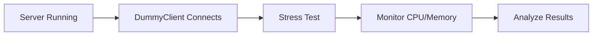

# 32주차: [Final] 최종 안정화 및 부하 테스트

"끝이 아닌 새로운 시작."
서버를 다 만들었지만, 테스트하지 않은 서버는 서버가 아닙니다.
**더미 클라이언트(Dummy Client)**를 만들어 서버를 괴롭혀보고, 얼마나 버티는지 확인합니다.

## 1. 학습 목표
- **Dummy Client**: 수백 개의 연결을 생성하고 자동으로 메시지를 보내는 봇(Bot) 구현.
- **Stress Test**: 서버의 한계(동시 접속자 수, 처리량) 측정.
- **회고**: 32주간의 여정을 정리하고 부족한 점 파악.

## 2. 구현 상세
### 2.1. Dummy Client 구조
서버와 똑같이 Asio를 사용하지만, `Connect`를 비동기로 여러 번 호출한다는 점이 다릅니다.
```cpp
for(int i=0; i<100; ++i) {
    auto client = make_shared<Client>(io, i);
    client->Connect("127.0.0.1", 9999);
}
```

## 3. 테스트 시나리오
1.  서버 실행.
2.  더미 클라이언트 실행 (접속자 100명).
3.  작업 관리자에서 서버의 CPU, 메모리 사용량 확인.
4.  서버 콘솔에 로그가 정상적으로 찍히는지 확인.

## 4. 축하합니다! 🎉
32주간의 긴 여정을 무사히 마치셨습니다.
이제 여러분은 C++로 고성능 네트워크 서버를 바닥부터 설계하고 구현할 수 있는 능력을 갖췄습니다.
이 프로젝트를 포트폴리오로 다듬거나, 더 복잡한 MMORPG 서버로 확장해보세요!

## 5. 실습
1.  **DummyClient/**: 부하 테스트용 클라이언트.
2.  **테스트**: 서버와 클라이언트를 실행하여 부하 테스트 진행.

## Theory Overview
- Dummy Client 구현과 Stress Test 방법론을 설명합니다.
- 서버의 동시 접속자 수와 처리량 한계를 측정하는 방법을 다룹니다.

## Step‑by‑Step Guide
1. `DummyClient/` 폴더에서 클라이언트 코드를 분석합니다.
2. `build_cmake.bat`로 서버와 클라이언트를 모두 빌드합니다.
3. 서버를 먼저 실행합니다.
4. Dummy Client를 실행해 100명의 동시 접속을 테스트합니다.
5. 작업 관리자에서 CPU/메모리 사용량을 모니터링합니다.

## Common Pitfalls
- **비현실적인 테스트**: 로컬 환경에서만 테스트하면 네트워크 지연이나 패킷 손실을 확인할 수 없습니다. 가능하면 외부 서버로 테스트하세요.
- **메모리 누수 경고**: 부하 테스트 후 메모리 사용량이 계속 증가한다면 메모리 누수가 있는 것입니다. Valgrind 등의 도구로 분석하세요.

## Diagram

