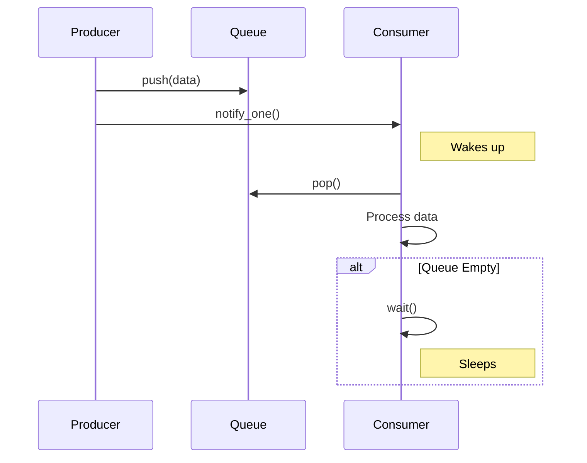

# 5주차: 쓰레드 간 신호 전달 (Condition Variable)

"언제까지 기다려야 해? 다 되면 깨워줘!"
이번 주에는 쓰레드끼리 효율적으로 신호를 주고받는 **Condition Variable(조건 변수)**를 배웁니다.

## 0. 미리 알면 좋은 용어 (Friendly Terms)
- **Condition Variable (조건 변수)**: "알림벨". 특정 조건이 만족될 때까지 자다가, 벨이 울리면 깨어나는 도구입니다.
- **Spurious Wakeup (가짜 기상)**: "자다가 깬 척". 아무도 안 깨웠는데 그냥 일어나는 현상입니다. (그래서 조건을 다시 확인해야 함)
- **Producer-Consumer (생산자-소비자)**: "요리사와 손님". 한쪽은 만들고(Notify), 한쪽은 기다렸다가 먹는(Wait) 패턴입니다.


## 1. 핵심 개념

### A. Polling vs Signaling
- **Polling**: "다 됐어? 다 됐어?" 계속 물어보는 것. (CPU 낭비)
- **Signaling**: "다 되면 깨워줘." 하고 자는 것. (효율적)
- `std::condition_variable`이 바로 이 '알람 시계' 역할을 합니다.

### B. 주요 함수
- **`wait(lock, predicate)`**: 락을 풀고 잠듭니다. 깨어나면 다시 락을 잡고 조건을 확인합니다.
- **`notify_one()`**: 자고 있는 쓰레드 중 하나를 깨웁니다.
- **`notify_all()`**: 자고 있는 모든 쓰레드를 깨웁니다.

### C. Producer-Consumer Pattern (생산자-소비자 패턴)
멀티쓰레딩의 꽃입니다.
- **생산자**: 데이터를 만들어 큐에 넣고 `notify`합니다.
- **소비자**: 큐가 비어있으면 `wait`하고, 데이터가 있으면 꺼내 처리합니다.

## 2. 자주 하는 실수 (Common Pitfalls)

### 1. Spurious Wakeup (가짜 기상)
누가 안 깨웠는데도 쓰레드가 그냥 일어나는 경우가 있습니다 (OS 스케줄링 이슈 등).
- **해결**: `wait` 할 때 반드시 **조건(Predicate)**을 같이 줘야 합니다.
```cpp
cv.wait(lock, []{ return !queue.empty(); }); // 큐가 비어있지 않을 때만 진짜로 일어남
```

### 2. Lost Wakeup (신호 놓침)
소비자가 `wait` 하러 들어가기 직전에 생산자가 `notify`를 해버리면?
- 소비자는 영원히 잠듭니다.
- **해결**: 반드시 `mutex`로 보호된 상태에서 조건을 검사하고 `wait` 해야 합니다.

## 3. 실습 가이드
1. **01_condition_variable.cpp**: 기본 사용법 익히기.
2. **02_producer_consumer.cpp**: 큐를 이용한 데이터 전달 구현.
3. **03_spurious_wakeup.cpp**: 조건 없이 `wait`만 하면 생기는 문제 확인.

## 4. 빌드 및 실행
```powershell
.\build_cmake.bat
```

## Diagram


## Step-by-Step Guide
1. `build_cmake.bat`를 실행하여 빌드합니다.
2. `Debug/01_condition_variable.exe`를 실행하여 `wait`와 `notify`의 기본 동작을 확인합니다.
3. `Debug/02_producer_consumer.exe`를 실행하여 생산자-소비자 패턴의 데이터 흐름을 관찰합니다.
4. `Debug/03_spurious_wakeup.exe`를 실행하여 조건 검사 없는 `wait`의 위험성을 확인합니다.
