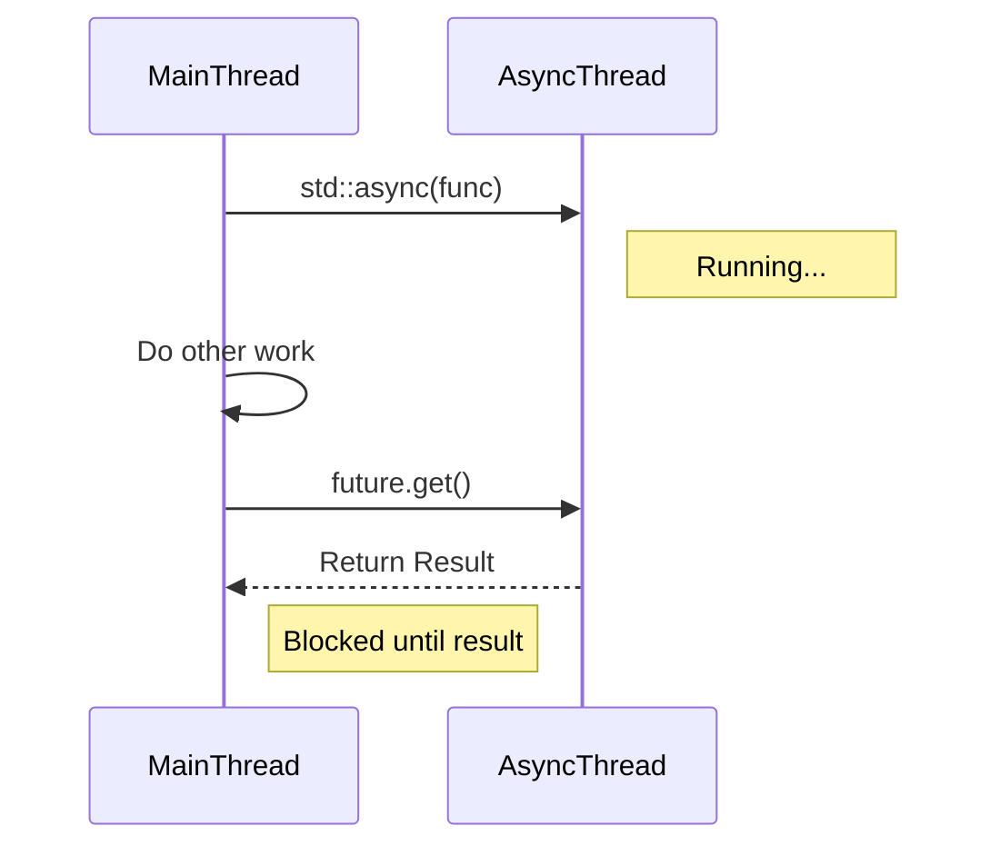

# 6주차: 비동기 결과 조회 (Future, Promise, Async)

"쓰레드가 끝날 때까지 기다리는 건 `join`으로 되는데, **결과값(리턴값)**은 어떻게 받죠?"
이번 주에는 쓰레드로부터 값을 받아오는 우아한 방법들을 배웁니다.

## 0. 미리 알면 좋은 용어 (Friendly Terms)
- **Future (퓨처)**: "교환권". 나중에 실제 값으로 바꿀 수 있는 티켓입니다.
- **Promise (프로미스)**: "약속 어음". 나중에 값을 채워주겠다고 약속하는 객체입니다.
- **Async (어싱크)**: "비동기 심부름". 다른 쓰레드에게 일을 시키고, 결과 교환권(Future)을 받아오는 함수입니다.


## 1. 핵심 개념

### A. `std::future` & `std::promise`
- **Promise**: "나중에 값을 줄게." (생산자 쪽)
- **Future**: "나중에 값을 받을게." (소비자 쪽)
- 둘은 짝꿍입니다. `promise`에 값을 세팅(`set_value`)하면, `future`에서 그 값을 꺼낼(`get`) 수 있습니다.

### B. `std::async`
- "쓰레드 만들고, 약속(promise)하고, 미래(future) 받고... 귀찮아!"
- 함수 하나로 비동기 실행과 결과 수신을 한방에 해결해줍니다.
- `std::async(std::launch::async, 함수)`: 새로운 쓰레드에서 실행.
- `std::async(std::launch::deferred, 함수)`: `get()` 할 때까지 미뤘다가 실행 (Lazy Evaluation).

### C. `std::shared_future`
- `std::future`는 `get()`을 한 번만 호출할 수 있습니다. (일회용)
- 여러 쓰레드가 동시에 같은 결과를 기다려야 한다면 `std::shared_future`를 씁니다.

## 2. 자주 하는 실수 (Common Pitfalls)

### 1. `std::async`의 리턴값 무시
```cpp
std::async(std::launch::async, []{ ... }); // 임시 객체 소멸!
```
- `std::async`가 리턴하는 `future`를 변수에 저장하지 않으면, 그 줄에서 즉시 `wait`가 걸려버립니다. (동기 실행처럼 됨)
- **해결**: 반드시 `auto fut = std::async(...)` 처럼 받아서 유지해야 합니다.

### 2. `future::get()` 두 번 호출
- `get()`은 값을 이동(Move)시켜서 가져옵니다. 두 번째 호출하면 예외가 발생합니다.
- **해결**: `valid()`로 확인하거나, 한 번만 호출하세요.

## 3. 실습 가이드
1. **01_promise_future.cpp**: 수동으로 채널을 열고 값을 주고받기.
2. **02_async_task.cpp**: `std::async`로 세상 편하게 비동기 작업하기.
3. **03_shared_future.cpp**: 하나의 결과를 여러 쓰레드에 방송(Broadcast)하기.

## 4. 빌드 및 실행
```powershell
.\build_cmake.bat
```

## Diagram


## Step-by-Step Guide
1. `build_cmake.bat`를 실행하여 빌드합니다.
2. `Debug/01_promise_future.exe`를 실행하여 수동으로 값을 전달하는 과정을 확인합니다.
3. `Debug/02_async_task.exe`를 실행하여 `std::async`의 편리함과 리턴값 처리 방식을 익힙니다.
4. `Debug/03_shared_future.exe`를 실행하여 하나의 결과를 여러 쓰레드가 공유하는 패턴을 확인합니다.
