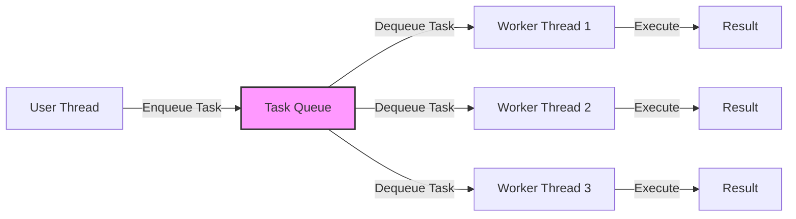

# 7주차: 쓰레드 풀 (Thread Pool)과 안전한 큐

"쓰레드를 매번 만들었다 지웠다 하는 건 너무 비싸요!"
이번 주에는 멀티쓰레딩의 꽃, **쓰레드 풀**을 직접 만들어봅니다.

## 0. 미리 알면 좋은 용어 (Friendly Terms)
- **Thread Pool (쓰레드 풀)**: "인력 사무소". 일꾼(쓰레드)들을 미리 뽑아놓고 대기시키는 곳입니다.
- **Task Queue (작업 큐)**: "일감 바구니". 해야 할 일들을 쌓아두는 곳입니다. 일꾼들이 여기서 하나씩 꺼내갑니다.


## 1. 핵심 개념

### A. 쓰레드 생성 비용
- 쓰레드 하나를 만드는 건 OS 입장에서 꽤 무거운 작업입니다 (메모리 할당, 커널 리소스 등).
- 작업이 0.001초 만에 끝나는데 쓰레드 만드는 데 0.01초가 걸린다면? 배보다 배꼽이 더 큽니다.

### B. 쓰레드 풀 (Thread Pool)
- 미리 N개의 쓰레드를 만들어두고 대기시킵니다.
- 작업(Task)이 들어오면 노는 쓰레드가 가져가서 처리합니다.
- 작업이 끝나면 쓰레드는 죽지 않고 다시 대기 상태로 돌아갑니다.

### C. Thread-safe Queue
- 쓰레드 풀의 핵심은 "작업 대기열"입니다.
- 여러 쓰레드가 동시에 작업을 가져가거나 넣어야 하므로, 반드시 동기화가 필요합니다.
- 5주차에 배운 `condition_variable`을 활용해 만듭니다.

## 2. 자주 하는 실수 (Common Pitfalls)

### 1. 소멸자 처리 (Graceful Shutdown)
- 프로그램이 끝날 때 쓰레드 풀도 우아하게 종료되어야 합니다.
- `done` 플래그를 세팅하고 `notify_all`로 다 깨운 뒤 `join` 해야 합니다.
- 안 그러면 프로그램이 종료되지 않고 멈춰버립니다 (Hang).

### 2. 작업 중 예외 발생
- 쓰레드 풀 내부에서 실행된 작업이 예외를 던지면?
- `std::terminate`로 프로그램 전체가 죽을 수 있습니다.
- 반드시 `try-catch`로 감싸야 합니다.

## 3. 실습 가이드
1. **01_thread_safe_queue.cpp**: 큐부터 튼튼하게 만듭니다.
2. **02_simple_thread_pool.cpp**: 큐를 이용해 간단한 쓰레드 풀을 구현합니다.
3. **03_using_thread_pool.cpp**: 실제로 작업을 던져보고 잘 돌아가는지 확인합니다.

## 4. 빌드 및 실행
```powershell
.\build_cmake.bat
```

## Diagram


## Step-by-Step Guide
1. `build_cmake.bat`를 실행하여 빌드합니다.
2. `Debug/01_thread_safe_queue.exe`를 실행하여 멀티쓰레드 환경에서 큐가 안전하게 동작하는지 확인합니다.
3. `Debug/02_simple_thread_pool.exe`를 실행하여 쓰레드 풀의 초기화 및 종료 과정을 관찰합니다.
4. `Debug/03_using_thread_pool.exe`를 실행하여 실제 작업을 제출하고 처리되는 순서를 확인합니다.
