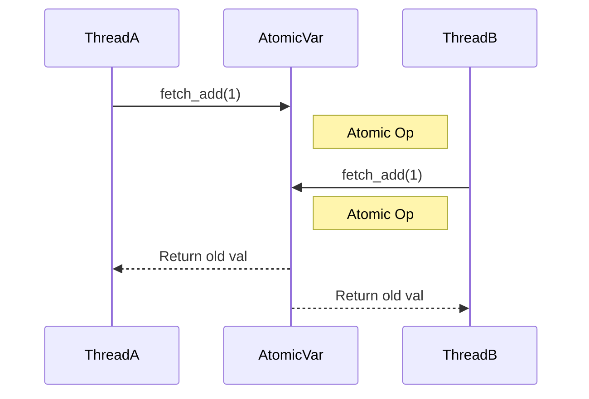

# 8주차: 원자적 연산 (Atomics)

"Mutex는 너무 무거워요. 더 가벼운 건 없나요?"
이번 주에는 락(Lock) 없이도 쓰레드 안전하게 변수를 다루는 **Atomic(원자적) 연산**을 배웁니다.

## 0. 미리 알면 좋은 용어 (Friendly Terms)
- **Atomic (아토믹)**: "원자". 더 이상 쪼갤 수 없는 최소 단위입니다. 중간에 누가 끼어들 수 없습니다.
- **Lock-free (락 프리)**: "열쇠 없이 문 열기". 자물쇠(Mutex)를 쓰지 않고도 안전하게 데이터를 공유하는 고급 기술입니다.


## 1. 핵심 개념

### A. 원자성 (Atomicity)
- "쪼개질 수 없는 연산"입니다.
- `i++`는 사실 `Read -> Add -> Write` 3단계지만, `std::atomic<int>`를 쓰면 이 과정이 한 방에(Atomic하게) 일어납니다.
- 중간에 다른 쓰레드가 끼어들 틈이 없습니다.

### B. Compare-And-Swap (CAS)
- Lock-free 알고리즘의 핵심입니다.
- `compare_exchange_weak(expected, desired)`
- "현재 값이 `expected`랑 같으면 `desired`로 바꿔줘. 다르면 `expected`를 현재 값으로 업데이트해줘."

### C. Spinlock
- Mutex는 대기할 때 OS에게 "나 재워줘" 하고 잠듭니다 (Context Switching 발생).
- Spinlock은 "될 때까지 계속 확인(Loop)" 합니다.
- 짧게 기다릴 때는 Spinlock이 훨씬 빠르지만, 오래 걸리면 CPU를 낭비합니다.

## 2. 자주 하는 실수 (Common Pitfalls)

### 1. Atomic 변수만 쓰면 만사형통?
- `std::atomic`은 단일 변수에 대해서만 안전합니다.
- 여러 개의 atomic 변수를 묶어서 트랜잭션처럼 처리하려면 결국 Mutex가 필요합니다.

### 2. `is_lock_free()` 맹신
- 하드웨어에 따라 Atomic 연산이 내부적으로 Lock을 쓸 수도 있습니다.
- `is_lock_free()`로 확인할 수 있습니다.

## 3. 실습 가이드
1. **01_atomic_counter.cpp**: 일반 `int` vs `atomic<int>` vs `mutex` 성능 비교.
2. **02_cas_loop.cpp**: CAS 연산을 이용해 값을 안전하게 업데이트하는 패턴.
3. **03_spinlock.cpp**: `atomic_flag`를 이용해 직접 Spinlock을 구현해봅니다.

## 4. 빌드 및 실행
```powershell
.\build_cmake.bat
```

## Diagram


## Step-by-Step Guide
1. `build_cmake.bat`를 실행하여 빌드합니다.
2. `Debug/01_atomic_counter.exe`를 실행하여 `atomic`과 `mutex`의 성능 차이를 비교합니다.
3. `Debug/02_cas_loop.exe`를 실행하여 CAS(Compare-And-Swap) 루프가 어떻게 동작하는지 확인합니다.
4. `Debug/03_spinlock.exe`를 실행하여 Spinlock의 동작과 CPU 점유율을 관찰합니다.
