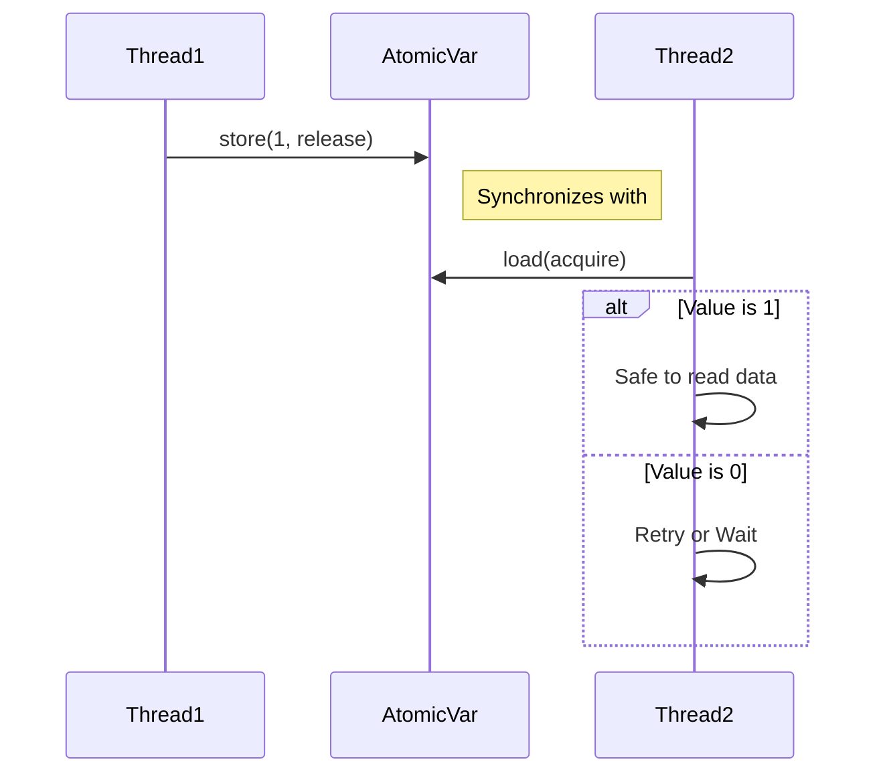

# 9주차: 메모리 모델 (Memory Model)과 Lock-free

"컴파일러와 CPU가 우리 몰래 순서를 바꾼다고요?"
이번 주에는 멀티쓰레딩의 끝판왕, **메모리 모델(Memory Ordering)**을 배웁니다. 매우 어렵지만 중요한 내용입니다.

## 0. 미리 알면 좋은 용어 (Friendly Terms)
- **Memory Order (메모리 순서)**: "작업 순서표"입니다. 컴파일러나 CPU가 최적화를 위해 명령어 순서를 바꿀 때, "이것만큼은 꼭 지켜줘"라고 제약(Constraint)을 거는 것입니다.
- **Reordering (재배치)**: "순서 바꾸기"입니다. 성능을 위해 A작업과 B작업의 순서를 뒤집는 것을 말합니다. 싱글 쓰레드에선 괜찮지만 멀티 쓰레드에선 문제가 됩니다.
- **Acquire-Release (획득-해제)**: "주고 받기"입니다. 생산자가 정보를 다 쓰고 "해제(Release)"하면, 소비자가 그 정보를 "획득(Acquire)"해서 안전하게 읽는 동기화 방식입니다.

## 1. 핵심 개념

### A. 재배치 (Reordering)
- 컴파일러와 CPU는 성능 최적화를 위해 명령어 순서를 바꿉니다.
- 예: `A=1; B=2;`를 `B=2; A=1;`로 바꿔도 결과는 같으니까요.
- 하지만 다른 쓰레드가 `B`가 2인 걸 보고 `A`를 읽었는데 아직 0이라면? 대재앙이 일어납니다.

### B. Memory Order 종류
1. **`memory_order_relaxed` (느슨함)**
   - "순서는 상관없어, 원자성(Atomic)만 보장해줘."
   - 가장 빠릅니다. 단순 카운터 증가 등에 씁니다.
2. **`memory_order_acquire` (획득)**
   - "이 명령 뒤에 오는 읽기/쓰기는 절대 이 명령보다 앞으로 넘어올 수 없어." (Barrier 역할)
   - 데이터를 읽을 때 씁니다.
3. **`memory_order_release` (해제)**
   - "이 명령 앞에 있는 읽기/쓰기는 절대 이 명령보다 뒤로 넘어갈 수 없어."
   - 데이터를 다 쓰고 게시할 때 씁니다.
4. **`memory_order_seq_cst` (순차적 일관성)**
   - "모든 쓰레드에서 순서가 똑같이 보여야 해."
   - 기본값이며 가장 안전하지만, 가장 느립니다.

### C. Acquire-Release Semantics
- Mutex 없이도 안전한 통신이 가능합니다.
- 생산자: 데이터 쓰기 -> `store(true, memory_order_release)`
- 소비자: `load(memory_order_acquire)` -> true면 데이터 읽기
- 이렇게 하면 데이터 쓰기가 완료된 후에만 소비자가 읽을 수 있음이 보장됩니다.

## 2. 자주 하는 실수 (Common Pitfalls)

> [!DANGER]
> **1. `relaxed` 남용**
> "빠르니까 무조건 relaxed 써야지!" -> 데이터가 아직 준비 안 됐는데 flag만 true가 될 수 있습니다.
> -> 인과 관계가 있는 데이터(Flag로 신호 주기 등)에는 절대 쓰면 안 됩니다.

> [!WARNING]
> **2. x86 vs ARM**
> x86(인텔/AMD) CPU는 하드웨어적으로 순서를 꽤 잘 지켜줍니다(Strong Memory Model). 그래서 대충 짜도 잘 돌아가는 것처럼 보입니다.
> 하지만 ARM(모바일, 애플 실리콘)은 순서를 막 바꿉니다(Weak Memory Model). x86에서 잘 돌던 코드가 ARM에서 터질 수 있습니다.
> -> 표준을 지켜야 합니다.

## 3. 실습 가이드
1. **01_reordering_demo.cpp**: 이론적으로 재배치가 일어나는 상황을 이해합니다. (실제 재현은 하드웨어에 따라 어려울 수 있음)
2. **02_acquire_release.cpp**: Mutex 없이 플래그로 동기화하는 Acquire-Release 패턴을 익힙니다.
3. **03_atomic_fence.cpp**: `atomic_thread_fence`를 사용하는 심화 내용을 다룹니다.

## 4. Step-by-Step Guide
1. `build_cmake.bat`를 실행하여 빌드합니다.
2. `Debug/01_reordering_demo.exe`를 실행하여 메모리 재배치 현상을 이론적으로 이해합니다.
3. `Debug/02_acquire_release.exe`를 실행하여 Mutex 없는 동기화(Acquire-Release)를 확인합니다.
4. `Debug/03_atomic_fence.exe`를 실행하여 메모리 펜스의 동작을 관찰합니다.

## 5. 빌드 및 실행
```powershell
.\build_cmake.bat
```

## 6. Diagram

