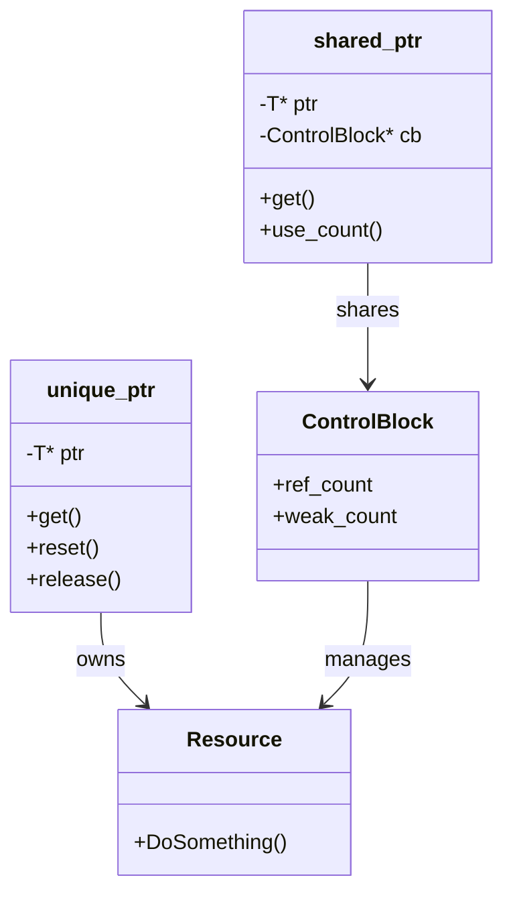

# 1주차: Modern C++ 워밍업 및 환경 적응

개발 환경 구축에 성공하신 것을 축하합니다. 이제 본격적으로 C++ 멀티쓰레딩을 위한 기초 체력을 다져봅시다.

## 0. 미리 알면 좋은 용어 (Friendly Terms)
- **Smart Pointer (스마트 포인터)**: "자동 청소부"입니다. 개발자가 직접 메모리를 해제(`delete`)하지 않아도, 사용이 끝나면 알아서 메모리를 정리해주는 똑똑한 포인터입니다.
- **Lambda (람다)**: "이름 없는 함수" 또는 "일회용 함수"입니다. 함수를 따로 정의하고 이름을 짓는 번거로움 없이, 코드 중간에 즉석에서 만들어 쓰는 함수 조각입니다.
- **RAII (Resource Acquisition Is Initialization)**: "자원의 획득은 초기화이다"라는 뜻의 C++ 핵심 원칙입니다. 쉽게 말해 "자원을 빌리는 것(생성)과 반납하는 것(소멸)을 객체의 수명과 일치시킨다"는 뜻입니다. 객체가 만들어질 때 자원을 얻고, 객체가 사라질 때 자원을 자동으로 반납하게 하여 실수를 방지합니다.

## 1. 핵심 개념
멀티쓰레딩 환경에서는 **메모리 관리**가 가장 큰 골칫덩어리입니다. 예를 들어, 쓰레드 A가 사용 중인 객체를 쓰레드 B가 실수로 지워버린다면 프로그램은 즉시 충돌(Crash)하게 됩니다.
C++11부터 도입된 **Smart Pointer**와 **Lambda**, 그리고 C++20의 **jthread**는 이러한 메모리 관리와 쓰레드 관리 문제를 훨씬 안전하고 우아하게 해결해줍니다.

### A. 스마트 포인터 (Smart Pointers)
과거 C++에서는 `new`로 할당하고 `delete`를 깜빡해서 메모리 누수(Memory Leak)가 발생하는 일이 잦았습니다. 스마트 포인터는 이를 해결합니다.

1. **`std::unique_ptr<T>` (유니크 포인터)**
   - **개념**: "이 객체는 나만 소유한다."
   - **특징**: 복사가 불가능합니다. 누군가에게 주려면 복사가 아니라 아예 줘버려야(Move) 합니다. 소유권이 명확해야 하는 멀티쓰레딩 환경에서 매우 유용합니다.
   
2. **`std::shared_ptr<T>` (쉐어드 포인터)**
   - **개념**: "이 객체를 우리 모두가 공유한다."
   - **특징**: 참조 횟수(Reference Count)를 관리합니다. 나를 포함해 이 객체를 가리키는 사람이 아무도 없을 때(Count가 0이 될 때) 자동으로 메모리가 해제됩니다. 여러 쓰레드가 하나의 데이터를 안전하게 공유할 때 필수적입니다.

### B. 람다 표현식 (Lambda Expressions)
"함수를 객체처럼 다룬다."
쓰레드를 생성할 때 별도의 함수를 만들어서 포인터로 넘기는 것은 번거롭습니다. 람다를 사용하면 실행할 코드를 그 자리에서 바로 작성하여 쓰레드에게 넘겨줄 수 있습니다.

```cpp
// 람다를 사용하여 쓰레드 생성
std::thread t([]{
    std::cout << "저는 쓰레드입니다!" << std::endl;
});
```

### C. std::jthread (C++20)
"Join 가능한 쓰레드 (Joinable Thread)."
기존 `std::thread`는 쓰레드 객체가 소멸되기 전에 반드시 `join()`(대기)이나 `detach()`(분리)를 개발자가 직접 호출해야 했습니다. 만약 깜빡하면 프로그램이 강제 종료됩니다.
C++20에 추가된 `std::jthread`는 소멸자가 호출될 때 자동으로 `join()`을 수행해줍니다. 이는 RAII 원칙을 쓰레드 관리에 적용한 것으로, 실수를 획기적으로 줄여줍니다.

## 2. 자주 하는 실수 (Common Pitfalls)
초심자가 가장 많이 겪는 문제들입니다. 꼭 읽어보세요.

> [!WARNING]
> **1. 스마트 포인터의 순환 참조 (Circular Reference)**
> `shared_ptr` A가 B를 가리키고, B가 다시 A를 가리키면 서로가 서로를 붙잡고 있어서 참조 횟수가 절대 0이 되지 않습니다.
> 결과적으로 메모리 누수가 발생합니다.
> -> **해결**: 둘 중 하나는 `std::weak_ptr`(약한 참조)를 사용해야 합니다.

> [!DANGER]
> **2. 람다의 댕글링 참조 (Dangling Reference)**
> 람다에서 외부 변수를 참조(`[&]`)로 가져왔는데, 쓰레드가 실행되는 도중에 그 변수가 이미 사라졌다면 프로그램이 죽거나 쓰레기 값을 참조하게 됩니다.
> -> **해결**: 쓰레드의 수명이 변수의 수명보다 길다면, 참조 대신 값 복사(`[=]`)를 사용하세요.

> [!IMPORTANT]
> **3. `join()` 누락**
> `std::thread`를 만들고 `join()`도 `detach()`도 하지 않으면, 메인 함수가 끝날 때 `std::terminate()`가 호출되어 프로그램이 비정상 종료됩니다.
> -> **해결**: `std::jthread`를 사용하면 이 문제를 원천적으로 차단할 수 있습니다.

## 3. 실습 가이드
### 예제 코드 설명
`Week1/src` 폴더에 있는 예제 코드들을 분석하고 실행해봅니다.

1. **01_smart_pointers.cpp**: `unique_ptr`와 `shared_ptr`가 언제 메모리를 해제하는지 직접 확인합니다.
2. **02_lambdas.cpp**: 람다 캡처(`[=]`, `[&]`) 방식을 바꿔가며 멀티쓰레딩에서 어떤 문제가 생길 수 있는지 체험합니다.
3. **03_jthread.cpp**: `std::thread`를 썼을 때의 불편함과 `std::jthread`의 편리함을 비교합니다.

## 4. Step-by-Step Guide
1. `setup_env.bat`를 실행하여 컴파일러와 CMake 경로를 설정합니다.
2. `build_cmake.bat`를 실행하여 예제 코드를 빌드합니다.
3. `Debug/01_SmartPointers.exe`를 실행하여 포인터 생명주기 로그를 확인합니다.
4. `Debug/02_Lambdas.exe`를 실행하여 캡처 방식에 따른 차이를 관찰합니다.
5. `Debug/03_Jthread.exe`를 실행하여 쓰레드 자동 종료(Join)를 확인합니다.

## 5. 빌드 및 실행
**중요**: 터미널을 새로 열었다면 먼저 루트 폴더(`E:\repos\C++_Study`)의 `setup_env.bat`를 실행해주세요. (CMake 경로 설정)

### 빌드 방법 (CMake 사용)
환경 설정부터 빌드까지 한 번에 해줍니다.
```powershell
.\build_cmake.bat
```

## 6. Diagram


## 7. PowerShell 기초 (Zsh 사용자를 위한 팁)
윈도우 PowerShell은 리눅스 쉘과 비슷하면서도 조금 다릅니다.

| 동작 | Zsh / Bash | PowerShell | 비고 |
| :--- | :--- | :--- | :--- |
| **현재 경로** | `pwd` | `pwd` 또는 `Get-Location` | 동일하게 작동 |
| **경로 이동** | `cd path` | `cd`, `Set-Location` | 동일하게 작동 |
| **목록 보기** | `ls -al` | `ls`, `dir` | 옵션은 다름 (`ls -Force`로 숨김파일 확인) |
| **화면 지우기** | `clear` | `cls`, `clear` | 동일하게 작동 |
| **파일 복사** | `cp a b` | `cp`, `copy` | 동일하게 작동 |
| **파일 이동** | `mv a b` | `mv`, `move` | 동일하게 작동 |
| **파일 삭제** | `rm a` | `rm`, `del` | 동일하게 작동 |
| **스크립트 실행** | `./script.sh` | `.\script.bat` | **역슬래시(\) 주의!** |
| **내용 보기** | `cat file` | `cat`, `type` | 동일하게 작동 |
| **관리자 권한** | `sudo ...` | (없음) | 관리자 권한으로 터미널을 새로 열어야 함 |

> **Tip**: 탭(Tab) 키를 누르면 자동 완성이 되며, 계속 누르면 가능한 파일들이 순환됩니다.
