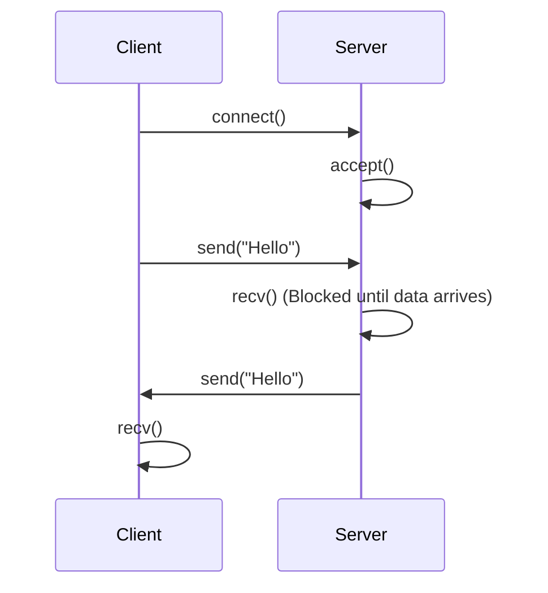

# 12주차: Blocking I/O와 에코 서버

"여보세요? 말할 때까지 안 끊고 기다릴게요."
가장 기본적이지만 직관적인 **Blocking I/O** 모델을 배웁니다.

## 0. 미리 알면 좋은 용어 (Friendly Terms)
- **Blocking I/O (블로킹 I/O)**: "잠깐 멈춤"입니다. 데이터를 달라고 요청했는데 아직 도착하지 않았다면, 도착할 때까지 프로그램이 그 자리에서 멈춰서 기다립니다.
- **Non-blocking I/O (논블로킹 I/O)**: "바로 진행"입니다. 데이터가 없으면 "없음"이라고 알려주고 즉시 리턴해서 다른 일을 할 수 있게 합니다.
- **Echo Server (에코 서버)**: "메아리 서버"입니다. 클라이언트가 보낸 말을 그대로 다시 돌려보내는 가장 기초적인 서버입니다.

## 1. 핵심 개념

### A. Blocking I/O의 특징
- `recv()`를 호출했는데 상대방이 아직 아무것도 안 보냈다면? -> 데이터가 올 때까지 **영원히 멈춥니다(Block)**.
- `send()`를 호출했는데 네트워크 버퍼가 꽉 찼다면? -> 빈 공간이 생길 때까지 **멈춥니다**.
- 코딩하기는 매우 쉽고 직관적이지만, 한 쓰레드가 한 번에 한 명의 클라이언트밖에 처리를 못 한다는 치명적인 단점이 있습니다. (여러 명을 처리하려면 멀티쓰레드가 필요함)

### B. 서버의 기본 흐름
1. **`socket()`**: 전화기를 설치합니다.
2. **`bind()`**: 전화번호(IP/Port)를 전화기에 등록합니다.
3. **`listen()`**: 개통합니다. 이제 전화를 받을 수 있는 상태가 됩니다.
4. **`accept()`**: 따르릉! 전화가 오면 수화기를 듭니다. 이때 **새로운 소켓**이 만들어집니다.
5. **`recv/send()`**: 대화를 나눕니다.
6. **`close()`**: 전화를 끊습니다.

## 2. 자주 하는 실수 (Common Pitfalls)

### 1. `accept`는 새로운 소켓을 반환합니다
- `listen`할 때 쓴 소켓(Listening Socket)은 계속 전화벨을 듣는 용도입니다.
- 실제 대화는 `accept`가 리턴해준 **새로운 소켓(Client Socket)**으로 해야 합니다.
- 리스닝 소켓으로 `send`를 하려고 하면 에러가 납니다.

### 2. TCP는 스트림입니다 (Packet Boundary)
- TCP는 데이터의 경계가 없습니다. 물줄기(Stream)와 같습니다.
- "Hello"를 5번 보냈다고 해서 `recv`도 5번 호출된다는 보장이 없습니다.
- "HelloHelloHello..."처럼 뭉쳐서 한 번에 올 수도 있고, "He", "llo" 처럼 끊겨서 올 수도 있습니다.
- 따라서 애플리케이션 레벨에서 길이 정보나 구분자(\n)를 이용해 메시지를 잘라줘야 합니다.

## 3. 실습 가이드
1. **01_echo_server.cpp**: 클라이언트가 보낸 말을 그대로 돌려주는 서버를 만듭니다.
2. **02_echo_client.cpp**: 서버에 접속해서 말을 거는 클라이언트를 만듭니다.

## 4. Step-by-Step Guide
1. `build_cmake.bat`를 실행하여 빌드합니다.
2. 터미널을 두 개 엽니다.
3. 첫 번째 터미널에서 `Debug/01_EchoServer.exe`를 실행하여 서버를 대기시킵니다.
4. 두 번째 터미널에서 `Debug/02_EchoClient.exe`를 실행하여 서버에 접속하고 메시지를 보냅니다.
5. 서버가 메시지를 그대로 돌려주는지(Echo) 확인합니다.

## 5. 빌드 및 실행
서버를 먼저 켜고, 클라이언트를 켜야 합니다.
```powershell
# 터미널 1 (서버 실행)
.\build\Debug\01_EchoServer.exe

# 터미널 2 (클라이언트 실행)
.\build\Debug\02_EchoClient.exe
```

## 6. Diagram

