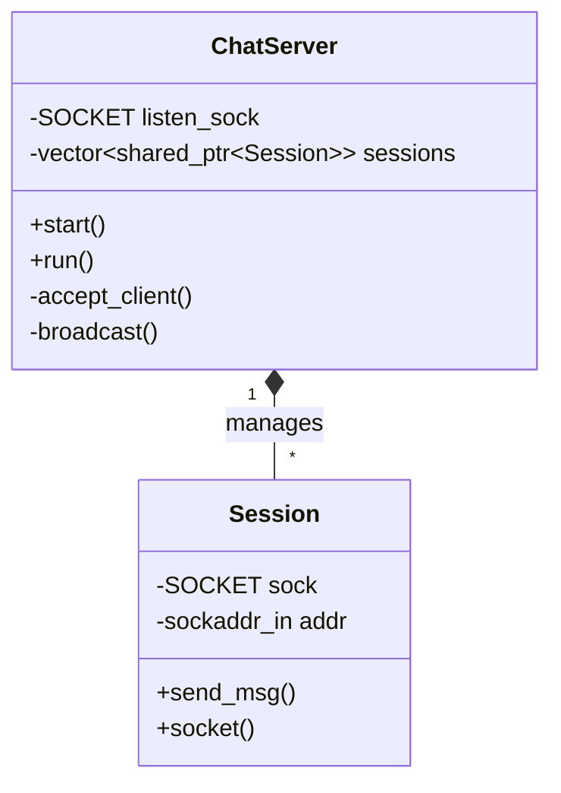

# 16주차: 중간 점검 및 리팩토링

"코드가 너무 지저분해요. 정리 좀 하고 가죠!"
지난주에 만든 채팅 서버, `main` 함수 하나에 모든 로직이 들어있어 유지보수가 힘들었죠?
이번 주에는 **객체 지향적 설계(OOP)**를 적용해 코드를 깔끔하게 분리해봅니다.

## 0. 미리 알면 좋은 용어 (Friendly Terms)
- **Refactoring (리팩토링)**: "집안 정리"입니다. 겉으로 보이는 기능은 그대로 두면서, 내부의 코드 구조를 더 깔끔하고 효율적으로 개선하는 작업입니다.
- **Code Review (코드 리뷰)**: "점검 회의"입니다. 내가 짠 코드를 다른 사람이(혹은 미래의 내가) 읽기 쉽게 검토하고 문제점을 찾는 과정입니다.
- **OOP (Object-Oriented Programming)**: "역할 분담"입니다. 모든 일을 혼자(`main`) 다 하지 않고, `Server`, `Session`, `User` 등 역할을 가진 객체들에게 일을 나눠주는 프로그래밍 방식입니다.

## 1. 핵심 개념

### A. 학습 목표
- **관심사의 분리 (Separation of Concerns)**: 네트워크 I/O, 세션 관리, 메시지 처리를 각각 다른 클래스가 담당하도록 분리합니다.
- **RAII 패턴 적용**: 소켓 리소스 관리를 클래스 소멸자에 위임하여, 실수로 `closesocket`을 안 해도 자동으로 닫히게 만듭니다.
- **Modern C++ 활용**: `std::shared_ptr`, `std::vector` 등을 적극 활용하여 메모리 관리를 자동화합니다.

### B. 리팩토링 설계
- **`ChatServer`**: 서버의 생명주기(Start, Stop)와 메인 루프(`select`)를 담당합니다. "사장님" 역할입니다.
- **`Session`**: 클라이언트 한 명의 상태(소켓, IP주소, 버퍼 등)를 관리합니다. "손님 담당 직원" 역할입니다.

### C. RAII (Resource Acquisition Is Initialization)
C++에서는 자원의 획득과 해제를 객체의 생성/소멸과 일치시키는 것이 중요합니다.
```cpp
class Session {
public:
    // 생성자: 소켓을 받아서 내 것으로 만듦
    Session(SOCKET s) : sock_(s) {}

    // 소멸자: 객체가 사라질 때 소켓도 같이 정리함
    ~Session() {
        if (sock_ != INVALID_SOCKET) closesocket(sock_); 
    }
private:
    SOCKET sock_;
};
```
이렇게 하면 예외가 발생하거나 함수를 빠져나갈 때 별도로 `closesocket`을 호출하지 않아도 안전하게 정리됩니다.

## 2. 자주 하는 실수 (Common Pitfalls)

### 1. 스마트 포인터 순환 참조 (Circular Reference)
만약 `Session`이 `ChatServer`를 `shared_ptr`로 들고 있고, `ChatServer`도 `Session`을 `shared_ptr`로 들고 있다면?
서로가 서로를 놓아주지 않아(참조 카운트가 0이 안 됨) 메모리 누수가 발생합니다.
- **해결**: 부모(`ChatServer`)는 자식(`Session`)을 `shared_ptr`로 소유하되, 자식은 부모를 `weak_ptr`(약한 참조)로 가리켜야 합니다.

### 2. 복사 비용 최소화
`broadcast` 함수에서 메시지(`std::string`)를 값으로 전달하면, 모든 클라이언트에게 보낼 때마다 문자열 복사가 일어납니다.
- **해결**: `const std::string&` (const reference)를 사용하여 복사 없이 원본을 읽기만 하도록 최적화하세요.

## 3. 실습 가이드
1. **01_refactored_server.cpp**: 리팩토링된 서버 코드를 분석하고 실행해봅니다.

## 4. Step-by-Step Guide
1. `build_cmake.bat`를 실행하여 빌드합니다.
2. `Debug/01_refactored_server.exe`를 실행합니다.
3. `Week12/Debug/02_EchoClient.exe`를 실행하여 접속 테스트를 진행합니다.
4. 서버 코드를 보며 `ChatServer` 클래스가 어떻게 `Session` 객체를 관리하는지 분석합니다.

## 5. 빌드 및 실행
```powershell
.\build_cmake.bat
```

## 6. Diagram


