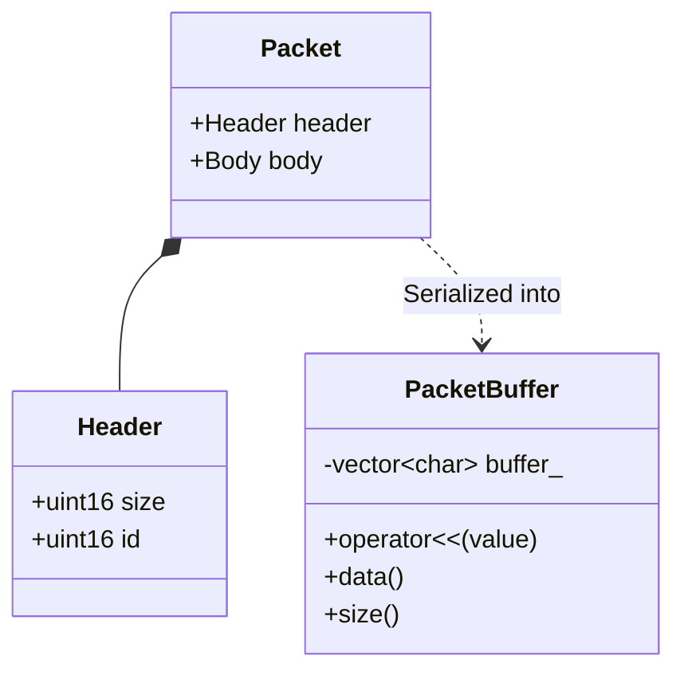

# 17주차: 패킷 직렬화 (Serialization) 설계

"구조체를 그냥 보내면 안 되나요?"
네, 안 됩니다. 같은 C++ 프로그램끼리라도 컴파일러 설정이나 CPU 아키텍처가 다르면 문제가 생깁니다.
이번 주에는 데이터를 네트워크로 보내기 위해 일렬로 나열하는 **직렬화(Serialization)**를 배웁니다.

## 0. 미리 알면 좋은 용어 (Friendly Terms)
- **Serialization (직렬화)**: "데이터 포장"입니다. 복잡한 구조체나 객체를 네트워크로 전송하기 위해 바이트 배열(일렬로 된 데이터)로 변환하는 과정입니다.
- **Deserialization (역직렬화)**: "데이터 개봉"입니다. 받은 바이트 배열을 다시 원래의 구조체나 객체로 복원하는 과정입니다.
- **Endianness (엔디안)**: "순서 규칙"입니다. 데이터를 메모리에 저장할 때 앞(상위 바이트)부터 저장할지, 뒤(하위 바이트)부터 저장할지 정하는 규칙입니다. (Big-endian vs Little-endian)

## 1. 핵심 개념

### A. 학습 목표
- **직렬화의 필요성**: Endianness, Padding, Data Alignment 문제를 이해합니다.
- **패킷 구조 설계**: Header와 Body로 구성된 패킷 프로토콜을 정의합니다.
- **버퍼 관리**: 직렬화된 데이터를 담을 버퍼 클래스를 구현합니다.

### B. 왜 그냥 보내면 안 될까?
1.  **Endianness (엔디안)**: 정수 `0x12345678`을 메모리에 저장할 때,
    -   **Big-Endian (네트워크 표준)**: `12 34 56 78` 순서로 저장.
    -   **Little-Endian (Intel/AMD CPU)**: `78 56 34 12` 순서로 저장.
    -   서로 다른 엔디안을 쓰는 기계끼리 통신하면 값이 뒤집혀서 엉뚱한 숫자가 됩니다.
2.  **Padding (패딩)**: 컴파일러는 CPU가 데이터를 빨리 읽게 하려고 구조체 멤버 사이에 빈 공간(padding)을 넣습니다.
    ```cpp
    struct A {
        char c; // 1 byte
        // 3 bytes padding (컴파일러가 몰래 넣음)
        int i;  // 4 bytes
    };
    ```
    이 패딩 크기는 컴파일러 옵션이나 OS마다 다릅니다. 그래서 `sizeof(A)`가 다를 수 있습니다.

### C. 해결책: 직렬화
데이터를 바이트 배열(Stream)에 차곡차곡 밀어 넣는 과정입니다.
`[Header][Data1][Data2]...` 형태로 빈틈없이 채워 넣습니다. 이렇게 하면 패딩 문제도 해결되고, 엔디안 변환도 수행할 수 있습니다.

## 2. 자주 하는 실수 (Common Pitfalls)

### 1. 포인터 직렬화
`char* name` 같은 포인터를 직렬화하면, 문자열 내용("Hello")이 아니라 **메모리 주소값(0x1234ABCD)**이 전송됩니다.
받는 쪽에서는 그 주소에 아무것도 없거나 엉뚱한 데이터가 있겠죠. 반드시 **내용(Value)**을 복사해서 보내야 합니다.

### 2. #pragma pack
구조체 패딩을 없애기 위해 `#pragma pack(push, 1)`을 쓸 수도 있지만, 이는 CPU 성능 저하를 유발할 수 있고 이식성이 떨어집니다. 직렬화 버퍼를 쓰는 것이 더 정석입니다.

## 3. 실습 가이드
### 3.1. 패킷 구조
```cpp
struct PacketHeader {
    uint16_t size; // 패킷 전체 크기
    uint16_t id;   // 패킷 종류 (로그인, 이동, 공격 등)
};
```

### 3.2. 직렬화 연산자 오버로딩
C++의 `<<`, `>>` 연산자를 오버로딩하면 `cout` 쓰듯이 편하게 직렬화할 수 있습니다.
```cpp
// 버퍼에 int32_t 값을 밀어 넣기
void operator<<(int32_t value) {
    size_t offset = buffer_.size();
    buffer_.resize(offset + sizeof(value));
    *reinterpret_cast<int32_t*>(&buffer_[offset]) = value;
}
```

## 4. Step-by-Step Guide
1. `build_cmake.bat`를 실행하여 빌드합니다.
2. `Debug/01_packet_structure.exe`를 실행하여 구조체 패딩과 사이즈를 확인합니다.
3. `Debug/02_serialization.exe`를 실행하여 직렬화/역직렬화 과정이 올바르게 수행되는지 검증합니다.

## 5. 빌드 및 실행
```powershell
.\build_cmake.bat
```

## 6. Diagram


