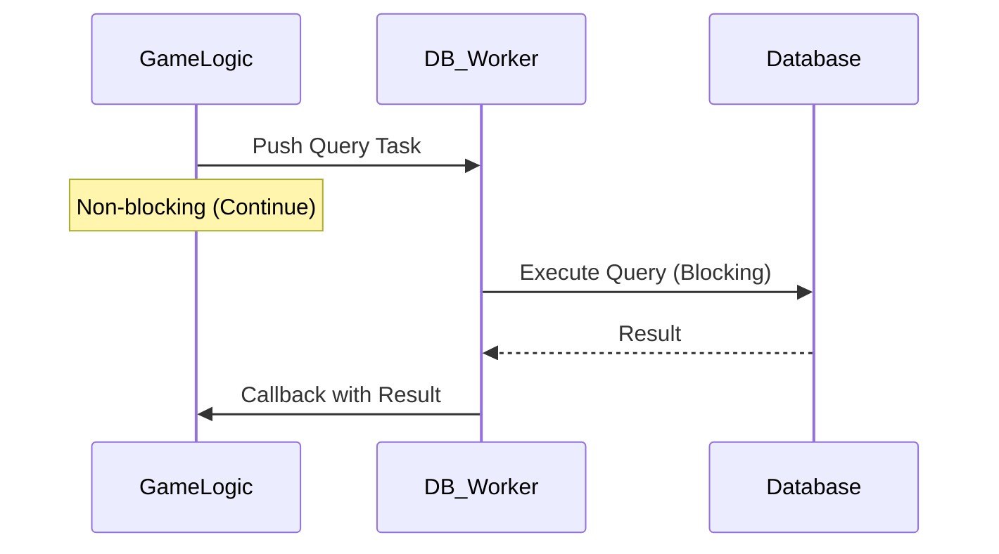

# 18주차: 데이터베이스 연동 기초

"서버 껐다 켜도 데이터가 남아있어야죠!"
게임 서버에서 유저 정보, 아이템, 로그 등을 저장하기 위해 DB는 필수입니다.
이번 주에는 C++ 서버에서 DB와 통신하는 방법과 **비동기 DB 처리 패턴**을 익힙니다.

## 0. 미리 알면 좋은 용어 (Friendly Terms)
- **Database (데이터베이스)**: "영구 저장소". 서버가 꺼져도 데이터가 남아있는 저장 공간.
- **SQL (Structured Query Language)**: "질문서". 데이터베이스에게 데이터를 요청하거나 수정하라고 명령하는 언어.
- **Connection Pool (커넥션 풀)**: "대기 줄". DB 연결을 미리 여러 개 만들어두고, 필요할 때 빌려 쓰고 반납하는 방식. 연결 비용을 아끼기 위함입니다.
- **Transaction (트랜잭션)**: "일괄 처리". 여러 작업을 하나로 묶어서, 하나라도 실패하면 모두 취소(Rollback)하여 데이터 무결성을 지키는 기능.

## 1. 핵심 개념

### A. 학습 목표
- **DB 연동 방식**: ODBC, Native Client 등의 차이를 이해합니다.
- **비동기 처리**: DB 작업은 느리기 때문에 메인 로직을 막지 않도록(Non-blocking) 처리해야 함을 배웁니다.
- **SQL Injection 방지**: 보안을 위한 Prepared Statement 사용법을 익힙니다.

### B. 동기(Synchronous) vs 비동기(Asynchronous) DB 처리
- **동기 방식**: `query()` 함수를 호출하면 DB 응답이 올 때까지 쓰레드가 멈춥니다. (게임 렉 유발)
- **비동기 방식**: 별도의 **DB Worker Thread**에게 일감을 던져주고(`push`), 메인 쓰레드는 하던 일을 계속합니다. 나중에 결과가 나오면 콜백으로 처리합니다.

### C. Connection Pool
DB 연결(`Connect`)은 비용이 매우 비쌉니다. 매번 연결하고 끊으면 성능이 급격히 떨어집니다.
따라서 미리 여러 개의 연결을 맺어두고(Pool), 필요할 때 빌려 쓰고 반납하는 방식을 사용합니다.

## 2. 자주 하는 실수 (Common Pitfalls)
> [!DANGER]
> **1. 메인 쓰레드에서 DB 접속**
> `Connect`나 `Query`를 게임 로직 쓰레드(메인 루프)에서 직접 호출하면, 네트워크 지연 등으로 인해 서버 전체가 수 초간 멈출 수 있습니다. **절대 금지!**

> [!WARNING]
> **2. 쿼리 문자열 조합 (String Concatenation)**
> `string query = "SELECT * FROM Users WHERE Name = '" + name + "'";`
> 이렇게 짜면 `name`에 `'; DROP TABLE Users; --` 같은 값을 넣어 해킹할 수 있습니다 (**SQL Injection**).
> 반드시 `Bind Parameter` (Prepared Statement) 기능을 사용하세요.

## 3. 실습 가이드 (Mock DB)
실제 DB 설치 없이 비동기 패턴을 익히기 위해 `MockDB` 클래스를 만듭니다.
```cpp
class MockDB {
    // 요청 큐 (Thread-safe하게 관리)
    std::queue<Task> tasks_;
    std::mutex mtx_;
    std::condition_variable cv_;
    
    // 워커 쓰레드 함수
    void process_queries() {
        while(true) {
            std::unique_lock<std::mutex> lock(mtx_);
            cv_.wait(lock, [this]{ return stop_ || !tasks_.empty(); });
            
            // 큐에서 작업 꺼내기
            auto task = tasks_.front();
            tasks_.pop();
            
            // 가짜 딜레이 (DB 처리 시간 시뮬레이션)
            std::this_thread::sleep_for(10ms);
            task.callback(result);
        }
    }
};
```

## 4. Step-by-Step Guide
1. `build_cmake.bat`를 실행하여 빌드합니다.
2. `Debug/01_mock_db_async.exe`를 실행하여 비동기 DB 처리 흐름을 확인합니다.
3. 로그를 통해 메인 쓰레드가 멈추지 않고 계속 도는지 확인하세요.

## 5. 빌드 및 실행
```powershell
.\build_cmake.bat
```

## 6. Diagram

