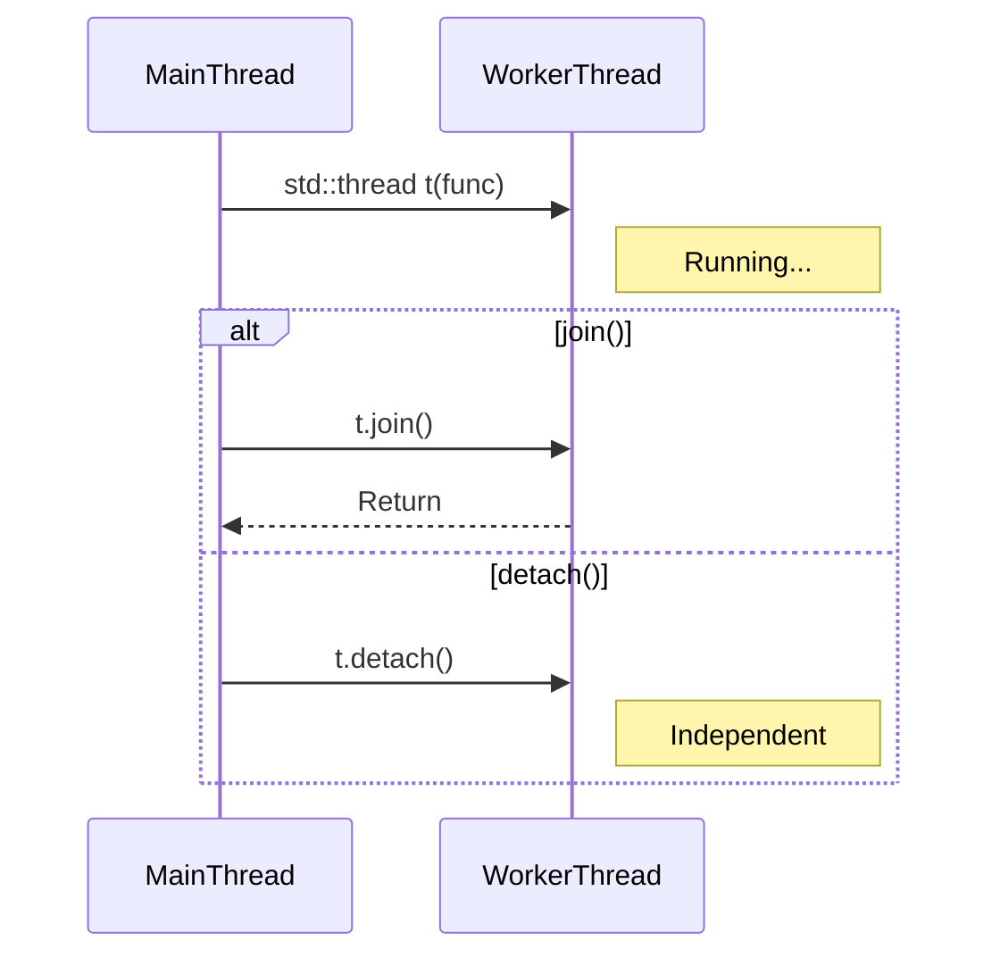

# 2주차: 쓰레드 관리 (Thread Management)

1주차에서 환경 설정하느라 고생 많으셨습니다.
이번 주에는 **쓰레드를 만들고, 일을 시키고, 퇴근시키는(종료)** 가장 기초적인 방법을 배웁니다.

## 0. 미리 알면 좋은 용어 (Friendly Terms)
- **Thread (쓰레드)**: "일꾼"입니다. 프로그램 안에서 실제로 일을 하는 작업 단위입니다.
- **Join (조인)**: "퇴근 대기"입니다. 부모(메인 쓰레드)가 자식 쓰레드가 일을 마칠 때까지 기다려주는 것입니다.
- **Detach (디태치)**: "자율 근무"입니다. 부모가 자식을 기다리지 않고, 알아서 하라고 연결을 끊어주는 것입니다. (일이 끝나면 알아서 사라집니다)
- **Context Switch (문맥 교환)**: "작업 전환 비용"입니다. A 일꾼이 하던 일을 멈추고 B 일꾼이 일을 시작할 때, 책상을 치우고 새 서류를 꺼내는 등의 준비 시간이 필요합니다. 이 비용이 너무 크면 오히려 성능이 떨어집니다.

## 1. 핵심 개념

### A. 쓰레드의 생명주기 (Lifecycle)
쓰레드는 `std::thread` 객체를 만드는 순간 **즉시 실행**됩니다.
하지만 메인 쓰레드(부모)가 먼저 끝나버리면, 자식 쓰레드는 갈 곳을 잃고 프로그램이 강제 종료됩니다.
그래서 부모는 자식에게 두 가지 중 하나를 반드시 결정해줘야 합니다:

1. **`join()`**: "끝날 때까지 기다릴게." (동기적)
   - 가장 안전하고 일반적인 방법입니다.
   - 메인 쓰레드는 자식 쓰레드가 끝날 때까지 멈춰 있습니다.
2. **`detach()`**: "알아서 살아라." (비동기적, 백그라운드)
   - 메인 쓰레드는 자식을 신경 쓰지 않고 자기 할 일을 계속합니다.
   - **주의**: 자식 쓰레드가 메인 쓰레드의 메모리(지역 변수 등)를 참조하고 있다면, 메인 쓰레드가 먼저 죽었을 때 심각한 오류가 발생합니다.

### B. 인자 전달 (Argument Passing)
쓰레드 함수에 변수를 넘길 때 조심해야 합니다. `std::thread`는 기본적으로 인자를 **복사(Copy)**해서 가져갑니다.

- **기본**: 값 복사로 넘어갑니다. 원본이 바뀌어도 쓰레드 안에서는 모릅니다.
- **참조(`&`)**: `std::ref(변수)`로 감싸야 진짜 참조로 넘어갑니다. 그냥 `&`를 쓰면 컴파일 에러가 나거나 의도치 않게 복사됩니다.
- **이동(`std::move`)**: `unique_ptr`처럼 복사가 불가능한 객체는 `std::move`를 사용해 소유권을 쓰레드에게 넘겨줘야 합니다.

### C. 하드웨어 동시성 (Hardware Concurrency)
`std::thread::hardware_concurrency()` 함수를 사용하면 현재 컴퓨터의 CPU 코어 개수(논리 프로세서 수)를 알 수 있습니다.
무작정 쓰레드를 100개 만드는 것보다, 코어 수에 맞춰 적절히 만드는 것이 성능에 훨씬 좋습니다. (보통 코어 수와 비슷하거나 2배 정도로 맞춥니다)

## 2. 자주 하는 실수 (Common Pitfalls)

> [!WARNING]
> **1. `detach()`의 함정**
> "백그라운드에서 돌라고 `detach` 했는데 왜 죽죠?"
> 메인 함수(`main`)가 끝나면 프로세스 전체가 종료됩니다. `detach`된 쓰레드가 아직 열심히 일하고 있어도, 프로세스가 꺼지면 강제로 종료당합니다.
> 또한, `detach`된 쓰레드가 이미 소멸된 메인 쓰레드의 변수(지역 변수 등)를 참조하면 메모리 접근 오류(Segmentation Fault)가 발생합니다.

> [!TIP]
> **2. 인자가 복사되는지 모름**
> `std::thread` 생성자는 인자를 무조건 복사해서 보관하려는 성질이 있습니다.
> ```cpp
> void update(int& n) { n++; }
> int val = 10;
> std::thread t(update, val); // 컴파일 에러 또는 복사됨!
> ```
> 참조로 넘기고 싶다면 반드시 `std::ref(val)`을 사용해야 합니다.
- 참조로 넘기려면 반드시 `std::ref(val)`을 명시적으로 써야 합니다.
```cpp
std::thread t(update, std::ref(val)); // OK
```

## 3. 실습 가이드

`Week2/src` 폴더의 예제들을 순서대로 실행해보세요.

1. **01_thread_lifecycle.cpp**: `join`을 했을 때와 `detach`를 했을 때 프로그램의 동작 순서가 어떻게 달라지는지 확인합니다.
2. **02_argument_passing.cpp**: `std::ref`를 썼을 때와 안 썼을 때, 그리고 `std::move`를 써야만 하는 상황을 실습합니다.
3. **03_parallel_sum.cpp (미니 프로젝트)**: 
   - 1부터 100만까지 더하는 작업을 수행합니다.
   - 싱글 쓰레드(혼자 하기) vs 멀티 쓰레드(4명이 나눠서 하기)의 속도를 비교해봅니다.

## 4. Step-by-Step Guide
1. `build_cmake.bat`를 실행하여 빌드합니다.
2. `Debug/01_thread_lifecycle.exe`를 실행하여 `join`과 `detach`의 동작 차이를 확인합니다.
3. `Debug/02_argument_passing.exe`를 실행하여 값 복사와 참조 전달(`std::ref`)의 차이를 확인합니다.
4. `Debug/03_parallel_sum.exe`를 실행하여 싱글 쓰레드와 멀티 쓰레드의 성능 차이를 비교합니다.

## 5. 빌드 및 실행
1주차와 똑같습니다. `Week2` 폴더에서 아래 스크립트를 실행하세요.

```powershell
.\build_cmake.bat
```

실행 파일은 `Week2/build/Debug` 폴더에 생성됩니다.

## 6. Diagram


