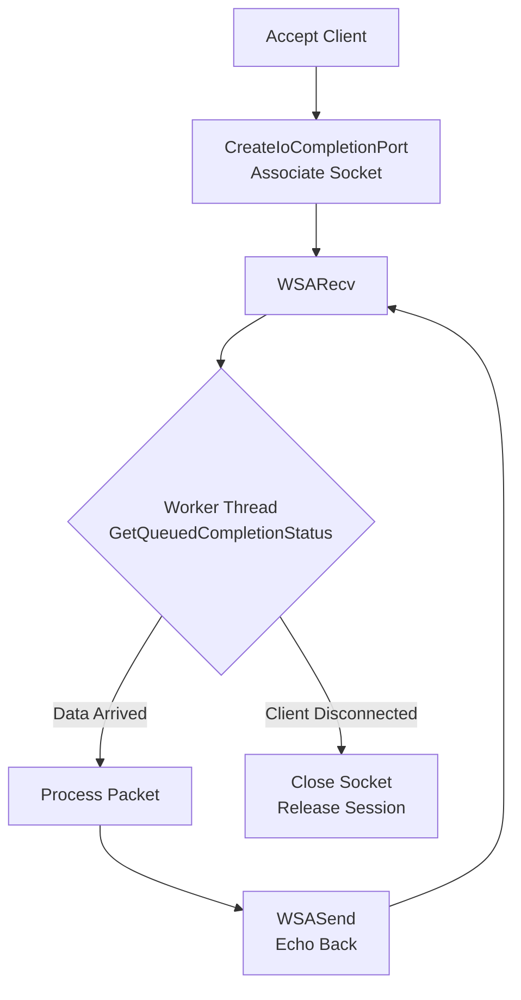

# 22주차: IOCP 에코 서버 구현

"진짜 고성능 서버를 만들어봅시다."
지난주에 배운 이론을 바탕으로, 실제로 작동하는 IOCP 에코 서버를 만듭니다.
코드가 다소 복잡하고 길어질 수 있으니 집중하세요!

## 0. 미리 알면 좋은 용어 (Friendly Terms)
- **WSASocket**: "고성능 소켓". 일반 `socket()`보다 윈도우에 최적화된 소켓 생성 함수입니다.
- **WSARecv / WSASend**: "비동기 송수신". 데이터를 보내고 받으라고 시켜놓고, 즉시 리턴하는 함수입니다.
- **Completion Key (완료 키)**: "식별표". 어떤 소켓(세션)의 작업이 끝났는지 구분하기 위해 붙여두는 꼬리표입니다.
- **Reference Counting (참조 카운팅)**: "수명 관리". 몇 명이 이 객체를 쓰고 있는지 세어서, 0명이 될 때만 지우는 기법입니다.

## 1. 핵심 개념
### A. 학습 목표
- **WSASocket**: 일반 `socket` 대신 Overlapped 속성을 가진 소켓을 생성합니다.
- **WSARecv / WSASend**: 비동기 입출력 함수를 사용합니다.
- **세션 관리**: `OVERLAPPED` 구조체를 확장하여 세션 정보를 전달하는 기법을 익힙니다.

## 2. 자주 하는 실수 (Common Pitfalls)
> [!DANGER]
> **1. Use-After-Free (치명적)**
> 클라이언트가 접속을 끊어서 `delete session`을 했는데,
> OS는 아직 그 세션에 대해 처리 중인 비동기 작업이 있을 수 있습니다.
> 나중에 OS가 그 메모리에 쓰려고 하면 **서버가 즉시 크래시**납니다.
> -> **해결책**: `Reference Counting`을 사용하여 모든 비동기 작업이 끝날 때까지 세션을 살려둬야 합니다. (보충 자료 `src/02_iocp_pitfalls.cpp` 참조)

> [!WARNING]
> **2. WSASend 버퍼 유지**
> `WSASend`에 넘긴 버퍼도 전송이 완료될 때까지 유효해야 합니다.
> 지역 변수(Local Variable) 버퍼를 넘기면 함수가 끝나면서 사라지므로 절대 안 됩니다.

## 3. 실습 가이드
### A. 확장된 Overlapped 구조체
IOCP 큐에서 완료 통지를 받을 때, `LPOVERLAPPED` 포인터만 돌려받습니다.
이것만으로는 "누가" 보낸 건지, "Send"인지 "Recv"인지 알 수 없습니다.
그래서 구조체 상속(또는 포함)을 통해 정보를 덧붙입니다.
```cpp
struct Session {
    OVERLAPPED overlapped; // 반드시 가장 앞에! (C 스타일 캐스팅을 위해)
    SOCKET sock;
    char buffer[1024];
    bool is_recv; // 작업 종류 구분
};
```

### B. 흐름도
1.  `Accept` (메인 쓰레드) -> `CreateIoCompletionPort`로 소켓 등록.
2.  `WSARecv` 호출 (비동기 읽기 시작).
3.  ... (데이터 도착) ...
4.  OS가 Completion Queue에 완료 패킷 삽입.
5.  Worker Thread가 `GetQueuedCompletionStatus`로 깨어남.
6.  `is_recv` 확인 -> 데이터 처리 -> `WSASend` (에코).

## 4. Step-by-Step Guide
1. `build_cmake.bat`를 실행하여 빌드합니다.
2. `Debug/01_iocp_echo.exe`를 실행합니다.
3. `Week12/Debug/02_EchoClient.exe`를 여러 개 실행하여 동시 접속 및 에코 동작을 테스트합니다.
4. `Debug/02_iocp_pitfalls.exe`를 실행하여 세션 종료 시의 메모리 오류(Use-After-Free) 시나리오를 확인합니다.

## 5. 빌드 및 실행
**중요**: 터미널을 새로 열었다면 먼저 루트 폴더(`E:\repos\C++_Study`)의 `setup_env.bat`를 실행해주세요.

### 방법 A: CMake 사용 (자동 스크립트)
```powershell
.\build_cmake.bat
```

## 6. Diagram


