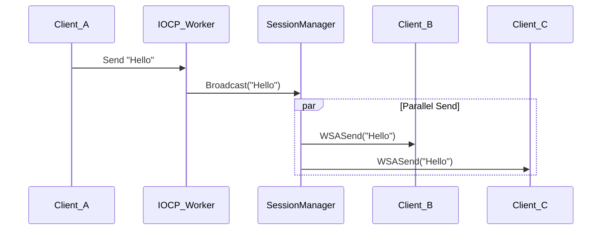

# 23주차: IOCP 채팅 서버 (기본)

"이제 진짜 채팅 서버를 만들어봅시다."
IOCP 에코 서버는 혼자 말하고 혼자 듣는 구조였죠.
이번에는 **여러 명이 서로 대화할 수 있는(Broadcasting)** 기능을 추가하고, 세션을 체계적으로 관리해봅니다.

## 0. 미리 알면 좋은 용어 (Friendly Terms)
- **Session Container (세션 보관소)**: 현재 접속 중인 모든 유저(세션)를 담아두는 `vector`나 `map` 같은 자료구조입니다.
- **Thread Safety (쓰레드 안전성)**: 여러 쓰레드가 동시에 건드려도 망가지지 않게 락(Lock) 등을 잘 거는 것입니다.
- **Lock Granularity (락의 범위)**: 락을 얼마나 넓게, 혹은 좁게 거느냐의 문제입니다. 너무 넓으면 성능이 떨어지고(병목), 너무 좁으면 관리가 힘듭니다.

## 1. 핵심 개념
### A. 학습 목표
- **세션 컨테이너**: 접속한 모든 세션을 `vector`나 `map`으로 관리합니다.
- **동기화**: 여러 워커 쓰레드가 동시에 세션 목록에 접근할 때의 Thread Safety를 확보합니다.
- **브로드캐스팅**: 효율적인 메시지 전파 방식을 고민합니다.

## 2. 자주 하는 실수 (Common Pitfalls)
> [!WARNING]
> **1. 락 범위 (Lock Granularity)**
> `Broadcast` 함수 전체에 락을 걸고 `WSASend`를 100번 호출하면,
> 그 동안 다른 쓰레드는 아무것도 못하고 대기해야 합니다 (병목 현상).
> -> **해결책**: 세션 목록을 복사(Snapshot)해서 락을 빨리 풀거나, Job Queue 방식을 사용합니다.

> [!TIP]
> **2. Pending 상태 처리**
> `WSARecv`/`WSASend`가 `WSA_IO_PENDING`이 아닌 `0`을 리턴하면 "즉시 완료"된 것입니다.
> 이 경우 Completion Port에 큐잉이 되느냐 안 되느냐는 `SetFileCompletionNotificationModes` 설정에 따라 다릅니다. (기본값은 큐잉 됨)

## 3. 실습 가이드
### A. 세션 관리 클래스
```cpp
class ChatServer {
    std::vector<Session*> sessions_;
    std::mutex sessions_mtx_; // 세션 목록 보호용
    
    void Broadcast(const std::string& msg) {
        std::lock_guard<std::mutex> lock(sessions_mtx_);
        for(auto s : sessions_) {
            s->Send(msg); // 비동기 Send 요청
        }
    }
};
```

### B. Send 처리의 주의점
IOCP에서 `WSASend`는 비동기입니다.
만약 100명에게 브로드캐스팅을 한다면 `WSASend`를 100번 호출하게 되는데,
각각의 `WSASend`마다 별도의 `OVERLAPPED` 구조체(또는 상태 정보)가 필요할 수 있습니다.
(단순히 하나의 버퍼를 공유하면 언제 해제해야 할지 애매해짐)

## 4. Step-by-Step Guide
1. `build_cmake.bat`를 실행하여 빌드합니다.
2. `Debug/01_iocp_chat_basic.exe`를 실행합니다.
3. 여러 개의 클라이언트(`Week12/Debug/02_EchoClient.exe`)를 실행하여 접속합니다.
4. 한 클라이언트가 메시지를 보내면 다른 모든 클라이언트에게 전달되는지 확인합니다.

## 5. 빌드 및 실행
**중요**: 터미널을 새로 열었다면 먼저 루트 폴더(`E:\repos\C++_Study`)의 `setup_env.bat`를 실행해주세요.

### 방법 A: CMake 사용 (자동 스크립트)
```powershell
.\build_cmake.bat
```

## 6. Diagram


