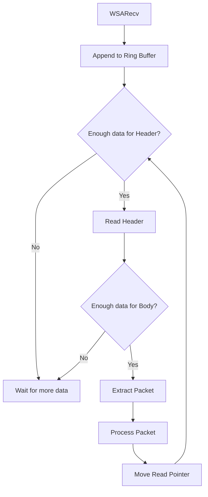

# 24주차: IOCP 채팅 서버 (심화)

"패킷이 잘려서 오면 어떡하죠?"
TCP는 스트림(Stream) 방식이라서 데이터의 경계가 없습니다.
`send`를 100바이트 해도 `recv`는 50바이트씩 두 번 될 수도 있고, 200바이트가 한 번에 올 수도 있습니다.
이 문제를 해결하기 위해 **Ring Buffer(Circular Buffer)**와 **Packet Parsing** 로직을 구현합니다.

## 0. 미리 알면 좋은 용어 (Friendly Terms)
- **TCP Stream (스트림)**: "수도꼭지 물줄기". 데이터가 끊김 없이 계속 흐르는 형태입니다. 어디서부터 어디까지가 한 덩어리인지 알 수 없습니다.
- **Fragmentation (조각남)**: "택배 분실". 큰 데이터를 보냈는데 잘게 쪼개져서 도착하는 현상입니다.
- **Coalescing (뭉침)**: "택배 합배송". 작은 데이터를 여러 번 보냈는데 한 번에 뭉쳐서 도착하는 현상입니다.
- **Ring Buffer (링 버퍼)**: "회전 초밥". 끝에 도달하면 다시 처음으로 돌아가서 데이터를 담는 둥근 형태의 버퍼입니다.

## 1. 핵심 개념
### A. 학습 목표
- **TCP 스트림의 이해**: Fragmentation(조각남)과 Coalescing(뭉침) 현상 이해.
- **Ring Buffer**: 끊임없이 들어오는 데이터를 효율적으로 담을 순환 버퍼 구현.
- **패킷 파싱**: 헤더를 먼저 읽고, 바디 크기만큼 기다렸다가 처리하는 로직 구현.

### B. 핵심 이론: 패킷 구조
보통 `[Header][Body]` 구조를 사용합니다.
```cpp
struct Header {
    uint16_t len; // 패킷 전체 길이
    uint16_t id;  // 프로토콜 ID
};
```
받는 쪽에서는 항상 `Header` 크기만큼 먼저 확인하고, `len`만큼 데이터가 모였는지 체크합니다.

## 2. 자주 하는 실수 (Common Pitfalls)
> [!WARNING]
> **1. 무한 루프**
> 패킷 파싱 루프(`while`)에서 데이터를 처리하고 나서 `ReadPos`를 이동시키지 않으면,
> 같은 패킷을 무한히 처리하게 됩니다.

> [!TIP]
> **2. 버퍼 오버플로우**
> 악의적인 클라이언트가 패킷 길이를 65535로 보내놓고 데이터를 안 보내면?
> 서버는 그만큼 기다리느라 버퍼를 계속 비워두게 됩니다. (DDoS 공격의 일종)
> -> 최대 패킷 크기 제한, 타임아웃 등의 방어 로직이 필요합니다.

## 3. 실습 가이드
### A. Ring Buffer
배열의 끝에 도달하면 다시 처음으로 돌아가는 버퍼입니다.
데이터 이동(복사) 없이 계속해서 쓰고 읽을 수 있어 네트워크 버퍼로 이상적입니다.

### B. Recv 로직 변화
- **기존**: `WSARecv` -> 버퍼 그대로 문자열로 사용.
- **변경**: `WSARecv` -> Ring Buffer에 복사 -> 패킷 완성될 때까지 루프 돌며 파싱 -> 처리.

### C. 실습 예제
1.  **01_ring_buffer.cpp**: 링 버퍼 클래스 테스트.
2.  **02_packet_handling.cpp**: 패킷 조립 로직 구현.
3.  **03_tcp_stream_guide.md**: (보충) TCP 스트림 상세 설명.

## 4. Step-by-Step Guide
1. `build_cmake.bat`를 실행하여 빌드합니다.
2. `Debug/01_ring_buffer.exe`를 실행하여 링 버퍼 동작을 확인합니다.
3. `Debug/02_packet_handling.exe`를 실행하여 조각난 패킷이 잘 조립되는지 확인합니다.

## 5. 빌드 및 실행
**중요**: 터미널을 새로 열었다면 먼저 루트 폴더(`E:\repos\C++_Study`)의 `setup_env.bat`를 실행해주세요.

### 방법 A: CMake 사용 (자동 스크립트)
```powershell
.\build_cmake.bat
```

## 6. Diagram

