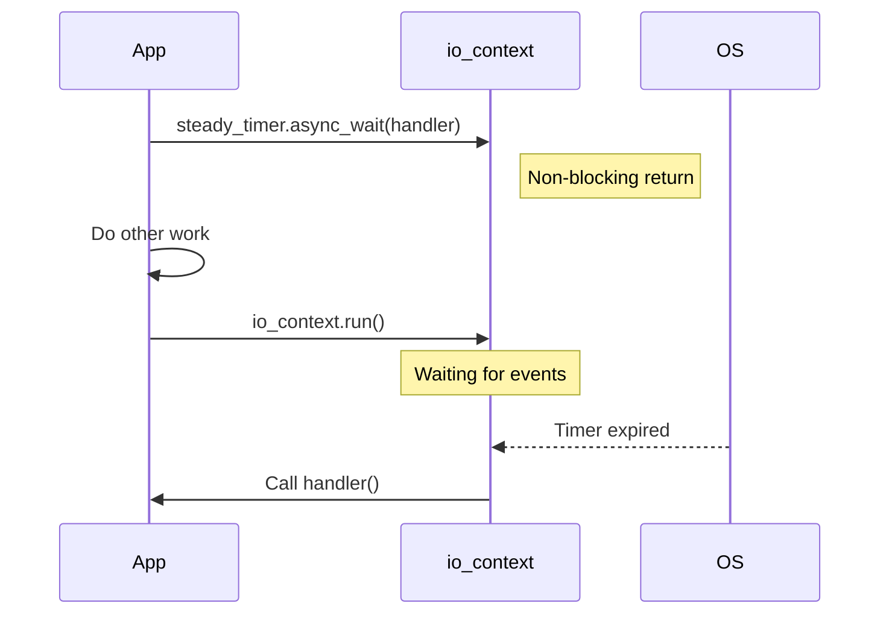

# 25주차: Boost.Asio (Standalone) 기초

"C++ 네트워크의 미래."
**Boost.Asio**는 C++ 표준 네트워크 라이브러리(Networking TS)의 기반이 되는 강력한 라이브러리입니다.
IOCP의 복잡함을 세련된 C++ 템플릿과 객체로 감싸서, 훨씬 직관적이고 안전하게 고성능 서버를 짤 수 있게 해줍니다.

## 0. 미리 알면 좋은 용어 (Friendly Terms)
- **Boost.Asio**: "네트워크 만능 도구". 윈도우(IOCP), 리눅스(Epoll), 맥(Kqueue) 등 OS에 상관없이 최고의 성능을 내주는 라이브러리입니다.
- **io_context**: "일감 관리소". 모든 비동기 작업(타이머, 소켓 등)을 총괄하고 실행하는 핵심 객체입니다.
- **Completion Handler (완료 핸들러)**: "콜백 함수". 비동기 작업이 끝났을 때 호출되는 함수(주로 람다)입니다.
- **Standalone**: "독립 실행". 거대한 Boost 라이브러리 전체를 설치하지 않고, Asio 헤더 파일만 있어도 쓸 수 있다는 뜻입니다.

## 1. 핵심 개념
### A. 학습 목표
- **Asio 환경 설정**: Boost 설치 없이 Standalone Asio를 설정합니다.
- **io_context**: Asio의 핵심인 I/O 실행 컨텍스트를 이해합니다.
- **비동기 타이머**: `async_wait`를 통해 비동기 콜백 패턴을 익힙니다.

### B. 핵심 이론
#### 1. Proactor Pattern in Asio
Asio는 OS에 따라 최적의 구현체(Windows는 IOCP, Linux는 Epoll)를 자동으로 선택합니다.
사용자는 `io_context.run()`만 호출하면 됩니다.

#### 2. 비동기 핸들러 (Completion Handler)
비동기 작업이 끝나면 호출될 함수(콜백)입니다.
람다(Lambda) 함수를 주로 사용하며, 문맥(Context)을 캡처할 수 있어 매우 편리합니다.
```cpp
timer.async_wait([](const asio::error_code& e) {
    std::cout << "Timer expired!\n";
});
```

## 2. 자주 하는 실수 (Common Pitfalls)
> [!IMPORTANT]
> **1. io_context.run()의 블로킹**
> `io_context.run()`은 할 일이 없으면 즉시 리턴합니다.
> 서버처럼 계속 떠있게 하려면 `asio::executor_work_guard`를 쓰거나, 계속해서 비동기 작업을 걸어둬야 합니다.

> [!WARNING]
> **2. 싱글 쓰레드 vs 멀티 쓰레드**
> `io_context.run()`을 한 쓰레드에서만 호출하면 싱글 쓰레드 서버가 되고(동기화 불필요),
> 여러 쓰레드에서 호출하면 멀티 쓰레드 서버가 됩니다(동기화 필요).

## 3. 실습 가이드
### A. 환경 설정 (필수)
이 폴더에 있는 `setup_asio.bat`를 실행하여 Asio 헤더 파일을 다운로드 받으세요.
(`include/asio.hpp` 등이 생성됩니다.)

### B. 실습 예제
1.  **01_timer_sync.cpp**: 동기 타이머 (Blocking).
2.  **02_timer_async.cpp**: 비동기 타이머 (Non-blocking).

## 4. Step-by-Step Guide
1. `setup_asio.bat`를 실행하여 Boost.Asio(Standalone) 헤더를 다운로드합니다.
2. `build_cmake.bat`를 실행하여 빌드합니다.
3. `Debug/01_timer_sync.exe`를 실행하여 동기 대기(Blocking)의 특성을 확인합니다.
4. `Debug/02_timer_async.exe`를 실행하여 비동기 대기(Non-blocking)와 콜백 호출 순서를 관찰합니다.

## 5. 빌드 및 실행
**중요**: 터미널을 새로 열었다면 먼저 루트 폴더(`E:\repos\C++_Study`)의 `setup_env.bat`를 실행해주세요.

### 방법 A: CMake 사용 (자동 스크립트)
```powershell
.\build_cmake.bat
```

## 6. Diagram

