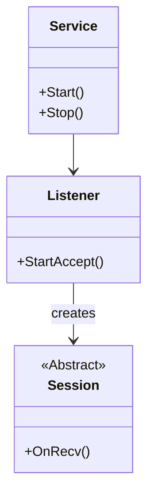

# 30주차: [Final] 코어 서버 (ServerCore) 구현

"서버의 엔진을 만듭니다."
게임 로직과 상관없이, 어떤 서버를 만들든 공통적으로 필요한 기능들을 **ServerCore** 라이브러리로 만듭니다.

## 0. 미리 알면 좋은 용어 (Friendly Terms)
- **Session (세션)**: "전화 연결". 클라이언트와 서버가 연결되어 있는 상태 그 자체를 객체로 만든 것입니다. 데이터를 주고받는 창구입니다.
- **Listener (리스너)**: "문지기". 새로운 손님(클라이언트)이 오는지 문 앞에서 계속 감시하다가, 오면 문을 열어주는 역할입니다.
- **Service (서비스)**: "관리 사무소". 서버의 설정(포트 번호, 최대 접속자 수 등)을 관리하고, 문지기(Listener)와 연결(Session)들을 총괄합니다.
- **Abstract Class (추상 클래스)**: "미완성 설계도". `ServerCore`에서는 "이런 기능이 있어야 해"라고 껍데기만 만들어두고, 실제 내용은 `GameServer`에서 채워 넣습니다.

## 1. 핵심 개념
### A. 학습 목표
- **Session 추상화**: `Send`, `Recv`, `OnConnected`, `OnDisconnected` 등의 가상 함수 인터페이스 설계.
- **Listener 캡슐화**: `Accept` 처리를 숨기고, 새로운 연결이 오면 `Session`을 생성해주는 공장(Factory) 역할.
- **Service 객체**: `io_context`와 워커 쓰레드 풀을 관리하는 관리자 객체.

### B. Theory Overview
- **Session Abstraction**: 네트워크 연결을 추상화하여, 상위 레벨에서 소켓의 복잡성을 몰라도 데이터를 주고받을 수 있게 합니다.
- **Listener Pattern**: 연결 수락(Accept) 로직을 캡슐화하여, 서버의 메인 로직과 분리합니다.
- **Service Locator/Manager**: 서버의 전역적인 설정과 리소스(I/O Context, Thread Pool)를 관리하는 패턴을 익힙니다.

## 2. 자주 하는 실수 (Common Pitfalls)
> [!IMPORTANT]
> **1. 가상 소멸자 (Virtual Destructor)**
> `Session` 클래스는 상속을 전제로 하므로 반드시 소멸자에 `virtual`을 붙여야 합니다.
> 그렇지 않으면 자식 클래스(`GameSession`)의 소멸자가 호출되지 않아 메모리 누수가 발생합니다.

> [!WARNING]
> **2. 세션 생명주기 관리 (Session Lifecycle)**
> 비동기 작업이 진행 중인데 세션이 소멸되면 크래시가 발생합니다.
> `shared_ptr`을 사용하여 비동기 작업이 완료될 때까지 세션이 살아있도록 보장해야 합니다 (`shared_from_this`).

> [!TIP]
> **3. 패킷 처리의 분리**
> `Session` 클래스 안에서 게임 로직을 직접 구현하지 마세요.
> `Session`은 패킷을 조립해서 넘겨주는 역할까지만 하고, 실제 처리는 `PacketHandler`나 `GameSession` (상속)에서 해야 합니다.

## 3. 실습 가이드
### A. Session 클래스
```cpp
class Session : public enable_shared_from_this<Session> {
public:
    void Send(string msg); // 비동기 전송
    virtual void OnRecv(char* data, int len); // 컨텐츠 쪽에서 오버라이딩
};
```
이렇게 설계하면 `GameServer`에서는 `Session`을 상속받아 `OnRecv`만 구현하면 됩니다. 네트워크의 복잡한 처리는 `ServerCore`가 담당합니다.

## 4. Step-by-Step Guide
1. `src/ServerCore/Session.h`를 열어 `Session` 클래스의 가상 함수들(`OnConnected`, `OnRecv` 등)을 확인합니다.
2. `src/ServerCore/Listener.cpp`에서 비동기 Accept가 어떻게 구현되어 있는지(`StartAccept`) 분석합니다.
3. `src/ServerCore/Service.cpp`에서 `ServerService`가 어떻게 리스너와 세션을 엮어주는지 흐름을 따라갑니다.
4. `build_cmake.bat`를 실행하여 빌드하고 테스트합니다.

## 5. 빌드 및 실행
**중요**: 터미널을 새로 열었다면 먼저 루트 폴더(`E:\repos\C++_Study`)의 `setup_env.bat`를 실행해주세요.

### 방법 A: CMake 사용 (자동 스크립트)
```powershell
.\build_cmake.bat
```

## 6. Diagram

