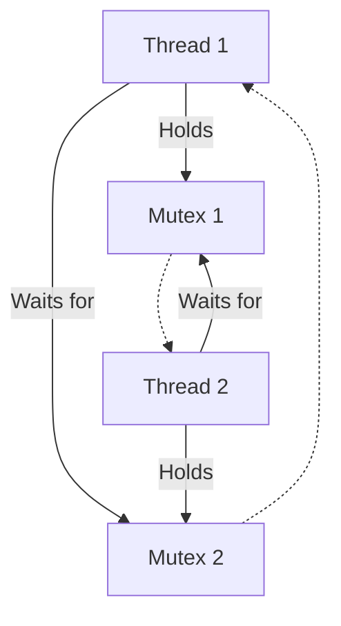

# 4주차: 교착 상태 (Deadlock)와 해결책

"자물쇠를 두 개 이상 쓸 때, 지옥이 시작됩니다."
이번 주에는 멀티쓰레딩의 가장 무서운 적, **Deadlock(교착 상태)**을 경험하고 해결해봅니다.

## 0. 미리 알면 좋은 용어 (Friendly Terms)
- **Deadlock (데드락)**: "외나무다리 원수"입니다. 좁은 다리에서 양쪽에서 사람이 왔는데, 서로 비켜주길 기다리다가 아무도 못 지나가는 상태입니다.
- **Lock Ordering (락 순서)**: "줄 서기 규칙"입니다. 자물쇠를 잠그는 순서를 미리 정해두어 데드락을 막는 방법입니다.
- **Spinlock (스핀락)**: "계속 물어보기"입니다. 자물쇠가 열릴 때까지 잠들지 않고 계속 문고리를 돌려보는 방식입니다. (CPU를 많이 씁니다)

## 1. 핵심 개념

### A. Deadlock (교착 상태)
두 개 이상의 쓰레드가 서로 상대방이 가진 자물쇠가 풀리기만을 하염없이 기다리는 상태입니다.
- **상황 예시**: 
  - 쓰레드 A: 자물쇠 1을 가지고 있음. 자물쇠 2를 원함.
  - 쓰레드 B: 자물쇠 2를 가지고 있음. 자물쇠 1을 원함.
- **결과**: 프로그램이 멈춥니다 (Hang). CPU 사용률은 0%가 되거나(대기 상태), 스핀락을 쓴다면 100%가 될 수도 있습니다.

### B. 해결책 1: 락 순서 (Lock Ordering)
"모든 쓰레드는 자물쇠를 잡을 때 무조건 1번 -> 2번 순서로 잡는다."
- 이렇게 규칙을 정하면 Deadlock은 절대 발생하지 않습니다.
- 하지만 코드가 복잡해지고 자물쇠가 많아지면 이 규칙을 지키기가 매우 어렵습니다.

### C. 해결책 2: std::scoped_lock (C++17)
"여러 개의 자물쇠를 한 번에 잠그자."
- `std::scoped_lock lock(mutex1, mutex2);`
- 내부적으로 Deadlock이 발생하지 않는 안전한 알고리즘을 사용하여 여러 뮤텍스를 동시에 잠급니다. 가장 추천하는 방법입니다.

## 2. 자주 하는 실수 (Common Pitfalls)

> [!DANGER]
> **1. 락 순서 무시**
> "A함수에서는 m1->m2 순서로 잠그고, B함수에서는 m2->m1 순서로 잠금."
> -> 평소에는 잘 돌아가다가, 운 나쁘게 두 함수가 동시에 실행되는 순간 프로그램이 멈춥니다. 디버깅하기 매우 어렵습니다.

> [!WARNING]
> **2. 중첩된 락 (Nested Lock)**
> 이미 m1을 잠갔는데, 호출한 함수 안에서 또 m1을 잠그려고 하면?
> 일반적인 `std::mutex`는 재진입이 불가능해서, 자기 자신이 잠근 자물쇠 때문에 갇혀버립니다(Self-Deadlock).
> -> `std::recursive_mutex`를 쓰면 해결되지만, 보통 이런 상황은 설계가 잘못된 경우가 많습니다.

## 3. 실습 가이드
1. **01_deadlock_demo.cpp**: 실제로 프로그램을 멈춰봅시다. 데드락이 걸리면 프로그램이 아무 반응도 하지 않게 됩니다.
2. **02_scoped_lock.cpp**: `std::scoped_lock`으로 위 문제를 해결합니다.
3. **03_dining_philosophers.cpp**: 유명한 '식사하는 철학자' 문제를 통해 Deadlock을 체험합니다. 5명의 철학자가 젓가락을 하나씩 집다가 굶어 죽는 시나리오입니다.

## 4. Step-by-Step Guide
1. `build_cmake.bat`를 실행하여 빌드합니다.
2. `Debug/01_deadlock_demo.exe`를 실행하여 프로그램이 멈추는(Hang) 현상을 직접 목격합니다. (강제 종료하려면 Ctrl+C)
3. `Debug/02_scoped_lock.exe`를 실행하여 `std::scoped_lock`이 어떻게 교착 상태를 해결하는지 확인합니다.
4. `Debug/03_dining_philosophers.exe`를 실행하여 철학자 문제의 데드락 상황을 체험합니다.

## 5. 빌드 및 실행
```powershell
.\build_cmake.bat
```

## 6. Diagram

