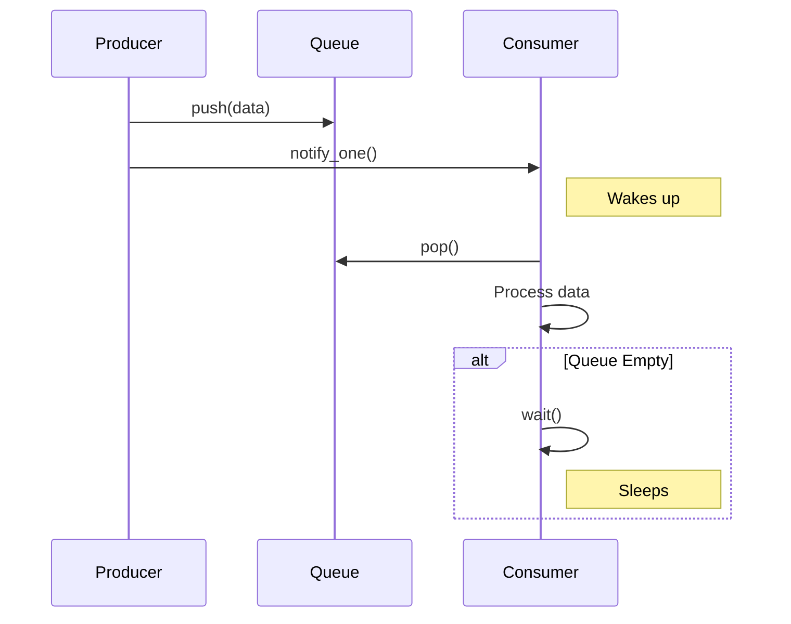

# 5주차: 쓰레드 간 신호 전달 (Condition Variable)

"언제까지 기다려야 해? 다 되면 깨워줘!"
이번 주에는 쓰레드끼리 효율적으로 신호를 주고받는 **Condition Variable(조건 변수)**를 배웁니다.

## 0. 미리 알면 좋은 용어 (Friendly Terms)
- **Condition Variable (조건 변수)**: "알림벨"입니다. 특정 조건이 만족될 때까지 자다가, 벨이 울리면 깨어나는 도구입니다.
- **Spurious Wakeup (가짜 기상)**: "자다가 깬 척"입니다. 아무도 안 깨웠는데(벨이 안 울렸는데) 쓰레드가 그냥 일어나는 현상입니다. 운영체제의 스케줄링 특성상 발생할 수 있습니다. 그래서 깨어난 후에는 반드시 조건을 다시 확인해야 합니다.
- **Producer-Consumer (생산자-소비자)**: "요리사와 손님"입니다. 요리사(생산자)는 음식을 만들어 접시(큐)에 놓고 벨을 누릅니다. 손님(소비자)은 벨이 울리면 접시에서 음식을 가져가 먹습니다. 접시가 비어있으면 손님은 기다려야 합니다.

## 1. 핵심 개념

### A. Polling vs Signaling
- **Polling (폴링)**: "다 됐어? 다 됐어?" 하고 계속 물어보는 방식입니다. CPU를 계속 사용하므로 낭비가 심합니다.
- **Signaling (시그널링)**: "다 되면 깨워줘." 하고 자는 방식입니다. CPU를 쓰지 않고 대기 상태로 들어갑니다.
- `std::condition_variable`이 바로 이 '알람 시계' 역할을 하여 효율적인 대기를 가능하게 합니다.

### B. 주요 함수
- **`wait(lock, predicate)`**: 
  1. 가지고 있던 자물쇠(`lock`)를 잠시 풉니다.
  2. 깊은 잠에 듭니다 (대기 상태).
  3. 누군가 깨우면(`notify`) 다시 일어납니다.
  4. 자물쇠를 다시 잠급니다.
  5. 조건(`predicate`)이 만족되었는지 확인합니다. 만족되지 않았다면 다시 1번으로 돌아갑니다.
- **`notify_one()`**: 자고 있는 쓰레드 중 **하나만** 깨웁니다.
- **`notify_all()`**: 자고 있는 **모든** 쓰레드를 깨웁니다.

### C. Producer-Consumer Pattern (생산자-소비자 패턴)
멀티쓰레딩의 꽃입니다. 데이터를 만드는 쪽과 처리하는 쪽을 분리하여 성능을 높입니다.
- **생산자**: 데이터를 만들어 큐(Queue)에 넣고 `notify`를 호출하여 소비자를 깨웁니다.
- **소비자**: 큐가 비어있으면 `wait`하고, 데이터가 있으면 꺼내서 처리합니다.

## 2. 자주 하는 실수 (Common Pitfalls)

> [!WARNING]
> **1. Spurious Wakeup (가짜 기상) 처리 안 함**
> 누가 안 깨웠는데도 쓰레드가 그냥 일어나는 경우가 있습니다. 이때 큐가 비어있는데 데이터를 꺼내려 하면 에러가 납니다.
> -> **해결**: `wait` 할 때 반드시 **조건(Predicate)**을 같이 줘야 합니다.
> ```cpp
> // 잘못된 예
> cv.wait(lock); 
> 
> // 올바른 예
> cv.wait(lock, []{ return !queue.empty(); }); // 큐가 비어있지 않을 때만 진짜로 일어남
> ```

> [!IMPORTANT]
> **2. Lost Wakeup (신호 놓침)**
> 소비자가 `wait` 하러 들어가기 직전(찰나의 순간)에 생산자가 `notify`를 해버리면?
> 소비자는 이미 벨이 울린 줄 모르고 영원히 잠듭니다.
> -> **해결**: 반드시 `mutex`로 보호된 상태에서 조건을 검사하고 `wait` 해야 합니다. `std::unique_lock`을 사용하는 이유입니다.

## 3. 실습 가이드
1. **01_condition_variable.cpp**: `wait`와 `notify`의 기본 사용법을 익힙니다.
2. **02_producer_consumer.cpp**: 큐를 이용한 데이터 전달을 구현해봅니다. 생산자는 숫자를 넣고, 소비자는 숫자를 꺼내 출력합니다.
3. **03_spurious_wakeup.cpp**: 조건 검사 없이 `wait`만 하면 어떤 문제가 생기는지 확인합니다.

## 4. Step-by-Step Guide
1. `build_cmake.bat`를 실행하여 빌드합니다.
2. `Debug/01_condition_variable.exe`를 실행하여 `wait`와 `notify`의 기본 동작을 확인합니다.
3. `Debug/02_producer_consumer.exe`를 실행하여 생산자-소비자 패턴의 데이터 흐름을 관찰합니다.
4. `Debug/03_spurious_wakeup.exe`를 실행하여 조건 검사 없는 `wait`의 위험성을 확인합니다.

## 5. 빌드 및 실행
```powershell
.\build_cmake.bat
```

## 6. Diagram

