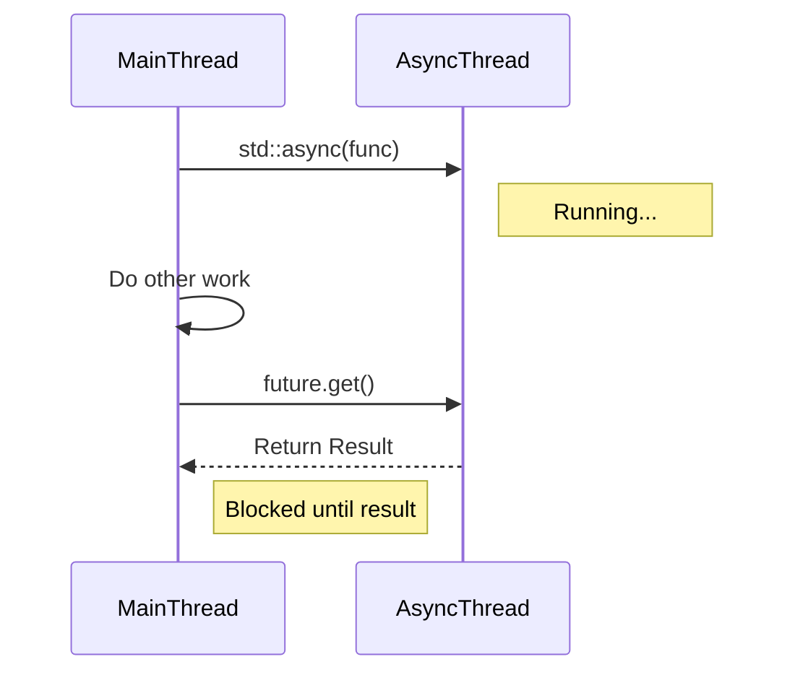

# 6주차: 비동기 결과 조회 (Future, Promise, Async)

"쓰레드가 끝날 때까지 기다리는 건 `join`으로 되는데, **결과값(리턴값)**은 어떻게 받죠?"
이번 주에는 쓰레드로부터 값을 받아오는 우아한 방법들을 배웁니다.

## 0. 미리 알면 좋은 용어 (Friendly Terms)
- **Future (퓨처)**: "교환권"입니다. 나중에 실제 값으로 바꿀 수 있는 티켓입니다. 지금은 값이 없지만, 미래에 값이 채워질 것임을 보장합니다.
- **Promise (프로미스)**: "약속 어음"입니다. 나중에 값을 채워주겠다고 약속하는 객체입니다. 생산자가 여기에 값을 넣으면, 소비자는 교환권(Future)으로 값을 받습니다.
- **Async (어싱크)**: "비동기 심부름"입니다. 다른 쓰레드에게 일을 시키고, 그 결과물을 받을 수 있는 교환권(Future)을 즉시 받아오는 함수입니다.

## 1. 핵심 개념

### A. `std::future` & `std::promise`
- **Promise**: "나중에 값을 줄게." (생산자 역할)
- **Future**: "나중에 값을 받을게." (소비자 역할)
- 둘은 짝꿍입니다. `promise` 객체에서 `get_future()`를 호출하면 `future` 객체를 얻을 수 있습니다.
- `promise`에 값을 세팅(`set_value`)하면, `future`가 대기하고 있다가 그 값을 꺼낼(`get`) 수 있습니다.

### B. `std::async`
- "쓰레드 만들고, 약속(promise)하고, 미래(future) 받고... 너무 복잡해!"
- 함수 하나로 비동기 실행과 결과 수신을 한방에 해결해주는 고수준 API입니다.
- **`std::launch::async`**: 무조건 새로운 쓰레드를 만들어서 실행합니다.
- **`std::launch::deferred`**: `get()`을 호출할 때까지 실행을 미룹니다(Lazy Evaluation). 호출한 쓰레드에서 동기적으로 실행됩니다.

### C. `std::shared_future`
- 일반적인 `std::future`는 `get()`을 한 번만 호출할 수 있습니다. (일회용 티켓)
- 여러 쓰레드가 동시에 같은 결과를 기다려야 한다면 `std::shared_future`를 사용합니다. (복사 가능한 티켓)

## 2. 자주 하는 실수 (Common Pitfalls)

> [!WARNING]
> **1. `std::async`의 리턴값 무시 (Fire and Forget)**
> ```cpp
> std::async(std::launch::async, []{ ... }); // 임시 객체 소멸!
> ```
> `std::async`가 리턴하는 `future`를 변수에 저장하지 않으면, 그 줄에서 즉시 소멸자가 호출되면서 쓰레드가 끝날 때까지 기다려버립니다(`wait`).
> 즉, 비동기로 실행하려 했는데 동기 실행처럼 되어버립니다.
> -> **해결**: 반드시 `auto fut = std::async(...)` 처럼 리턴값을 받아서 유지해야 합니다.

> [!TIP]
> **2. `future::get()` 두 번 호출**
> `get()`은 값을 이동(Move)시켜서 가져옵니다. 이미 가져간 빈 껍데기에 대고 또 `get()`을 호출하면 예외가 발생합니다.
> -> **해결**: `valid()`로 유효한지 확인하거나, 로직상 한 번만 호출하도록 설계하세요.

## 3. 실습 가이드
1. **01_promise_future.cpp**: 수동으로 채널을 열고 값을 주고받는 기본 패턴을 익힙니다.
2. **02_async_task.cpp**: `std::async`로 세상 편하게 비동기 작업을 수행해봅니다.
3. **03_shared_future.cpp**: 하나의 결과를 여러 쓰레드에 방송(Broadcast)하는 방법을 배웁니다.

## 4. Step-by-Step Guide
1. `build_cmake.bat`를 실행하여 빌드합니다.
2. `Debug/01_promise_future.exe`를 실행하여 수동으로 값을 전달하는 과정을 확인합니다.
3. `Debug/02_async_task.exe`를 실행하여 `std::async`의 편리함과 리턴값 처리 방식을 익힙니다.
4. `Debug/03_shared_future.exe`를 실행하여 하나의 결과를 여러 쓰레드가 공유하는 패턴을 확인합니다.

## 5. 빌드 및 실행
```powershell
.\build_cmake.bat
```

## 6. Diagram

