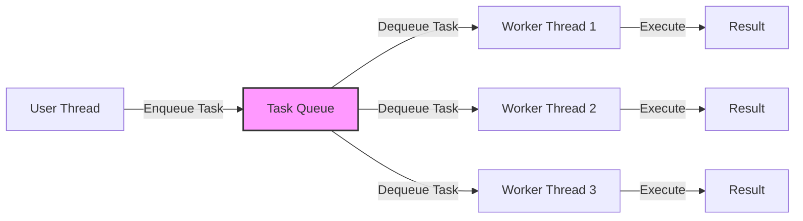

# 7주차: 쓰레드 풀 (Thread Pool)과 안전한 큐

"쓰레드를 매번 만들었다 지웠다 하는 건 너무 비싸요!"
이번 주에는 멀티쓰레딩의 꽃, **쓰레드 풀**을 직접 만들어봅니다.

## 0. 미리 알면 좋은 용어 (Friendly Terms)
- **Thread Pool (쓰레드 풀)**: "인력 사무소"입니다. 일꾼(쓰레드)들을 미리 뽑아놓고 대기시키는 곳입니다. 일이 들어오면 대기 중인 일꾼을 보내고, 일이 끝나면 다시 사무소로 복귀시킵니다.
- **Task Queue (작업 큐)**: "일감 바구니"입니다. 해야 할 일(함수 등)들을 쌓아두는 곳입니다. 일꾼들이 여기서 하나씩 꺼내서 처리합니다.
- **Graceful Shutdown (우아한 종료)**: "퇴근 준비"입니다. 하던 일을 마저 끝내고, 정리 정돈을 한 뒤에 안전하게 프로그램을 끄는 것입니다.

## 1. 핵심 개념

### A. 쓰레드 생성 비용
- 쓰레드 하나를 만드는 건 운영체제(OS) 입장에서 꽤 무거운 작업입니다 (메모리 할당, 커널 리소스 등록 등).
- 만약 작업이 0.001초 만에 끝나는데 쓰레드 만드는 데 0.01초가 걸린다면? 배보다 배꼽이 더 큰 상황이 됩니다.
- 그래서 쓰레드를 미리 만들어두고 재사용하는 **쓰레드 풀**이 필요합니다.

### B. 쓰레드 풀 (Thread Pool)의 구조
1. **Worker Threads**: 미리 생성된 N개의 쓰레드들입니다. 무한 루프를 돌면서 "일감 바구니(Queue)"를 감시합니다.
2. **Task Queue**: 사용자가 요청한 작업들이 쌓이는 곳입니다.
3. **동작 방식**:
   - 큐가 비어있으면 쓰레드들은 잡니다(Wait).
   - 큐에 작업이 들어오면 깨어나서(Notify) 작업을 가져갑니다.
   - 작업이 끝나면 쓰레드는 죽지 않고 다시 대기 상태로 돌아갑니다.

### C. Thread-safe Queue
- 쓰레드 풀의 핵심은 "작업 대기열"입니다.
- 여러 쓰레드가 동시에 작업을 가져가거나(Pop), 메인 쓰레드가 작업을 넣어야(Push) 하므로, 반드시 동기화가 필요합니다.
- 5주차에 배운 `mutex`와 `condition_variable`을 활용해 만듭니다.

## 2. 자주 하는 실수 (Common Pitfalls)

> [!IMPORTANT]
> **1. 소멸자 처리 (Graceful Shutdown)**
> 프로그램이 끝날 때 쓰레드 풀도 안전하게 종료되어야 합니다.
> 그냥 놔두면 `std::terminate`가 호출되거나, 쓰레드가 영원히 기다리는 상태(Hang)가 됩니다.
> -> **해결**: `done` 플래그를 세팅하고 -> `notify_all`로 자는 쓰레드를 다 깨운 뒤 -> `join`으로 모든 쓰레드가 종료될 때까지 기다려야 합니다.

> [!WARNING]
> **2. 작업 중 예외 발생**
> 쓰레드 풀 내부에서 실행된 작업이 예외를 던지면 어떻게 될까요?
> 처리하지 않으면 쓰레드 자체가 죽어버리거나 프로그램이 종료됩니다.
> -> **해결**: 반드시 작업 실행 부분을 `try-catch`로 감싸서 예외가 발생해도 쓰레드는 죽지 않고 다음 작업을 받을 수 있게 해야 합니다.

## 3. 실습 가이드
1. **01_thread_safe_queue.cpp**: 큐부터 튼튼하게 만듭니다. 멀티쓰레드 환경에서 안전한지 테스트합니다.
2. **02_simple_thread_pool.cpp**: 큐를 이용해 간단한 쓰레드 풀을 구현합니다.
3. **03_using_thread_pool.cpp**: 실제로 작업을 던져보고 잘 돌아가는지 확인합니다.

## 4. Step-by-Step Guide
1. `build_cmake.bat`를 실행하여 빌드합니다.
2. `Debug/01_thread_safe_queue.exe`를 실행하여 멀티쓰레드 환경에서 큐가 안전하게 동작하는지 확인합니다.
3. `Debug/02_simple_thread_pool.exe`를 실행하여 쓰레드 풀의 초기화 및 종료 과정을 관찰합니다.
4. `Debug/03_using_thread_pool.exe`를 실행하여 실제 작업을 제출하고 처리되는 순서를 확인합니다.

## 5. 빌드 및 실행
```powershell
.\build_cmake.bat
```

## 6. Diagram

