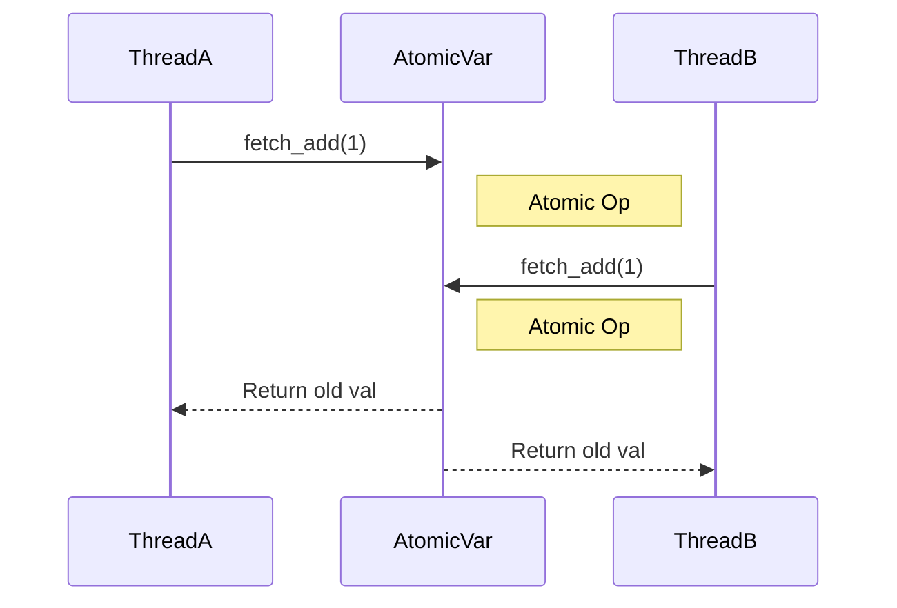

# 8주차: 원자적 연산 (Atomics)

"Mutex는 너무 무거워요. 더 가벼운 건 없나요?"
이번 주에는 락(Lock) 없이도 쓰레드 안전하게 변수를 다루는 **Atomic(원자적) 연산**을 배웁니다.

## 0. 미리 알면 좋은 용어 (Friendly Terms)
- **Atomic (아토믹)**: "원자"입니다. 더 이상 쪼갤 수 없는 최소 단위를 의미합니다. 프로그래밍에서는 "중간에 끊기지 않고 한 번에 실행되는 연산"을 뜻합니다.
- **Lock-free (락 프리)**: "열쇠 없이 문 열기"입니다. 자물쇠(Mutex)를 쓰지 않고도 안전하게 데이터를 공유하는 고급 기술입니다. 대기하지 않으므로 빠릅니다.
- **CAS (Compare-And-Swap)**: "확인하고 바꾸기"입니다. "내가 기억하는 값이 맞으면 새 값으로 바꿔줘, 아니면 말고"라는 식의 조건부 업데이트 명령어입니다.

## 1. 핵심 개념

### A. 원자성 (Atomicity)
- "쪼개질 수 없는 연산"입니다.
- `i++`는 사실 `Read(읽기) -> Add(더하기) -> Write(쓰기)` 3단계로 이루어져 있습니다. 이 중간에 다른 쓰레드가 끼어들면 값이 꼬입니다.
- `std::atomic<int>`를 쓰면 이 과정이 하드웨어 수준에서 한 방에(Atomic하게) 일어납니다. 중간에 다른 쓰레드가 끼어들 틈이 없습니다.

### B. Compare-And-Swap (CAS)
- Lock-free 알고리즘의 핵심입니다.
- `compare_exchange_weak(expected, desired)`
- "현재 값이 `expected`랑 같으면 `desired`로 바꿔줘. 다르면 `expected`를 현재 값으로 업데이트해줘."
- 실패하면 다시 시도(Loop)하는 방식으로 동기화를 맞춥니다.

### C. Spinlock (스핀락)
- Mutex는 대기할 때 OS에게 "나 재워줘" 하고 잠듭니다 (Context Switching 발생). 깨어나는 데 시간이 걸립니다.
- Spinlock은 "될 때까지 계속 확인(Loop)" 합니다. 잠들지 않습니다.
- 아주 짧게 기다릴 때는 Spinlock이 훨씬 빠르지만, 오래 걸리면 CPU를 낭비합니다.

## 2. 자주 하는 실수 (Common Pitfalls)

> [!WARNING]
> **1. Atomic 변수만 쓰면 만사형통?**
> `std::atomic`은 **단일 변수**에 대해서만 안전합니다.
> 예를 들어, `atomic` 변수 A와 B를 동시에 업데이트해야 한다면? A는 업데이트됐는데 B는 아직 안 된 상태를 다른 쓰레드가 볼 수 있습니다.
> -> 여러 변수를 묶어서 트랜잭션처럼 처리하려면 결국 Mutex가 필요합니다.

> [!TIP]
> **2. `is_lock_free()` 맹신**
> 모든 `std::atomic` 타입이 락 프리인 것은 아닙니다.
> 하드웨어가 지원하지 않는 큰 구조체 등은 내부적으로 Lock을 쓸 수도 있습니다.
> -> `is_lock_free()` 함수로 확인할 수 있습니다.

## 3. 실습 가이드
1. **01_atomic_counter.cpp**: 일반 `int` vs `atomic<int>` vs `mutex` 성능을 비교해봅니다.
2. **02_cas_loop.cpp**: CAS 연산을 이용해 값을 안전하게 업데이트하는 패턴을 익힙니다.
3. **03_spinlock.cpp**: `atomic_flag`를 이용해 직접 Spinlock을 구현해보고 CPU 점유율을 확인합니다.

## 4. Step-by-Step Guide
1. `build_cmake.bat`를 실행하여 빌드합니다.
2. `Debug/01_atomic_counter.exe`를 실행하여 `atomic`과 `mutex`의 성능 차이를 비교합니다.
3. `Debug/02_cas_loop.exe`를 실행하여 CAS(Compare-And-Swap) 루프가 어떻게 동작하는지 확인합니다.
4. `Debug/03_spinlock.exe`를 실행하여 Spinlock의 동작과 CPU 점유율을 관찰합니다.

## 5. 빌드 및 실행
```powershell
.\build_cmake.bat
```

## 6. Diagram

